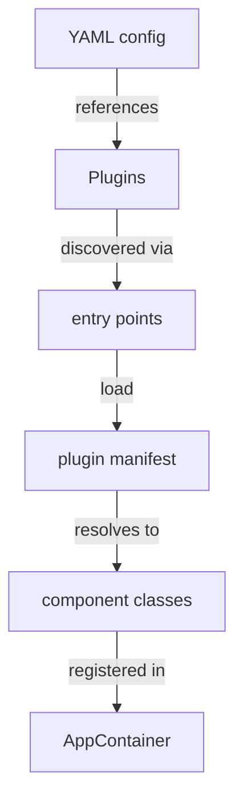

# Component system

`redsun` component system allows third-party packages to provide devices, presenters, and views that are dynamically discovered and loaded at runtime.

## Overview

From Python point of view, components are standard Python packages that register themselves via [entry points]. When `redsun` builds an application from a YAML configuration file, it uses these entry points to discover available plugins and load the requested components.



## Plugin discovery

When [`AppContainer.from_config()`][redsun.containers.container.AppContainer.from_config]
is called with a configuration file, Redsun:

1. **Reads the configuration** - parses the YAML file to determine which devices, presenters, and views are needed.
2. **Queries entry points** - looks up installed packages registered under the `redsun.plugins` entry point group.
3. **Loads manifests** - each plugin provides a YAML manifest file that maps plugin IDs to their Python class locations.
4. **Validates protocols** - each loaded class is checked against the expected protocol ([`Device`][sunflare.device.Device], [`Presenter`][sunflare.presenter.Presenter], or [`View`][sunflare.view.View]).
5. **Creates the container** - a dynamic container class is assembled with the discovered components.

## Plugin manifest

Each plugin package includes a YAML manifest file that declares the available components. Each entry maps a plugin ID directly to its `"module:ClassName"` class path:

```yaml
devices:
  my_motor: "my_plugin.devices:MyMotor"

presenters:
  my_controller: "my_plugin.presenters:MyController"

views:
  my_ui: "my_plugin.views:MyView"
```

The manifest is registered as a [Python entry point] in the plugin's `pyproject.toml`:

```toml
[project.entry-points."redsun.plugins"]
my-plugin = "manifest.yaml"
```

## Configuration file format

The application configuration file references plugins by name and ID:

```yaml
schema: 1.0
session: "My applcation"
frontend: "pyqt"

devices:
  motor:
    plugin_name: my-plugin
    plugin_id: my_motor
    axis:
      - X
      - Y

presenters:
  controller:
    plugin_name: my-plugin
    plugin_id: my_controller

views:
  ui:
    plugin_name: my-plugin
    plugin_id: my_ui
```

The `plugin_name` and `plugin_id` keys are used for plugin resolution and are not passed to the component constructors. All other keys become keyword arguments for the component.

## Protocol validation

Before a plugin class is used, Redsun verifies it implements the expected protocol:

- **Devices** must be subclasses of [`Device`][sunflare.device.Device] or structurally implement the [`PDevice`][sunflare.device.PDevice] protocol.
- **Presenters** must be subclasses of [`Presenter`][sunflare.presenter.Presenter] or structurally implement the [`PPresenter`][sunflare.presenter.PPresenter] protocol.
- **Views** must be subclasses of [`View`][sunflare.view.View] or structurally implement the [`PView`][sunflare.view.PView] protocol.

Classes that satisfy the protocol structurally (without inheriting from the base class) are registered as virtual subclasses via [`ABCMeta.register()`][abc.ABCMeta.register].

## Inline vs. config-based registration

The plugin system is used when building from configuration files via
[`AppContainer.from_config()`][redsun.containers.container.AppContainer.from_config].
When using the declarative class-based approach (defining a container subclass with
[`component()`][redsun.containers.components.component] fields), component classes are
passed directly as the first argument to `component()` and do not go through plugin discovery.

Both approaches produce the same result: an
[`AppContainer`][redsun.containers.container.AppContainer] with registered device,
presenter, and view components ready to be built.

[entry points]: https://packaging.python.org/en/latest/specifications/entry-points/
[python entry point]: https://packaging.python.org/en/latest/specifications/entry-points/
