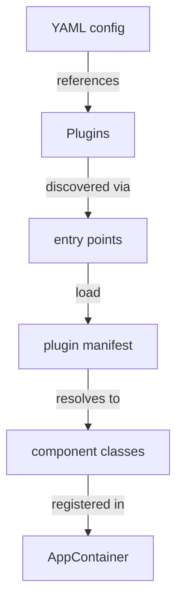

# Component system

`redsun`'s component system lets other packages provide devices, presenters and views, discovered and loaded at runtime.

## Overview

Components ship in ordinary Python packages that register through [entry points]. Building an application from a YAML configuration file, `redsun` reads those entry points to find the installed plugins and load the components the file asks for.


```mermaid
graph TB
    Config[YAML config] -->|references| Plugins
    Plugins -->|discovered via| EntryPoints[entry points]
    EntryPoints -->|load| Manifest[plugin manifest]
    Manifest -->|resolves to| Classes[component classes]
    Classes -->|registered in| Container[AppContainer]
```

## Plugin discovery

When [`AppContainer.from_config()`][redsun.containers.container.AppContainer.from_config]
is called with a configuration file, `redsun`:

1. **Reads the configuration** to learn which devices, presenters and views are needed.
2. **Queries entry points** for installed packages in the `redsun.plugins` group.
3. **Loads manifests**: each plugin's YAML manifest maps plugin IDs to Python classes.
4. **Validates components**: a device class must subclass `ophyd_async.core.Device`; presenter and view instances are checked against [`PPresenter`][redsun.presenter.PPresenter] / [`PView`][redsun.view.PView] when the container builds (see [Protocol validation](#protocol-validation)).
5. **Creates the container** class from the discovered components.

## Component manifest

A component package includes a YAML manifest, `redsun.yaml`, declaring its components.

Each entry maps a plugin ID to a `"module:ClassName"` class path:

```yaml
# redsun.yaml

devices:
  my_motor: "my_plugin.devices:MyMotor"

presenters:
  my_controller: "my_plugin.presenters:MyController"

views:
  my_ui: "my_plugin.views:MyView"
```

Register the manifest as a [Python entry point] in the package's `pyproject.toml`:

```toml
[project.entry-points."redsun.plugins"]
my-plugin = "redsun.yaml"
```

!!! tip

    The design follows the [napari manifest](https://napari.org/stable/plugins/technical_references/manifest.html).

    Check that your packaging tool includes `redsun.yaml` in the built package, or the components cannot be discovered.

## Configuration file format

An application configuration file names plugins by name and ID:

```yaml
schema_version: 1.0
session: "My application"
frontend: "pyqt"
metadata:
    user: Jacopo Abramo
    location: Jena
    setup: iSCAT

devices:
  motor:
    plugin_name: my-plugin
    plugin_id: my_motor
    axis:
      - X
      - Y

presenters:
  controller:
    plugin_name: my-plugin
    plugin_id: my_controller

views:
  ui:
    plugin_name: my-plugin
    plugin_id: my_ui
```

The top-level keys describe the application:

- `schema_version` is the component system's version, kept for compatibility;
- `session` is the application's display name;
- `frontend` is the UI toolkit, which picks the `AppContainer` subclass;
- `metadata` holds application-level context.

`plugin_name` and `plugin_id` resolve the plugin and are not passed to the constructor. Every other key becomes a keyword argument of the component.

## Protocol validation

Each check runs where its information exists:

- **Devices** are checked at discovery: the class must subclass
  `ophyd_async.core.Device`. A class check is enough, because devices conform
  by inheritance.
- **Presenters and views** are checked twice:
    1. *Constructor signature, at discovery.* The leading positional parameters
       must be exactly `(name, devices)` for presenters and `(name,)` for
       views, and any further parameter must accept a keyword: the container
       calls `cls(*positionals, **config_kwargs)`. A plugin failing this is
       rejected before it is instantiated.
    2. *Protocol, at build.* The instance must satisfy
       [`PPresenter`][redsun.presenter.PPresenter] (`name` and `devices`) or
       [`PView`][redsun.view.PView] (`name` and `view_position`) by shape.
       Attributes assigned in `__init__` exist only now; an instance that does
       not conform raises a `TypeError` naming the missing members.

Inheriting the [`Presenter`][redsun.presenter.Presenter] or
[`View`][redsun.view.View] ABC is optional, since conformance is by shape (see
[ADR 0003](decisions/0003-structural-subtyping-for-presenters-and-views.md)).

## Built-in components

`redsun` ships its own manifest under the `redsun` entry point, so a
configuration file names built-in components the same way as any plugin's:

```yaml
presenters:
  storage:
    plugin_name: redsun
    plugin_id: storage

views:
  storage:
    plugin_name: redsun
    plugin_id: storage
  logs:
    plugin_name: redsun
    plugin_id: logs
```

A manifest entry is imported only when a configuration names it, so a headless
installation never imports the Qt views.

The built-ins are described in
[Presenters](architecture/presenters.md#built-in-presenters), and the `logs`
view in [Configure logging](../how-to/configure-logging.md#show-the-logs-in-the-application).

## Inline vs. config-based registration

Plugin discovery only runs when building from a configuration file with
[`AppContainer.from_config()`][redsun.containers.container.AppContainer.from_config].
A container subclass declared with
[`declare_device()`][redsun.containers.components.declare_device],
[`declare_presenter()`][redsun.containers.components.declare_presenter] or
[`declare_view()`][redsun.containers.components.declare_view] passes the
classes directly and skips discovery. The build checks both the same way.

Either way the result is an
[`AppContainer`][redsun.containers.container.AppContainer] with its devices,
presenters and views declared and ready to build.

[entry points]: https://packaging.python.org/en/latest/specifications/entry-points/
[python entry point]: https://packaging.python.org/en/latest/specifications/entry-points/
