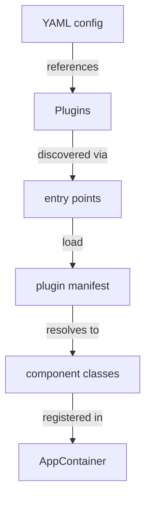

# Component system

`redsun` component system allows third-party packages to provide devices, presenters, and views that are dynamically discovered and loaded at runtime.

## Overview

From Python point of view, components are standard Python packages that register themselves via [entry points]. When `redsun` builds an application from a YAML configuration file, it uses these entry points to discover available plugins and load the requested components.


```mermaid
graph TB
    Config[YAML config] -->|references| Plugins
    Plugins -->|discovered via| EntryPoints[entry points]
    EntryPoints -->|load| Manifest[plugin manifest]
    Manifest -->|resolves to| Classes[component classes]
    Classes -->|registered in| Container[AppContainer]
```

## Plugin discovery

When [`AppContainer.from_config()`][redsun.containers.container.AppContainer.from_config]
is called with a configuration file, Redsun:

1. **Reads the configuration** - parses the YAML file to determine which devices, presenters, and views are needed.
2. **Queries entry points** - looks up installed packages registered under the `redsun.plugins` entry point group.
3. **Loads manifests** - each plugin provides a YAML manifest file that maps plugin IDs to their Python class locations.
4. **Validates components** - devices are checked at discovery (must subclass `ophyd_async.core.Device`); presenter and view instances are validated against [`PPresenter`][redsun.presenter.PPresenter] / [`PView`][redsun.view.PView] when the container builds (see [Protocol validation](#protocol-validation)).
5. **Creates the container** - a dynamic container class is assembled with the discovered components.

## Component manifest

Each component package must include a YAML manifest file named `redsun.yaml` that declares the available components. 

Each entry maps a plugin ID directly to its `"module:ClassName"` class path:

```yaml
# redsun.yaml

devices:
  my_motor: "my_plugin.devices:MyMotor"

presenters:
  my_controller: "my_plugin.presenters:MyController"

views:
  my_ui: "my_plugin.views:MyView"
```

The manifest must be registered as a [Python entry point] in the package `pyproject.toml`:

```toml
[project.entry-points."redsun.plugins"]
my-plugin = "redsun.yaml"
```

!!! tip

    This is inspired by the [napari manifest](https://napari.org/stable/plugins/technical_references/manifest.html).

    Make sure that depending on the packaging system you use, the `redsun.yaml` is included in the built package otherwise your components will not be discoverable.

## Configuration file format

The application configuration file references plugins by name and ID. A full example follows:

```yaml
schema_version: 1.0
name: "My application"
frontend: "pyqt"
metadata:
    user: Jacopo Abramo
    location: Jena
    setup: iSCAT

devices:
  motor:
    plugin_name: my-plugin
    plugin_id: my_motor
    axis:
      - X
      - Y

presenters:
  controller:
    plugin_name: my-plugin
    plugin_id: my_controller

views:
  ui:
    plugin_name: my-plugin
    plugin_id: my_ui
```

The top-level keys represent application level information:

- `schema_version` is the version value of the component system, kept for future compatibility;
- `name` identifies the session, and names the application its commands and
  menus are registered on. It defaults to the container class's own name;
- `frontend` is the UI toolkit used to load the correct subclass of `AppContainer`;
- `metadata` are application-level metadata to add contextual informations.

The `plugin_name` and `plugin_id` keys are used for plugin resolution and are not passed to the component constructors. All other keys become keyword arguments for the component.

## Protocol validation

Validation happens at two different moments, matching where the required
information actually exists:

- **Devices** are checked at discovery time: the loaded class must subclass
  `ophyd_async.core.Device`. This is a sound class-level check because the
  device layer is nominal.
- **Presenters and views** pass a **dual gate**, each part checked where
  the information exists:
    1. *Constructor signature (class level, at discovery)* - the leading
       positional parameters must be exactly `(name, devices)` for
       presenters and `(name,)` for views; further parameters must be
       keyword-assignable (the container calls
       `cls(*positionals, **config_kwargs)` and has no control over the
       keywords). Plugins failing this gate are rejected before
       instantiation.
    2. *Protocol compliance (instance level, at build)* - the constructed
       instance must satisfy [`PPresenter`][redsun.presenter.PPresenter]
       (exposing `name` and `devices`) or [`PView`][redsun.view.PView]
       (exposing `name` and `view_position`) structurally. Attributes
       assigned in `__init__` are only visible here; a non-compliant
       instance raises a `TypeError` naming the missing members.

Inheriting the [`Presenter`][redsun.presenter.Presenter] /
[`View`][redsun.view.View] ABCs is optional - compliance is purely
structural (see
[ADR 0003](decisions/0003-structural-subtyping-for-presenters-and-views.md)).

## Built-in components

redsun itself ships a plugin manifest under the `redsun` entry point, so
built-in components resolve through the same discovery path as external
plugins - no special-casing in configuration files:

```yaml
presenters:
  storage:
    plugin_name: redsun
    plugin_id: storage

views:
  storage:
    plugin_name: redsun
    plugin_id: storage
```

A manifest entry is imported only when a configuration names it, so a headless
installation never imports the Qt views.

The available built-ins are documented in
[Presenters](architecture/presenters.md#built-in-presenters).

## Inline vs. config-based registration

The plugin system is used when building from configuration files via
[`AppContainer.from_config()`][redsun.containers.container.AppContainer.from_config].
When using the declarative class-based approach (defining a container subclass with
[`declare_device()`][redsun.containers.components.declare_device], [`declare_presenter()`][redsun.containers.components.declare_presenter] or [`declare_view()`][redsun.containers.components.declare_view] field functions), component classes are
passed directly as the first argument to the respective function and do not go through plugin discovery. Build-time protocol validation applies identically to both paths.

Both approaches produce the same result: an
[`AppContainer`][redsun.containers.container.AppContainer] with registered device,
presenter, and view components ready to be built.

[entry points]: https://packaging.python.org/en/latest/specifications/entry-points/
[python entry point]: https://packaging.python.org/en/latest/specifications/entry-points/
