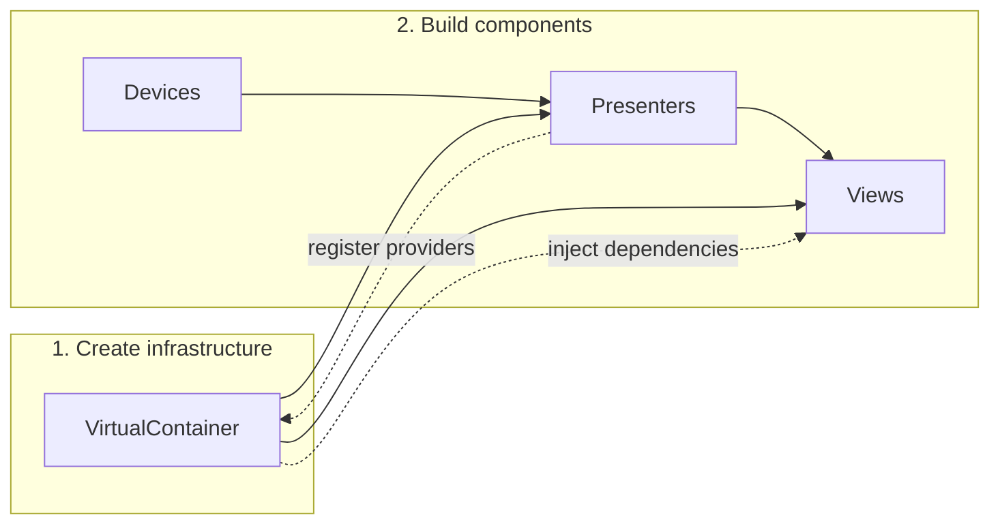

# Container architecture

Redsun uses a **container-based Model-View-Presenter (MVP) architecture** to manage the lifecycle and dependencies of application components.

## Overview

At the core of Redsun is the [`AppContainer`][redsun.AppContainer], which acts as the central registry and build system for all application components. Components are declared as class attributes and instantiated in a well-defined dependency order.



## The MVP pattern

Redsun follows the **Model-View-Presenter** pattern provided by [`sunflare`](https://redsun-acquisition.github.io/sunflare/):

- **Model (Devices)**: hardware abstractions that implement Bluesky's device protocols via [`Device`][sunflare.device.Device]. They represent the actual instruments being controlled.
- **View**: UI components (currently Qt-based) that implement [`View`][sunflare.view.View] to display data and capture user interactions.
- **Presenter**: business logic components that implement [`Presenter`][sunflare.presenter.Presenter], sitting between models and views, coordinating device operations and updating the UI through the virtual bus.

This separation ensures that hardware drivers, UI components, and business logic can be developed and tested independently.

## Declarative component registration

`redsun` operates on a __bring-your-own components__ approach. Each component is intended to be developed separately and in isolation or as part of bundles of multiple components that can be dynamically assembled. In a declarative manner, this means importing the components explicitly and assigning them to a container.

Components are declared as class attributes using the layer-specific field specifiers:
[`device()`][redsun.containers.device],
[`presenter()`][redsun.containers.presenter], and
[`view()`][redsun.containers.view].
Each accepts the component class as its first positional argument, followed by optional keyword arguments forwarded to the constructor.

When writing a container explicitly, you inherit from the frontend-specific subclass rather than the base `AppContainer` — for Qt applications that is [`QtAppContainer`][redsun.qt.QtAppContainer]:

```python
from redsun.containers import device, presenter, view
from redsun.qt import QtAppContainer


def my_app() -> None:
    class MyApp(QtAppContainer):
        motor = device(MyMotor, axis=["X", "Y"])
        ctrl = presenter(MyController, gain=1.0)
        ui = view(MyView)

    MyApp().run()
```

The class is defined inside a function so that the Qt imports and any heavy device imports are deferred until the application is actually launched.

The [`AppContainerMeta`][redsun.containers.container.AppContainerMeta] metaclass collects these declarations at class creation time. Because the class is passed directly to the field specifier, no annotation inspection is needed. This declarative approach allows the container to:

- validate component types at class creation time;
- inherit and override components from base classes;
- merge configuration from YAML files with inline keyword arguments.

## Component naming

Every component receives a **name** that is used as its key in the container's `devices`, `presenters`, or `views` dictionaries and passed as the first positional argument to the component constructor. The name is resolved with the following priority:

1. **`alias`** — if an explicit `alias` is passed to `device()`, `presenter()`, or `view()`, that value is used regardless of everything else.
2. **Attribute name** — in the declarative flow, the Python attribute name becomes the component name when no `alias` is provided.
3. **YAML key** — in the dynamic flow ([`from_config()`][redsun.containers.container.AppContainer.from_config]), the top-level key in the `devices`/`presenters`/`views` section of the configuration file becomes the component name.

Examples in the declarative flow:

```python
class MyApp(QtAppContainer):
    motor = device(MyMotor)                       # name → "motor"
    cam = device(MyCamera, alias="detector")      # name → "detector"
```

In the dynamic flow:

```yaml
devices:
  iSCAT channel:           # name → "iSCAT channel"
    plugin_name: my-plugin
    plugin_id: my_detector
```

The `alias` parameter is useful when the desired runtime name differs from the attribute name — for example to match an identifier expected elsewhere in the application without renaming the Python attribute.

## Configuration file support

Components can pull their keyword arguments from a YAML configuration file by passing `config=` to the class definition and `from_config=` to each field specifier call:

```python
from redsun.containers import device, presenter, view
from redsun.qt import QtAppContainer


def my_app() -> None:
    class MyApp(QtAppContainer, config="app_config.yaml"):
        motor = device(MyMotor, from_config="motor")
        ctrl = presenter(MyController, from_config="ctrl")
        ui = view(MyView, from_config="ui")

    MyApp().run()

    # alternatively, you can first build and then run the app
    app = MyApp()
    app.build()
    app.run()
```

The configuration file provides base keyword arguments for each component. These can be selectively overridden by inline keyword arguments in the field specifier call, allowing the same container class to be reused across different hardware setups by swapping configuration files.

## Build order

When [`build()`][redsun.containers.container.AppContainer.build] is called, the container instantiates components in a strict dependency order:

1. **VirtualContainer** - the shared signal registry and dependency injection layer ([`VirtualContainer`][sunflare.virtual.VirtualContainer]), seeded with the application configuration.
2. **Devices** - hardware interfaces, each receiving their resolved name and keyword arguments.
3. **Presenters** - business logic components, receiving their resolved name and the full device dictionary. Presenters that implement [`IsProvider`][sunflare.virtual.IsProvider] register their providers in the VirtualContainer.
4. **Views** - UI components, receiving their resolved name. Views that implement [`IsInjectable`][sunflare.virtual.IsInjectable] receive dependencies from the VirtualContainer.

## Communication

Components communicate through the [`VirtualContainer`][sunflare.virtual.VirtualContainer], which serves as the single shared data exchange layer for the application. It combines two roles:

- **Signal registry**: components can register their [`psygnal`](https://psygnal.readthedocs.io/) signals into the container via `register_signals()`, making them discoverable by other components without direct references to each other. Registered signals are accessible through the `signals` property.
- **Dependency injection**: built on top of [`dependency_injector`](https://python-dependency-injector.readthedocs.io/)'s `DynamicContainer`, it allows presenters that implement [`IsProvider`][sunflare.virtual.IsProvider] to register typed providers, and views that implement [`IsInjectable`][sunflare.virtual.IsInjectable] to consume them. This decouples views from specific presenter implementations.

The `VirtualContainer` is created during [`build()`][redsun.containers.container.AppContainer.build] and is accessible via the [`virtual_container`][redsun.containers.container.AppContainer.virtual_container] property after the container is built.

## Two usage flows

Redsun supports two distinct approaches for assembling an application, both producing the same result at runtime.

### Explicit flow (developer-written containers)

The explicit flow is for plugin bundle authors who know exactly which components they need and which frontend they target. The container subclass, component classes, and frontend are all fixed at write time:

```python
from redsun.containers import device, presenter, view
from redsun.qt import QtAppContainer

# these are user-developed classes
# that should reflect the structure
# provided by sunflare for each layer
from my_package.device import MyMotor
from my_package.presenter import MyPresenter
from my_package.view import MyView


def my_app() -> None:
    class MyApp(QtAppContainer, config="config.yaml"):
        motor = device(MyMotor, from_config="motor")
        ctrl = presenter(MyPresenter, from_config="ctrl")
        ui = view(MyView, from_config="ui")

    MyApp().run()
```

The class is defined inside a function so that Qt imports (and any heavy device imports) are deferred until the function is actually called. `QtAppContainer` is imported from the public `redsun.qt` namespace.

### Dynamic flow (configuration-driven)

The dynamic flow is for end users who point Redsun at a YAML configuration file. Plugins are discovered via entry points and the frontend is resolved from the `frontend:` key in the file — no Python code needs to be written:

```python
from redsun import AppContainer

app = AppContainer.from_config("path/to/config.yaml")
app.run()
```

The YAML file drives everything:

```yaml
schema_version: 1.0
session: "My Experiment"
frontend: "pyqt"

devices:
  motor:
    plugin_name: my-plugin
    plugin_id: my_motor
```

See the [plugin system](plugin-system.md) documentation for a full description of the dynamic flow.

## Frontend support

Frontend is intended as the toolkit that deploys the functionalities to implement the Graphical User Interface (GUI).

### Qt

[`QtAppContainer`][redsun.qt.QtAppContainer] extends [`AppContainer`][redsun.containers.container.AppContainer] with the full Qt lifecycle:

1. Creates the `QApplication` instance.
2. Calls [`build()`][redsun.containers.container.AppContainer.build] to instantiate all components.
3. Constructs the `QtMainView` main window and docks all views.
4. Starts the `psygnal` signal queue bridge for thread-safe signal delivery.
5. Shows the main window and enters the Qt event loop.

It is imported from the public `redsun.qt` namespace:

```python
from redsun.qt import QtAppContainer
```

Both [`PyQt6`](https://pypi.org/project/PyQt6/) or [`PySide6`](https://pypi.org/project/PySide6/) wrapped via [`qtpy`](https://github.com/spyder-ide/qtpy) are supported.

### Other frontends

The future expectation is to provide support for other frontends (either desktop or web-based).

While the presenter and device layer are decoupled via the `VirtualContainer`, the `View` layer is tied to the frontend selection and plugins will have to implement each `View` according to the toolkit that the frontend provides. The hope is to find a way to minimize the code required to implement the UI and to simplify this approach across the board, regardless of the specified frontend.
