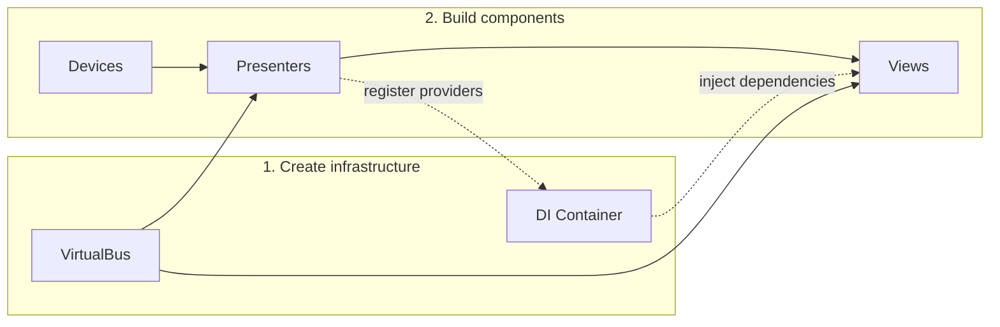

# Container architecture

Redsun uses a **container-based Model-View-Presenter (MVP) architecture** to manage the lifecycle and dependencies of application components.

## Overview

At the core of Redsun is the [`AppContainer`][redsun.containers.container.AppContainer], which acts as the central registry and build system for all application components. Components are declared as class attributes and instantiated in a well-defined dependency order.



## The MVP pattern

Redsun follows the **Model-View-Presenter** pattern provided by [Sunflare]:

- **Model (Devices)**: hardware abstractions that implement Bluesky's device protocols via [`Device`][sunflare.device.Device]. They represent the actual instruments being controlled.
- **View**: UI components (currently Qt-based) that implement [`View`][sunflare.view.View] to display data and capture user interactions.
- **Presenter**: business logic components that implement [`Presenter`][sunflare.presenter.Presenter], sitting between models and views, coordinating device operations and updating the UI through the virtual bus.

This separation ensures that hardware drivers, UI components, and business logic can be developed and tested independently.

## Declarative component registration

Components are declared as class attributes using the [`component()`][redsun.containers.components.component] field specifier, passing the component class as the first argument:

```python
from redsun.containers import AppContainer, component

class MyApp(AppContainer):
    motor = component(MyMotor, layer="device", axis=["X", "Y"])
    ctrl = component(MyController, layer="presenter", gain=1.0)
    ui = component(MyView, layer="view")
```

The [`AppContainerMeta`][redsun.containers.container.AppContainerMeta] metaclass collects these declarations at class creation time. Because the class is passed directly to `component()`, no annotation inspection is needed. This declarative approach allows the container to:

- validate component types at class creation time;
- inherit and override components from base classes;
- merge configuration from YAML files with inline keyword arguments.

## Configuration file support

Components can pull their keyword arguments from a YAML configuration file:

```python
from redsun.containers import AppContainer, component

class MyApp(AppContainer, config="app_config.yaml"):
    motor = component(MyMotor, layer="device", from_config="motor")
```

The configuration file provides base keyword arguments that can be overridden by inline values in the [`component()`][redsun.containers.components.component] call. This allows the same application class to be reused across different setups by swapping configuration files.

## Build order

When [`build()`][redsun.containers.container.AppContainer.build] is called, the container instantiates components in a strict dependency order:

1. **VirtualBus** - the event-driven communication channel ([`VirtualBus`][sunflare.virtual.VirtualBus]).
2. **DI container** - the dependency injection container, seeded with the application configuration.
3. **Devices** - hardware interfaces, each receiving their name and keyword arguments.
4. **Presenters** - business logic components, receiving the full device dictionary and virtual bus. Presenters that implement [`IsProvider`][sunflare.virtual.IsProvider] register their providers in the DI container.
5. **Views** - UI components, receiving the virtual bus. Views that implement [`IsInjectable`][sunflare.virtual.IsInjectable] receive dependencies from the DI container.

## Communication

Components communicate through two mechanisms:

- **Virtual bus**: an event-driven publish/subscribe system provided by Sunflare ([`VirtualBus`][sunflare.virtual.VirtualBus]). Presenters and views can emit and listen for signals without direct references to each other.
- **Dependency injection**: presenters can register providers in the DI container, and views can consume them. This allows views to access presenter-provided data without coupling to specific presenter implementations.

## Two usage flows

Redsun supports two distinct approaches for assembling an application, both producing the same result at runtime.

### Explicit flow (developer-written containers)

The explicit flow is for plugin bundle authors who know exactly which components they need and which frontend they target. The container subclass, component classes, and frontend are all fixed at write time:

```python
from redsun import AppContainer, component
from redsun.qt import QtAppContainer


def my_app() -> None:
    class _MyApp(QtAppContainer, config="config.yaml"):
        motor = component(MyMotor, layer="device", from_config="motor")
        ctrl = component(MyController, layer="presenter", from_config="ctrl")
        ui = component(MyView, layer="view", from_config="ui")

    _MyApp().run()
```

The class is defined inside a function so that Qt imports (and any heavy device imports) are deferred until the function is actually called. `QtAppContainer` is imported from the public [`redsun.qt`][redsun.qt] namespace.

### Dynamic flow (configuration-driven)

The dynamic flow is for end users who point Redsun at a YAML configuration file. Plugins are discovered via entry points and the frontend is resolved from the `frontend:` key in the file — no Python code needs to be written:

```python
from redsun import AppContainer

app = AppContainer.from_config("path/to/config.yaml")
app.run()
```

The YAML file drives everything:

```yaml
schema: 1.0
session: "My Experiment"
frontend: "pyqt"

devices:
  motor:
    plugin_name: my-plugin
    plugin_id: my_motor
```

See the [plugin system](plugin-system.md) documentation for a full description of the dynamic flow.

## Qt integration

[`QtAppContainer`][redsun.qt.QtAppContainer] extends [`AppContainer`][redsun.containers.container.AppContainer] with the full Qt lifecycle:

1. Creates the `QApplication` instance.
2. Calls [`build()`][redsun.containers.container.AppContainer.build] to instantiate all components.
3. Constructs the [`QtMainView`][redsun.view.qt.mainview.QtMainView] main window and docks all views.
4. Connects `VirtualAware` views to the virtual bus.
5. Starts the `psygnal` signal queue bridge for thread-safe signal delivery.
6. Shows the main window and enters the Qt event loop.

It is imported from the public `redsun.qt` namespace:

```python
from redsun.qt import QtAppContainer
```

[sunflare]: https://redsun-acquisition.github.io/sunflare/
