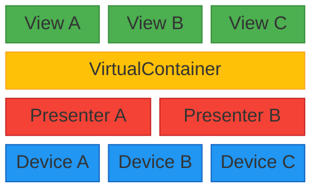
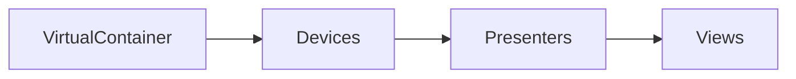
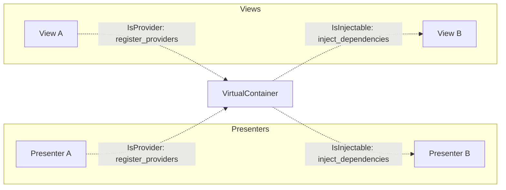

# Container architecture

`redsun` uses the **Device-View-Presenter** (DVP) architecture, a variant of [Model-View-Presenter](https://en.wikipedia.org/wiki/Model%E2%80%93view%E2%80%93presenter) (MVP).

=== "Architecture block diagram"


```mermaid
block-beta
  columns 6

  V1["View A"]:2
  V2["View B"]:2
  V3["View C"]:2
  VC["VirtualContainer"]:6
  P1["Presenter A"]:3
  P2["Presenter B"]:3
  D1["Device A"]:2
  D2["Device B"]:2
  D3["Device C"]:2

  style V1 fill:#4caf50,color:#fff,stroke:#388e3c
  style V2 fill:#4caf50,color:#fff,stroke:#388e3c
  style V3 fill:#4caf50,color:#fff,stroke:#388e3c
  style VC fill:#ffc107,color:#000,stroke:#f9a825
  style P1 fill:#f44336,color:#fff,stroke:#c62828
  style P2 fill:#f44336,color:#fff,stroke:#c62828
  style D1 fill:#2196f3,color:#fff,stroke:#1565c0
  style D2 fill:#2196f3,color:#fff,stroke:#1565c0
  style D3 fill:#2196f3,color:#fff,stroke:#1565c0
```

It differs from MVP in two ways:

- **A Device layer replaces the Model layer.** In MVP the Model holds the data the application works on, as a text editor's model holds its text. Here the layer holds the objects that talk to hardware, and the name says so.
- **Presenters and views are decoupled.** In MVP the two are tightly bound. In DVP they reach each other through a **virtual container**, by [dependency injection](https://en.wikipedia.org/wiki/Dependency_injection), so a session takes only the components it needs.

## Overview

[`AppContainer`][redsun.AppContainer] is the registry and build system for every component of an application. Components are declared as class attributes and built in dependency order.

**Build order**:


```mermaid
graph LR
    VC[VirtualContainer]
    Devices
    Presenters
    Views

    VC --> Devices
    Devices --> Presenters
    Presenters --> Views
```

**Provider registration and dependency injection**: once everything is built, each presenter or view implementing the matching protocol registers providers or receives dependencies:


```mermaid
graph LR
    VC[VirtualContainer]

    subgraph Presenters
        P1[Presenter A]
        P2[Presenter B]
    end

    subgraph Views
        V1[View A]
        V2[View B]
    end

    P1 -.->|IsProvider: register_providers| VC
    V1 -.->|IsProvider: register_providers| VC
    VC -.->|IsInjectable: inject_dependencies| P2
    VC -.->|IsInjectable: inject_dependencies| V2
```

## The DVP pattern

`redsun` builds three kinds of component:

- **Devices** talk to hardware and subclass `ophyd_async.core.Device`, or a higher-level `ophyd-async` base such as `StandardReadable` or `StandardDetector`.
- **Views** satisfy the [`PView`][redsun.view.PView] protocol; they show data and take user input.
- **Presenters** satisfy the [`PPresenter`][redsun.presenter.PPresenter] protocol. They hold the logic between devices and views, driving devices and updating the interface through [`psygnal`](https://psygnal.readthedocs.io/en/latest/).

Hardware drivers, interface and logic can then be developed and tested separately.

## Declarative containers

You bring your own components. Each is developed on its own, or in a bundle of components, and assembled later. Declaratively, that means importing the components and assigning them to a container.

Declare components as class attributes with
[`declare_device()`][redsun.containers.components.declare_device],
[`declare_presenter()`][redsun.containers.components.declare_presenter] and
[`declare_view()`][redsun.containers.components.declare_view].
Each takes the component class first, then keyword arguments passed to its constructor.

A container written by hand inherits from its frontend's subclass, not the base `AppContainer`; for Qt that is [`QtAppContainer`][redsun.qt.QtAppContainer]:

```python
from redsun.containers import declare_device, declare_presenter, declare_view
from redsun.qt import QtAppContainer


def my_app() -> None:
    class MyApp(QtAppContainer):
        motor = declare_device(MyMotor, axis=["X", "Y"])
        ctrl = declare_presenter(MyController, gain=1.0)
        ui = declare_view(MyView)

    MyApp().run()
```

Defining the class inside a function defers the Qt imports and any heavy device imports until the application launches.

`AppContainer.__init_subclass__` collects the declarations when the class is created. The class is passed to the function directly, so no annotations need reading. The container can then:

- validate component types when the class is created;
- inherit and override components from base classes;
- merge configuration from YAML files with inline keyword arguments.

Each function's return type is the class it was given, so `self.ctrl` is a
`MyController` to a type checker and the built instance at runtime. That makes
[`wire`][redsun.containers.container.AppContainer.wire] ordinary type-checked
code, not a script whose mistakes appear only at build.

## Component naming

Every component gets a `name`, its key in the container's `devices`, `presenters` or `views` mapping. A device receives it as the `name` keyword, a presenter or view as its first positional argument. The name comes from, in order:

1. `alias`, if passed to `declare_device()`, `declare_presenter()` or `declare_view()`;
2. the attribute name, in the declarative flow;
3. the YAML key under `devices`/`presenters`/`views`, in the configuration file flow ([`from_config()`][redsun.containers.container.AppContainer.from_config]).

Declarative flow:

```python
class MyApp(QtAppContainer):
    motor = declare_device(MyMotor)  # name -> "motor"
    cam = declare_device(MyCamera, alias="detector")  # name -> "detector"
```

Configuration file flow:

```yaml
devices:
  iSCAT channel:           # name -> "iSCAT channel"
    plugin_name: my-plugin
    plugin_id: my_detector
```

## Configuration file support

A component can take its keyword arguments from a YAML file: pass `config=` to the class definition and `from_config=` to each declaration:

```python
from redsun.containers import declare_device, declare_presenter, declare_view
from redsun.qt import QtAppContainer


def my_app() -> None:
    class MyApp(QtAppContainer, config="app_config.yaml"):
        motor = declare_device(MyMotor, from_config="motor")
        ctrl = declare_presenter(MyController, from_config="ctrl")
        ui = declare_view(MyView, from_config="ui")

    MyApp().run()

    # alternatively, you can first build and then run the app
    app = MyApp()
    app.build()
    app.run()
```

The file gives each component's base keyword arguments, and inline keyword arguments override them, so one container class serves several hardware setups by swapping files.

### Sharing declarations between sessions

Two sessions of one instrument usually differ only in their devices. A base
class holds what they share, and each subclass names its file:

```python
class InstrumentApp(QtAppContainer):
    ctrl = declare_presenter(MyController, from_config="ctrl")
    ui = declare_view(MyView, from_config="ui")


class Simulation(InstrumentApp, config="simulation.yaml"):
    motor = declare_device(MockMotor, from_config="motor")


class Instrument(InstrumentApp, config="instrument.yaml"):
    motor = declare_device(MyMotor, from_config="motor")
```

An inherited declaration reads the file of the class inheriting it, so
`Simulation` and `Instrument` read the same declarations from different files.
A base using `from_config` needs no file of its own; constructing a container
without one raises `TypeError` naming the declarations that wanted a section.

### Layering configuration files

`config` also takes several files, and a subclass adds to its bases' files
instead of replacing them, so shared settings are written once:

```python
class InstrumentApp(QtAppContainer, config="common.yaml"):
    ctrl = declare_presenter(MyController, from_config="ctrl")


class Simulation(InstrumentApp, config="simulation.yaml"):  # common, then simulation
    ...
```

Files are read in that order and merged as mappings: a later file wins a shared
key, and nested mappings merge in turn, with two exceptions:

- **A component entry is replaced whole.** The `services`, `devices`,
  `presenters` and `views` sections merge by component name, but a component
  named in a later file is taken entirely from that file. Its entry is a
  constructor call's keyword arguments, so one file owns all of them.
- **`schema_version` and `frontend` must agree.** They say what kind of session
  this is, so a later file with a different value raises instead of
  overriding. `name` overrides normally.

Only the merged result must satisfy [`AppConfig`][redsun.containers.AppConfig],
so a layered file may hold a fragment, such as a `presenters` section alone.
The files read, and any component one file took from another, are logged at
debug level.

## Build order

[`build()`][redsun.containers.container.AppContainer.build] runs the steps in
`AppContainer.BUILD_STEPS`, announcing each as it starts, in five stages.

**Services**, the step `services`: every declared service is started or
attached to before anything is built; see [Services](services.md).

**Construction and connection**, the steps `virtual container`, `devices`,
`connect`, `presenters` and `views`:

1. [`VirtualContainer`][redsun.virtual.VirtualContainer]: created with the application configuration.
2. **Devices**: each built as `cls(name=<resolved name>, **kwargs)`, given its service's prefix if it names one.
3. **Connect**: every device declared with `autoconnect` connects, all at once; see [Connecting](architecture/devices.md#connecting).
4. **Presenters**: each receives its name and the device mapping.
5. **Views**: each receives its name.

Presenter and view constructors are checked when declared or discovered
(leading positionals `(name, devices)` / `(name,)`), and every built instance
is checked against its layer's contract (`ophyd_async.core.Device`,
[`PPresenter`][redsun.presenter.PPresenter], [`PView`][redsun.view.PView]). A
component failing either check, or whose constructor raises, is logged at
`ERROR` and skipped: the build completes and the session runs with what it
has. `devices`, `presenters` and `views` hold what was built, so a mapping can
be shorter than its declarations. See
[ADR 11](decisions/0011-tolerating-a-component-that-fails-to-build.md).

**Provider registration**, the step `providers`:

Each presenter or view implementing [`IsProvider`][redsun.virtual.IsProvider] calls `register_providers()` on the `VirtualContainer`. Both layers can do this in any order, since no injection happens here.

**Wiring**, the step `wiring`:

[`wire()`][redsun.containers.container.AppContainer.wire] runs, then the `wiring` section of the configuration file. Every component exists now, so a connection can name both ends. See [wire components together](../how-to/wire-components.md).

**Dependency injection**, the step `injection`:

Each presenter or view implementing [`IsInjectable`][redsun.virtual.IsInjectable] calls `inject_dependencies()` on the `VirtualContainer`, using the providers registered earlier.

## Communication

Components communicate through the [`VirtualContainer`][redsun.virtual.VirtualContainer], the application's one shared exchange. It has two roles:

- **Signal bus.** A component declares [`psygnal`](https://psygnal.readthedocs.io/) signals and marks the methods that accept connections with [`slot`][redsun.virtual.slot]; the application connects them in the wiring step, and the container records every link. The older `register_signals()` registry, searched by name with `find_signals()`, still works for dynamic lookup.
- **Dependency injection.** Built on `dependency_injector`'s `DynamicContainer`, it lets a presenter or view implementing [`IsProvider`][redsun.virtual.IsProvider] register typed providers, and one implementing [`IsInjectable`][redsun.virtual.IsInjectable] consume them, without either referencing the other.

[`build()`][redsun.containers.container.AppContainer.build] creates the `VirtualContainer`; afterwards it is available as [`virtual_container`][redsun.containers.container.AppContainer.virtual_container].

## Two usage flows

There are two ways to assemble an application, with the same result at runtime. Picking a tab switches every tab on the site to the same form.

=== "Container class"

    For bundle authors who know which components and which frontend they need. The container, component classes and frontend are fixed in code:

    ```python
    from redsun.containers import declare_device, declare_presenter, declare_view
    from redsun.qt import QtAppContainer

    # these are user-developed classes
    # that should reflect the structure
    # provided by redsun for each layer
    from my_package.device import MyMotor
    from my_package.presenter import MyPresenter
    from my_package.view import MyView


    class MyApp(QtAppContainer, config="config.yaml"):
        motor = declare_device(MyMotor, from_config="motor")
        ctrl = declare_presenter(MyPresenter, from_config="ctrl")
        ui = declare_view(MyView, from_config="ui")

        def wire(self) -> None:
            self.connect(self.ctrl.sig_new_position, self.ui.update_setpoint)


    MyApp().run()
    ```

    Keyword arguments still come from `config.yaml`; Python fixes the components, the frontend and the connections.

=== "Configuration file"

    For users who point `redsun` at a YAML file. Plugins are discovered through entry points and the frontend comes from the `frontend:` key, with no Python to write:

    ```python
    from redsun import AppContainer

    app = AppContainer.from_config("path/to/config.yaml")
    app.run()
    ```

    The YAML file drives everything:

    ```yaml
    schema_version: 1.0
    name: "My Experiment"
    frontend: "pyqt"

    devices:
      motor:
        plugin_name: my-plugin
        plugin_id: my_motor

    presenters:
      ctrl:
        plugin_name: my-plugin
        plugin_id: my_presenter

    views:
      ui:
        plugin_name: my-plugin
        plugin_id: my_view

    wiring:
      - from: ctrl.sig_new_position
        to: ui.update_setpoint
    ```

    The [component system](component-system.md) page describes this flow in full.

## Frontend support

The frontend is the toolkit the graphical interface is built with.

### Qt

[`QtAppContainer`][redsun.qt.QtAppContainer] adds the Qt lifecycle to [`AppContainer`][redsun.containers.container.AppContainer]:

1. Creates the `QApplication`.
2. Calls [`build()`][redsun.containers.container.AppContainer.build].
3. Builds the `QtMainView` main window and docks every view.
4. Starts the `psygnal` queue bridge, which delivers signals across threads.
5. Shows the main window and enters the Qt event loop.

Import it from `redsun.qt`:

```python
from redsun.qt import QtAppContainer
```

[`PyQt6`](https://pypi.org/project/PyQt6/) and [`PySide6`](https://pypi.org/project/PySide6/) are both supported, through [`qtpy`](https://github.com/spyder-ide/qtpy).

### Other frontends

Other frontends, desktop or web, are planned.

Presenters and devices are independent of the frontend through the `VirtualContainer`, but views are not: a plugin writes each view for its frontend's toolkit. Reducing the code a view needs across frontends is an open goal.
