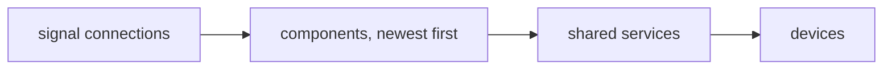

# The experimental container

!!! warning "Not a stable API"

    Everything on this page lives in `redsun.experimental`. It has no stability
    guarantee, it exists to be tried out, and it may change or be withdrawn.
    The supported container is [`AppContainer`][redsun.AppContainer], described
    in [Container architecture](container-architecture.md).

`redsun.experimental` is a second version of the container, built on
[dishka](https://dishka.readthedocs.io/) instead of `dependency-injector`.

The parts you already know stay the same: devices, presenters and views, the
virtual container, signals and slots, and the YAML session file. What changes is
**how a component says what it needs, and how it gets it**.

In one sentence: a component asks for what it needs in its `__init__`, and the
container works out who to build first.

## Where this stands

The rest of this page is the reasoning. This section is the inventory.

**What you can import today**, all from `redsun.experimental`:

| | |
| --- | --- |
| Assembling | `AppContainer`, `Frontend` |
| Declaring | `AsDevice`, `AsPresenter`, `AsView`, `Declare`, `FromConfig`, `Alias` |
| Placing a view | `Placement` (the concrete ones belong to a frontend) |
| Component shape | `PPresenter`, `PView` |
| Sharing | `provides` |
| Asking | `Requires`, `RequiresOne`, `RequiresMaybe`, `satisfies` |
| Session | `VirtualContainer`, `DeviceMapping`, `DocumentCallbacks`, `slot` |

The Qt frontend is `redsun.experimental.qt`: `QtAppContainer` to subclass,
`Qt` as the frontend itself, the placements it attaches (`Central`, `Dock`,
`MenuItem`, `ToolBarItem`), and `attach` to fill a window. It lives apart from
the rest so that nothing pulls in a toolkit unless it is used.

**When each thing is checked.** Nothing is deferred that could be settled
earlier:

| Moment | What is confirmed |
| --- | --- |
| Reading the declarations | A device subclasses `ophyd_async.core.Device`; a presenter or view leads with `name`; a view declares a `placement` and a presenter does not; the container's frontend attaches that placement |
| Before anything is built | Which component answers each `RequiresOne` or `RequiresMaybe`, from the declared classes; none or several is a failure that names the near misses; that no component depends on a layer built after its own |
| After the build | Every component against `PPresenter` or `PView`; a placement answered by a property rather than a class attribute; each chosen answer against the protocol it was chosen for |
| Attaching | The toolkit type the placement demands, which only the frontend knows |
| Reading a component | Its name does not shadow one the container answers itself, such as `devices` or `run` |

**What is not there yet:**

- The window `QtAppContainer` builds is a bare `QMainWindow`. Stable's
  `QtMainView` also carries a menu bar with "save configuration"; nothing here
  does.
- `redsun.experimental._wiring` is a copy of `redsun.virtual._wiring`. The two
  fold back together if this graduates.
- No decision recorded. This page is the whole of the rationale; no ADR revisits
  [ADR 3](decisions/0003-structural-subtyping-for-presenters-and-views.md) or
  [ADR 7](decisions/0007-typed-provider-keys.md) yet.
- No generated API reference. The names above are documented in their
  docstrings only.
- Nothing here has been used to port a real application.

## Writing a component

Say a motor presenter needs three things: the devices of the session, a
calibration value that something else in the session owns, and a step size the
user sets in the configuration file. It also has something of its own to share:
the readings it computes.

=== "Today"

    ```python
    class MotorPresenter:
        def __init__(self, name: str, devices: DeviceMap[Device]) -> None:
            self.name = name
            self.devices = devices
            self.step = 1.0

        def register_providers(self, container: VirtualContainer) -> None:
            container.provide(MOTOR_READINGS, self._readings)

        def inject_dependencies(self, container: VirtualContainer) -> None:
            self.calibration = container.require(CALIBRATION)
    ```

    The constructor takes only what the container hands every presenter. Everything
    else arrives later, in two methods the framework calls at fixed moments in the
    build. `CALIBRATION` and `MOTOR_READINGS` are keys you define and export
    somewhere, and both sides have to agree on them.

=== "Experimental"

    ```python
    class MotorPresenter:
        def __init__(
            self,
            name: str,
            /,
            devices: DeviceMapping,
            calibration: Calibration,
            step: float = 1.0,
        ) -> None:
            self.name = name
            self.devices = devices
            self.calibration = calibration
            self.step = step

        @provides
        def readings(self) -> MotorReadings:
            return MotorReadings(...)
    ```

    Everything the presenter needs is a parameter, and it is complete the moment
    it is constructed. `@provides` marks what it offers to others, named by the
    return type.

`register_providers` and `inject_dependencies` are gone, and so are the
`IsProvider` and `IsInjectable` protocols behind them.

### Where does each argument come from?

The container looks at your `__init__` and sorts the parameters out for you:

- `name` is always the component's name. The framework fills it in.
- Anything the **session file** or an inline `Declare(...)` mentions is taken
  from there. That is where `step` comes from.
- Everything else is looked up **by type**. `DeviceMapping` and `Calibration`
  are found because something in the session provides them.
- A parameter with a **default** is optional. If nothing provides it and no
  configuration mentions it, your default is used.

So `step: float = 1.0` works whether or not it appears in the YAML file, and you
never write code to reconcile the two.

## Assembling an application

=== "Today"

    ```python
    class MyApp(QtAppContainer):
        motor = declare_device(MyStage, axis=["X", "Y"])
        motor_ctrl = declare_presenter(MotorPresenter)
        motor_widget = declare_view(MotorView, step_size=5.0)
    ```

=== "Experimental"

    ```python
    class MyApp(QtAppContainer):
        __slots__ = ()

        config = "session.yaml"

        motor: AsDevice[MyStage]
        motor_ctrl: AsPresenter[MotorPresenter]
        motor_widget: Annotated[AsView[MotorView], Declare(step_size=5.0)]

        def wire(self) -> None:
            self.connect(self.motor_ctrl.sig_moved, self.motor_widget.refresh)
    ```

The component list is now the class annotations. There is no `declare_*` call:
the name on the left is the component's name and its key in the session file,
and the annotation on the right says which layer it belongs to and which class
to build.

`self.motor_ctrl` is a `MotorPresenter` to your editor and to mypy. `AsPresenter`
wraps the type without replacing it, so the attribute stays typed as what it
holds.

### The layer is stated, not guessed

One of `AsDevice`, `AsPresenter` or `AsView` is required. It is what tells the
container that an annotation is a component at all, so a container class can hold
ordinary attributes next to its components:

```python
class MyApp(QtAppContainer):
    threshold: float  # just an attribute
    motor_ctrl: AsPresenter[MotorPresenter]  # a component
```

And it is checked. A device has to be an `ophyd_async.core.Device` and a
presenter or view has to take `name` first, so a mistake is reported where you
made it rather than turning into a component of the wrong layer:

```text
TypeError: MyApp.motor is declared as a presenter, but MyStage is an
'ophyd_async.core.Device'; declare it with 'AsDevice'
```

This is what keeps devices buildable first. They are plain ophyd-async objects
that depend on no other layer, so they are constructed before the graph runs,
and the container knows which ones they are because you said so.

Components that appear only in the session file need no marker: the section they
sit under (`devices:`, `presenters:`, `views:`) is their layer, and it is checked
the same way.

### The toolkit is a base class

A container says which toolkit it is built against by subclassing, the way
`QtAppContainer` does today:

```python
from redsun.experimental.qt import QtAppContainer


class MyApp(QtAppContainer):
    image: AsView[ImageView]
```

`AppContainer.frontend` is a plain class attribute, so the frontend a container
uses is inherited like anything else, and importing `QtAppContainer` is what
requires the Qt bindings. `AppContainer` on its own names no toolkit: it builds
and it accepts any placement, which is what a headless test wants.

The split follows: the base container builds the components, and the toolkit
one arranges them. `QtAppContainer.__init__` puts a `QApplication`, the async
backend and an empty `QMainWindow` in place, because a widget cannot be built
before any of them exist; `build` calls `super().build()` and then attaches the
views to that window; `run` shows it and hands over to the event loop;
`shutdown` tears the async backend down after the components.

```python
class MyApp(QtAppContainer):
    image: AsView[ImageView]


MyApp().run()
```

`build()` alone is enough for a test: it leaves you a fully assembled
`main_window` without showing it or starting the loop.

### A session with no class at all

Everything above needs a class to hang the annotations on. A session that names
every one of its components in the file has nothing left to hang, so
`from_config` builds the container for it:

```python
from redsun.experimental import AppContainer

app = AppContainer.from_config("session.yaml").build()
```

The components come from the file's sections and the `frontend:` key picks the
container to build on, so this session comes up on `QtAppContainer` without ever
importing it:

```yaml
session: my-session
frontend: pyqt

devices:
  stage:
    plugin_name: my-plugin
    plugin_id: my-stage
```

A file naming no frontend builds on the container it was called on, which for a
plain `AppContainer` is the headless one.

What comes back is unbuilt, so whatever the file cannot say is still said in
Python before `build` runs. Calling it on a class of your own is the other half
of that: the class keeps its annotations, its `wire`, and its toolkit, and the
file fills in the rest.

```python
class MyApp(QtAppContainer):
    motor_ctrl: AsPresenter[MotorPresenter]
    motor_widget: Annotated[AsView[MotorView], Declare(step_size=5.0)]

    def wire(self) -> None:
        self.connect(self.motor_ctrl.sig_moved, self.motor_widget.refresh)


MyApp.from_config("session.yaml").run()
```

A file naming a frontend that class is not built against is refused rather than
quietly ignored.

### Layers are the one direction a dependency may not cross

Devices are built, then presenters, then views. A component may ask for
anything from its own layer or an earlier one, and nothing from a later one,
because satisfying that would mean building the later one first.

Two views sharing is the interesting case, and it is allowed. One owns the
value and shares it; the other asks for it by type:

```python
class ImageView(QWidget):
    placement = Central()

    def __init__(self, name: str, /) -> None:
        super().__init__()
        self._viewer = ViewerModel()

    @provides
    def viewer(self) -> ViewerModel:
        return self._viewer


class ROIView(QWidget):
    placement = Dock("right")

    def __init__(self, name: str, /, viewer: ViewerModel) -> None:
        super().__init__()
        self._viewer = viewer
```

`ImageView` is built first because `ROIView` asks for what it shares, not
because of anything written down. Nothing has to be published in one pass and
resolved in another, and if no component shares a `ViewerModel` the build fails
naming `ROIView` and the type before either widget is constructed.

The other direction is refused, whether the presenter names the view's class or
a type only the view shares:

```text
TypeError: 'watcher' is a presenter and its 'display' parameter asks for
'display', which is a view. A presenter is built before a view, so it cannot
depend on one; share the value the other way, or move what they both need into
an earlier layer.
```

A view asking for a presenter is the allowed direction and needs nothing
special. `Requires[P]` is not a dependency at all: it is a live view of the
session, read after everything exists, so it crosses layers freely.

### A view says where it attaches

A view is not "a widget". It is a component the frontend knows how to attach to
the main window, and it says where by declaring a placement:

```python
from redsun.experimental import Placement
from redsun.experimental.qt import Central, Dock, MenuItem


class MotorView(QWidget):
    placement: Placement = Dock("left")


class ImageView(QWidget):
    placement: Placement = Central()


class SaveAction(QAction):
    placement: Placement = MenuItem("File")
```

The core defines `Placement` and nothing else. A dock, a menu bar and a toolbar
are window concepts, so they belong to the frontend that has a window:
`redsun.experimental.qt` defines them next to the code that attaches them, and
pairs each with the toolkit type it demands, a `QWidget` for a dock or the
centre and a `QAction` for a menu or toolbar entry.

That keeps the vocabulary open. A frontend for something other than a desktop
window defines placements of its own in its own package, and the core learns
nothing:

```python
@dataclass(frozen=True)
class Route(Placement):
    path: str


class Web(Frontend):
    placements = frozenset({Route})
```

It also means frontend-specific detail is not a leak. A dock that starts
floating is a field on a Qt class, which is where Qt is allowed to be.

This is also the whole of the difference between the two component layers. A
view declares a placement; a presenter does not:

```text
TypeError: MyApp.motor_ctrl is declared as a view, but MotorPresenter declares
no 'placement'. A view says where it attaches; a component that attaches
nowhere is a presenter.
```

Because the placement is a value on the class, an application can be refused
before it builds anything:

```text
TypeError: MyApp.stray asks to be attached as 'Route', which Qt does not
attach. It attaches: Central, Dock, MenuItem, ToolBarItem.
```

A view that answers `placement` from a property instead is still legal, and is
checked once it exists, because only the instance can answer then.

Attaching is a separate step, so a container never touches a window:

```python
from qtpy.QtWidgets import QMainWindow
from redsun.experimental.qt import attach

app = MyApp().build()
window = QMainWindow()
attach(window, dict(app.views))
window.show()
```

When the plain name is not enough, `Annotated` carries the extras:

| Marker | What it does |
| --- | --- |
| `Declare(step=5.0)` | Constructor arguments written inline, winning over the file |
| `FromConfig("stage_x")` | Read the configuration from a different key |
| `Alias("stage_x")` | Register under a different name |

A container class does not have to list anything at all. Components named in the
session file are built whether or not the class mentions them. Writing an
annotation is how you get a typed attribute to reach one by, not how you make it
exist.

## Sharing something with other components

=== "Today"

    ```python
    # in some shared module
    MOTOR_READINGS = ProviderKey(instance_of=MotorReadings)


    # producer
    def register_providers(self, container):
        container.provide(MOTOR_READINGS, self._readings)


    # consumer
    def inject_dependencies(self, container):
        self.readings = container.require(MOTOR_READINGS)
    ```

=== "Experimental"

    ```python
    # producer
    @provides
    def readings(self) -> MotorReadings:
        return MotorReadings(...)


    # consumer
    def __init__(self, name: str, /, readings: MotorReadings) -> None:
        self.readings = readings
    ```

The type is the key, so there is no separate key object to define, export and
import on both sides. The container builds the producer before the consumer
because it can see that the consumer needs what the producer offers.

## Optional collaborators

Sometimes a view can use something if the session happens to include it, and
should carry on if it does not.

=== "Today"

    ```python
    def inject_dependencies(self, container):
        self.overlay = container.try_require(OVERLAY)
    ```

=== "Experimental"

    ```python
    def __init__(self, name: str, /, overlay: Overlay | None = None) -> None:
        self.overlay = overlay
    ```

`Overlay | None` means exactly what it says. If some component in the session
provides `Overlay`, you get it. If none does, you get `None`. There is no second
API for the optional case and no way to write the required one by mistake.

## Cleaning up

=== "Today"

    ```python
    class MotorPresenter:
        def shutdown(self) -> None:
            self._task.cancel()
    ```

    The container sweeps presenters implementing `HasShutdown` at the end, and
    separately undoes signal connections.

=== "Experimental"

    ```python
    class MotorPresenter:
        def shutdown(self) -> None:
            self._task.cancel()
    ```

    Identical, but it is now the only thing you write, and it works for devices
    too, sync or async.

Behind the scenes there is one teardown path instead of two. The virtual
container undoes everything, in this order:



Signal connections go first, so nothing is delivered to a component that is
already shutting down. Components go in the reverse of the order they were
built, so a component is never torn down while something that was built from it
is still alive.

## Two components of the same class

Two motor stages, or two copies of a plot widget, are normal. Each declaration
gets its own identity, so `stage_x` and `stage_y` never get confused even though
both are `MyStage`.

```python
class MyApp(QtAppContainer):
    stage_x: Annotated[AsDevice[MyStage], Alias("stage_x")]
    stage_y: Annotated[AsDevice[MyStage], Alias("stage_y")]
```

When a class appears exactly once in the session, you can also ask for it by
writing the class name in a constructor. When it appears twice, you cannot,
because the request would be ambiguous. The container tells you so in the log
rather than picking one.

## The one new idea: a registry that fills as it goes

Document callbacks are collected while the application is built. Each component
that has one registers it as it comes up. So a component that wants to see *all*
of them has a problem: at the moment it is constructed, the components after it
have not registered anything yet.

The answer is that `DocumentCallbacks` is a **live view**, not a copy. You hold
on to it and read it later, when the application is running:

```python
class AcquisitionPresenter:
    def __init__(self, name: str, /, callbacks: DocumentCallbacks) -> None:
        self.name = name
        self.callbacks = callbacks  # keep the view

    def run(self) -> None:
        for callback in self.callbacks.values():  # read it when you need it
            ...
```

Reading it too early raises, rather than quietly handing you half a registry:

```python
def __init__(self, name: str, /, callbacks: DocumentCallbacks) -> None:
    self.copy = dict(callbacks)  # LookupError
```

```text
LookupError: the document-callback registry is not complete until every
component exists. Hold this view and read it when the component runs, rather
than copying it while it is built.
```

This is the only place where the new container asks you to understand something
the old one did not, which is why it fails loudly.

## Asking the session a question

Everything so far is a component saying "give me this thing". Sometimes what you
want is not a thing but an answer: *which components in this session can be
reset?* You cannot write that as a type, because the answer depends on what the
user put in the session file.

`Requires[P]` asks that question. `P` is a protocol describing the capability,
and you get back every component that has it, by name.

=== "Today"

    ```python
    class SessionPresenter:
        def inject_dependencies(self, container: VirtualContainer) -> None:
            # there is no way to ask, so you name them
            self.resettable = [
                container.motor_ctrl,
                container.detector_ctrl,
            ]
    ```

    The list is written by hand and goes stale the moment the session changes.

=== "Experimental"

    ```python
    @runtime_checkable
    class Resettable(Protocol):
        def reset(self) -> None: ...


    class SessionPresenter:
        def __init__(self, name: str, /, resettable: Requires[Resettable]) -> None:
            self._resettable = resettable

        @slot
        def reset_all(self) -> None:
            for component in self._resettable.values():
                component.reset()
    ```

    Whatever the session contains, the answer matches it.

`Requires[Resettable]` is short for
`Annotated[Mapping[str, Resettable], Every()]`, so what you receive is an
ordinary mapping of names to components. Your editor knows it, `for name, comp
in ...items()` works, and you need no framework API to read it.

The answer is the same live view idea as the callback registry. It cannot be
complete until every component exists, so you hold it and read it when your
component runs.

### Components that answer their own question

The most useful shape is a group of components that all offer the same
capability and all want to know about each other. Three image widgets, each able
to link its camera to another one:

```python
@runtime_checkable
class Linkable(Protocol):
    name: str

    def apply_camera(self, zoom: float) -> None: ...


class ImageView:
    def __init__(self, name: str, /, peers: Requires[Linkable]) -> None:
        self.name = name
        self.peers = peers
        self.linked_to: str | None = None

    def link_targets(self) -> list[str]:
        """Return what this widget's 'link to...' menu offers."""
        return sorted(name for name in self.peers if name != self.name)
```

```python
class MyApp(QtAppContainer):
    left: Annotated[AsView[ImageView], Alias("left")]
    middle: Annotated[AsView[ImageView], Alias("middle")]
    right: Annotated[AsView[ImageView], Alias("right")]
```

`left` offers `middle` and `right`, `right` offers `left` and `middle`, and
nobody wrote a list.

### Four things that can go wrong

**You read the answer too early.** The most likely mistake, so it is the one the
container refuses outright:

```python
def __init__(self, name: str, /, resettable: Requires[Resettable]) -> None:
    self.names = list(resettable)  # LookupError
```

```text
LookupError: the components satisfying 'Resettable' are not known until every
component exists. Hold this view and read it when the component runs, rather
than copying it while it is built.
```

Keep the view, read it later.

**The answer includes you.** If your component has the capability it is asking
about, it is in its own answer:

```python
class Bookkeeper:
    def reset(self) -> None:  # kept for its own bookkeeping
        self.counter = 0

    def reset_all(self) -> None:
        for component in self._resettable.values():
            component.reset()  # resets itself too
```

This is on purpose. The answer describes the session, not the component asking,
so everyone gets the same one. Only you know whether leaving yourself out makes
sense, and when it does it is one line:

```python
others = {n: c for n, c in self._resettable.items() if n != self.name}
```

**A component joins the answer by accident.** Membership is decided by what a
component *has*, not by what it declares. A class with a `reset` method it wrote
for itself is `Resettable` whether it meant to be or not. If you do not want to
be in the answer, do not have the method, or give your own version a different
name.

**The names match but the calls do not.** Having a method called `reset` is not
the same as having one the protocol can call:

```python
class Loose:
    def reset(self, hard: bool) -> None:  # needs an argument nobody passes
        ...
```

This is not a match, and the container will tell you why if you ask:

```python
>>> "loose" in session.resettable
False
>>> session.resettable.rejected
{'loose': ["reset(hard) cannot be called as reset(): missing a required argument: 'hard'"]}
```

The rule is that an implementation must accept every call the protocol permits.
An extra parameter *with* a default is fine, because the protocol's calls still
work. Renaming a parameter is not, because a keyword call would fail. Types are
not compared; that is what a type checker is for, and it does it at the call
site where it can see both sides.

`rejected` only lists components carrying some of the protocol's members, so a
near miss is not buried under every component that was never a candidate.

### The same question, asked of the devices

`Requires[P]` answers over the presenters and views, never the devices. Asking
which *devices* can do something is a separate question, and `DevicesOf[P]`
asks it:

=== "Today"

    ```python
    class MotorPresenter:
        def __init__(self, name: str, devices: DeviceMap[Device]) -> None:
            self.motors = {
                name: device
                for name, device in devices.items()
                if isinstance(device, MotorProtocol)
            }
    ```

    Every presenter that cares about one kind of device writes this loop.

=== "Experimental"

    ```python
    class MotorPresenter:
        def __init__(self, name: str, /, motors: DevicesOf[MotorProtocol]) -> None:
            self.motors = motors
    ```

The two censuses look alike and behave differently in one way that matters.
Devices are built before anything else, so this one is *not* a live view: it
arrives complete and you may read it in `__init__`, which is exactly where the
loop it replaces used to run.

Ask for `DeviceMapping` when you want every device rather than a kind of them.

## Asking for one component

A census answers "which components can do this?". Much more often the question
is "which component does this?", and that is a different thing: you want the
component itself, not a mapping you have to pick through.

=== "Every one of them"

    ```python
    class RoiWidget:
        def __init__(self, name: str, /, cameras: Requires[HasCamera]) -> None:
            self._cameras = cameras
            # and now what? there should be one, but nothing says so
    ```

=== "Exactly one"

    ```python
    class RoiWidget:
        def __init__(self, name: str, /, camera: RequiresOne[HasCamera]) -> None:
            self._camera = camera  # the component itself, already built
    ```

`RequiresOne` is not a live view. It is an ordinary dependency: whoever answers
is built first, and your component receives it. Everything the container does
for a normal parameter, it does for this one.

That works because the container settles who answers *before* it builds
anything, by reading the declared classes. Two consequences follow, and both are
useful:

**A session that cannot answer does not start.** No guessing, no empty mapping
to check for:

```text
TypeError: 'roi' requires exactly one component satisfying 'HasCamera', and the
session holds none.
  'camera': apply_camera(factor) cannot be called as apply_camera(zoom):
  missing a required argument: 'factor'
```

That second line is the payoff of comparing signatures. The session *does* hold
something close, and it says which one and what is wrong with it, rather than
reporting an absence and leaving you to find the typo.

Too many answers is an error too, because the parameter has room for one:

```text
TypeError: 'roi' requires exactly one component satisfying 'HasCamera', but 2
do: 'camera' and 'spare'. Narrow the protocol, or ask with
'Requires[HasCamera]' for all of them.
```

**A component cannot answer its own question.** With a census that is fine, and
sometimes the point. Here it would mean depending on yourself, so it is refused
with an explanation rather than reported as a dependency cycle.

Use `RequiresMaybe` when doing without is a real option:

```python
def __init__(self, name: str, /, roi: RequiresMaybe[HasRoi] = None) -> None:
    self._roi = roi  # None if the session has no ROI component
```

An empty session answers `None`. Two answers is still an error.

### The one limitation

Deciding early means the container sees classes, not objects, and a value
assigned in `__init__` does not exist on a class:

```python
@runtime_checkable
class Countable(Protocol):
    count: int  # invisible before the component is built

    def bump(self) -> None: ...  # visible on the class
```

So the choice is made on the methods, and the rest is confirmed once the
component exists:

```text
TypeError: 'counter' was chosen as the one component satisfying 'Countable',
but does not: 'count' is missing
```

Two rules follow. A protocol used with `RequiresOne` or `RequiresMaybe` must
declare at least one method, or there is nothing to choose on:

```text
TypeError: 'DataOnly' declares no method, so which component answers cannot be
decided before they are built. Ask with 'Requires[DataOnly]', which is answered
afterwards.
```

And methods are what should carry a capability anyway. `HasCamera` is a good
protocol because `apply_camera` says what a component *does*; a protocol that is
only fields describes a value, and a value is better asked for directly.

### When not to use any of it

If you want one specific value rather than one component, ask for the value.
These three are for finding components by what they can do.

If components only need to be told when something happens, a signal is simpler:
connect them in `wire` and skip the question entirely.

## Side by side

| | Today | Experimental |
| --- | --- | --- |
| Declaring a component | `declare_presenter(Cls, ...)` | `name: AsPresenter[Cls]` |
| Asking for something | `container.require(KEY)` in a method | a constructor parameter |
| Sharing something | `container.provide(KEY, value)` in a method | `@provides` on a method |
| Optional collaborator | `container.try_require(KEY)` | `X \| None = None` |
| Every component that can do X | a list written by hand | `Requires[P]` |
| Every device that can do X | an `isinstance` loop in `__init__` | `DevicesOf[P]` |
| The one component that can do X | a key, agreed between both plugins | `RequiresOne[P]` |
| Identity of a value | a key object you define and export | the type itself |
| Two of one class | attribute name, agreed by convention | one key per declaration |
| Missing dependency | `KeyError` inside the consumer | build fails, naming the type and who wanted it |
| Where a view goes | `view_position`, a Qt dock area | `placement`, an intent the frontend attaches |
| What a view must be | a `QWidget`, in practice | whatever its placement demands |
| Cleanup | `HasShutdown` sweep, plus disconnect | one teardown path |
| A session built from a file | `AppContainer.from_config(path)` | the same, and it keeps the class's own declarations |
| Protocols to implement | `IsProvider`, `IsInjectable`, `HasShutdown` | none; `PPresenter` and `PView` are satisfied structurally |

## What gets easier

**You write a dependency once.** Today it appears three times: as a key, as a
`require` call, and as an attribute assigned in a method far from the
constructor. Your editor cannot connect them. Now the constructor is the whole
story.

**There is no framework method to implement.** `register_providers` and
`inject_dependencies` exist so the framework can call you back at two exact
moments during the build. Those moments were only there because the build order
was fixed by hand.

**A missing dependency is caught before anything is built, and it names names.**

```text
Cannot find factory for (Calibration, component=''). It is missing or has invalid scope.
   ▼   redsun.experimental._declarations.motor_ctrl   build_motor_ctrl
   ╰─> Calibration                                    ???
```

Today the same mistake is a `KeyError` raised inside `inject_dependencies`,
which points at the component that asked rather than at the one that should have
provided.

**A component is testable on its own.** Its constructor takes plain values, so a
test builds it directly:

```python
def test_readings() -> None:
    ctrl = MotorPresenter("ctrl", devices={"x": stage}, calibration=Calibration(1.0))
    assert ctrl.readings() == {...}
```

Today you have to build a virtual container first and prime it so that
`inject_dependencies` finds what it is looking for.

**A plugin can ship shared services, not just components.** A bundle can include
its own dishka provider in its manifest, so a value that is not a component can
still be offered to the session:

```python
from dishka import Provider, Scope, provide


class MyServices(Provider):
    scope = Scope.APP

    @provide
    def calibration(self, config: SessionConfig) -> Calibration:
        return Calibration(...)
```

The scope is dishka's own `Scope.APP`, not one of ours, so a provider already
written for another dishka application drops in unchanged. An application has
one stage, so nothing here enters a narrower scope; a provider declared at one
that is never entered fails when the container is created, naming the component
it cannot build.

## What you give up

### Handing something over at any time, from anywhere

Today the virtual container accepts a value from anyone holding it, at any point
in the program's life.

=== "Today"

    ```python
    # any code at all, at any moment
    container.provide(OVERLAY, overlay)

    # much later, some other code
    overlay = container.try_require(OVERLAY)
    ```

=== "Experimental"

    ```python
    # no equivalent
    ```

A value can enter in exactly three ways, and all of them happen before the
application is running: it is a component, it is a `@provides` method on a
component, or it comes from a `Provider` registered before the build.

If something genuinely fills up over time, it has to be designed as a live view,
the way `DocumentCallbacks` is. That works, but it is a decision you make per
case, not something you get for free.

### Deciding at runtime whether to provide something

=== "Today"

    ```python
    def register_providers(self, container):
        if self.camera.has_roi:
            container.provide(ROI, self._roi)
    ```

    A consumer's `try_require(ROI)` then returns `None` on cameras without one.

=== "Experimental"

    ```python
    @provides
    def roi(self) -> Roi | None:  # does NOT do what you want
        return self._roi if self.camera.has_roi else None
    ```

    A consumer asking for `Roi | None` gets `None`, even on a camera that has one.

This one is a genuine trap, so it is worth being precise. The container decides
what exists by looking at **types**, before anything is built. A method that
returns `Roi | None` is registered as a provider of `Roi | None`, not of `Roi`,
so the consumer's optional lookup never sees it.

What works is to make the value always exist and let the *value* carry the
absence:

```python
@provides
def roi(self) -> Roi:
    return self._roi if self.camera.has_roi else Roi.empty()
```

Optionality is now about whether a **component** is in the session, not about
what a component decides while it runs.

### Two components offering the same type

=== "Today"

    ```python
    # both are fine; the second one wins, silently
    container.provide(READINGS, self._a)
    container.provide(READINGS, self._b)
    ```

=== "Experimental"

    ```text
    TypeError: 'plot_b' and 'plot_a' both share 'Readings'.
    A shared type identifies one value; give them distinct types.
    ```

The failure is better than the silent overwrite, but the constraint is real:
naming a shared type is now a design decision. Two components that genuinely
produce the same kind of value need two types, which is more thought than
picking two strings.

### Hiding imports behind `TYPE_CHECKING`

This is the sharpest new rule, and it works against habit and against the ruff
`TC` rules, which push imports the other way.

=== "Usual practice"

    ```python
    if TYPE_CHECKING:
        from my_bundle.keys import Calibration


    class MotorPresenter:
        def __init__(self, name: str, /, calibration: Calibration) -> None: ...
    ```

=== "Required here"

    ```python
    from my_bundle.keys import Calibration


    class MotorPresenter:
        def __init__(self, name: str, /, calibration: Calibration) -> None: ...
    ```

The container reads your annotations at run time to know what to hand you, so a
name that exists only for the type checker is not there when it looks. The
failure explains itself:

```text
TypeError: cannot read the constructor of MotorPresenter: 'Calibration' is not
available at runtime. A type a component is injected by must be imported outside
'if TYPE_CHECKING', because the graph evaluates the annotation.
```

The rule applies to constructor parameters of components, to the return type of
a `@provides` method, and to the container class body. It does not apply to
anything else you write.

### The constructor shape of a presenter

Today a presenter is checked twice: its constructor must lead with
`(name, devices)` when you declare it, and the built instance must satisfy
`PPresenter`. The first half is gone. Devices are now an ordinary injected
dependency, so a presenter that talks to none never asks for the mapping, and
there is no fixed constructor shape left to check beyond `name`.

The dual gate itself survives, and the view half of it is stronger than before:
a view is refused at declaration time for a placement its frontend cannot
attach, where today `view_position` is only read once the window is built.
`PPresenter` correspondingly loses `devices` and keeps `name`, which is all the
framework ever reads.

So the layers are no longer symmetric. A view is defined by something the
frontend can see and act on; a presenter is what is left over. That is the trade
[ADR 3](decisions/0003-structural-subtyping-for-presenters-and-views.md) makes
in the other direction, and it is deliberate.

### The typed-key API

`ProviderKey`, `container.provide`, `container.require` and
`container.try_require`, introduced in
[ADR 7](decisions/0007-typed-provider-keys.md), have no counterpart. They are
replaced by constructor parameters rather than reimplemented, so a component
using them has to be rewritten rather than adapted.

## Still undecided

- Whether `Requires` should offer a way to leave the asking component out,
  rather than every peer writing the same one-line filter.
- Whether a component should be able to *declare* which capabilities it offers,
  instead of being matched on shape alone. Matching on shape is what lets a
  plugin answer a question it has never heard of, and it is also what lets one
  answer by accident. A declaration would settle intent, at the cost of the
  answering plugin having to import the protocol.
- Whether the callback registry should become a `Requires` question rather than
  a mechanism of its own. It nearly fits: a component can register callbacks
  that are not itself, and a question can only find components.
- Whether `@provides` should be able to offer a value built from another
  component's shared value.
- What a presenter tied to a particular kind of device should look like. It is
  deliberately out of scope for now, and nothing here rules it out.
