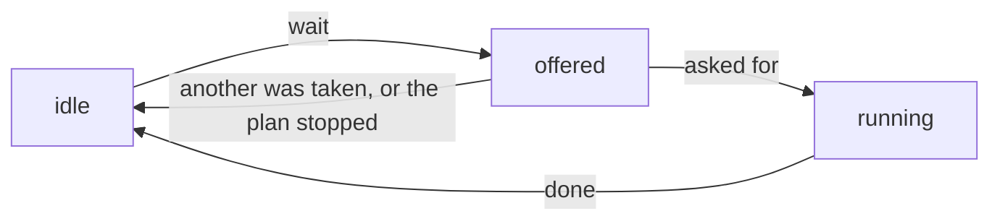

# How presenters run plans

`redsun` builds on the [Bluesky plan system](https://blueskyproject.io/bluesky/main/plans.html).
A *plan* is a generator yielding `Msg` objects, which the `RunEngine` turns
into hardware calls.

`redsun` adds two things:

- **`continuous` plans** run in a loop until stopped, optionally pausable, and
  accept user actions while running.
- **`PlanSpec`** describes a plan's signature, from which the view layer builds
  a parameter form.

---

## Continuous plans

Mark a plan as continuous with the `@continuous` decorator:

```python
from redsun.engine.actions import PlanAction, continuous
from bluesky.utils import MsgGenerator


@continuous(pausable=True)
def live_scan(detectors: Sequence[DetectorProtocol]) -> MsgGenerator[None]:
    while True:
        yield from bps.trigger_and_read(detectors)
```

A continuous plan always gets a toggle to start and stop it. With
`pausable=True` it also gets a button to pause and resume it.

The decorator stores one attribute on the function, `__continuous__`, holding
a `Continuous(pausable=True)`. `create_plan_spec` reads it to set
`PlanSpec.continuous` and `PlanSpec.pausable`, from which the view builds the
two buttons.

### In-flight actions

An action is something the user triggers while the plan runs. Two classes
describe it:

- `PlanAction` declares it: its name, its description and the labels of its
  button.
- `ActionManager` keeps the state of each action while a plan runs.

A `PlanAction` is a frozen dataclass and holds no latch. A plan names it as the
default of a parameter, and `create_plan_spec` reads it there to make the
button. Whoever owns the plans owns an `ActionManager`, and the plans wait on it:

```python
import bluesky.plan_stubs as bps
from bluesky.utils import MsgGenerator

from redsun.engine import RunEngine
from redsun.engine.actions import PlanAction, ActionManager, continuous

SNAP = PlanAction(name="snap", description="Take one frame")


class MyController:
    def __init__(self, name: str) -> None:
        self.name = name
        self.engine = RunEngine()
        self.actions = ActionManager()

    @continuous
    def live(
        self, camera: CameraProtocol, snap: PlanAction = SNAP
    ) -> MsgGenerator[None]:
        yield from bps.open_run()
        while True:
            name = yield from self.actions.wait(snap)
            yield from bps.trigger_and_read([camera])
            self.actions.done(name)
```

`wait` offers the actions it is given, waits until one is asked for, and
returns the name of the one asked for first. That action runs until the plan
calls `done`. The others go back to idle, as all of them do when the plan is
stopped while it waits. Called with no action, `wait` raises `ValueError`.

Each call to `wait` makes new latches for the actions it offers. A request
left from an earlier launch of the plan cannot start an action of this one.

`wait` does not time out, and yields a checkpoint every `poll_interval`
seconds while it waits, as the [stub it uses](#action-flow-control-stubs)
does.

The user asks for an action through `request`, a [slot](../reference/glossary.md#slot)
that is safe to call from any thread and raises nothing. Asking for an action
no plan offers changes nothing and is logged as a warning. So is asking an
action that is not running to end.

The `RunEngine` has no code for actions. It receives the latches `wait` made
and waits on them.

`create_plan_spec` refuses a plan declaring two actions of one name, with
`ValueError`: the name is what tells the actions of a plan apart.

### Toggle actions

An action with `toggle_states` gets a button that stays pressed until it is
released. The first label shows while the button is released, the second
while it is pressed. With `toggle_states=None`, the default, the button is
clicked.

```python
RECORD = PlanAction(name="record", toggle_states=("Start", "Stop"))


@continuous
def live(
    self, snap: PlanAction = SNAP, record: PlanAction = RECORD
) -> MsgGenerator[None]:
    while True:
        name = yield from self.actions.wait(snap, record)
        if name == record.name:
            yield from self.actions.wait_released(record)
        self.actions.done(name)
```

`live` is a method of `MyController`, as above.

Pressing the button asks for the action, and releasing it asks the action to
end, with `request(name, on=False)`. `wait_released` waits for that. It
raises `ValueError` for an action that is not running.

### Following an action from a view

An action is in one of three states, and `ActionManager.sig_changed` reports
each change with the name of the action and its new `ActionState`. A view
connected to it sets each button from the state reported:

| State | Meaning | What the view does |
|-------|---------|--------------------|
| `idle` | no plan waits for it and none runs it | disables the button, and shows a toggle button released |
| `offered` | a plan waits for it | enables the button |
| `running` | the plan took it, and has not finished it | disables a button that is clicked; a toggle button stays enabled, so the user can release it |



Only the plan changes a state, so the changes arrive in the order they
happened. A request changes none: the view that made it learns what came of
it from the next state.

The view asks with a signal carrying the name and whether the button is
pressed, and follows the answer in a slot:

```python
from psygnal import Signal

from redsun import slot
from redsun.engine.actions import ActionState


class MyView(QWidget):
    sig_action_request = Signal(str, bool)

    def ask(self, name: str) -> None:
        self.sig_action_request.emit(name, True)

    def ask_or_release(self, checked: bool, name: str) -> None:
        self.sig_action_request.emit(name, checked)

    @slot
    def on_action_changed(self, name: str, state: str) -> None:
        button = self.widget.action_buttons[name]
        match state:
            case ActionState.IDLE:
                button.setEnabled(False)
                button.release()
            case ActionState.OFFERED:
                button.setEnabled(True)
            case ActionState.RUNNING:
                button.setEnabled(button.isCheckable())
```

`ask` and `ask_or_release` are the `action_clicked_callback` and
`action_toggled_callback` of the [plan widget](qt-widgets.md#plan-widgets),
here `self.widget`. `release` shows a button released without emitting
`toggled`, which unchecking it would: the view would then ask an action that
already ended to end.

The session links the two components in `wire`:

```python
class MyApp(QtSession):
    ctrl: AsPresenter[MyController]
    panel: AsView[MyView]

    def wire(self) -> Iterator[Link]:
        yield self.panel.sig_action_request, self.ctrl.actions.request
        yield self.ctrl.actions.sig_changed, self.panel.on_action_changed
```

The `wiring` section of a session file cannot make these links. A path there
is `component.port`, and the ports of a component do not include those of an
object it holds.

The session records an `ActionManager` under the name of the component holding it,
so the two links are recorded as `panel.sig_action_request -> ctrl.request`
and `ctrl.sig_changed -> panel.on_action_changed`. See
[Inspect what is connected](../how-to/wire-components.md#inspect-what-is-connected).

### SRLatch

`ActionManager` makes one `SRLatch` for each action it offers, and waits on it. A
latch is set and reset from any thread, and a coroutine waits for either
state on whatever loop it runs:

```python
latch = SRLatch()

# in a coroutine:
await latch.wait_for_set()  # blocks until set()
await latch.wait_for_reset()  # blocks until reset()
```

`latch.changed_at` is when the latch last changed state, as `time.monotonic`
reads it, and `0.0` for a latch that never changed.

For a `wait_for_actions` message, the `RunEngine` runs one `wait_for_set` (or
`wait_for_reset`) task per latch, for `poll_interval` seconds at most. Of
several latches in the wanted state, it returns the one that reached that
state first. Of those that reached it together, it returns the first in the
map. If no latch is in the wanted state when the interval ends, the stub
yields its next checkpoint and sends the message again.

---

## Plan specification

`create_plan_spec` inspects a plan's signature and returns a `PlanSpec`:

```python
from redsun.presenter.plan_spec import create_plan_spec

spec = create_plan_spec(my_plan, devices={"stage": motor, "cam": camera})
```

Each parameter becomes a `ParamDescription` with:

| Field | Meaning |
|-------|---------|
| `annotation` | stripped type (no `Annotated` wrapper) |
| `choices` | string labels for `Literal` or device params |
| `multiselect` | True for `Sequence[...]` / `*args` device parameters |
| `device_proto` | the device class or runtime-checkable protocol for device params |
| `actions` | `PlanAction` metadata if the default is a `PlanAction` |

### Annotation dispatch

Annotations map to `ParamDescription` fields, first match wins:

1. `Literal["a", "b"]` -> `choices=["a", "b"]`
2. `Sequence[MyDevice]` -> multi-select, `choices=<matching device names>`
3. `*args: MyDevice` (VAR_POSITIONAL) -> multi-select
4. `MyDevice` (bare protocol) -> single-select
5. Everything else -> a plain value, left to the view layer to render

Step 5 accepts:

- `int`, `float`, `str`, `bool`, `bytes` and `range`
- `Path`
- `datetime`, `date`, `time` and `timedelta`
- any `Enum` subclass
- a sequence of anything that is not a device

A *required* parameter with any other annotation raises
`UnresolvableAnnotationError`, and the plan is skipped instead of shown with a
control nobody can fill in. `Any` is excluded on purpose: it would accept
everything and show as a bare text field.

The check is plain Python and imports no toolkit, so a plan can be inspected
before any application object exists. The view layer turns descriptions into
widgets; for Qt, see [Qt widgets - plans](qt-widgets.md).

### Collecting and resolving arguments

Once the user fills in the form, the presenter turns the values into a plan
call:

```python
from redsun.presenter.plan_spec import collect_arguments, resolve_arguments

# 1. Resolve: string device names -> live device instances
resolved = resolve_arguments(spec, widget_values, devices)

# 2. Collect: build (args, kwargs) matching the plan signature
args, kwargs = collect_arguments(spec, resolved)

# 3. Run
engine(my_plan(*args, **kwargs))
```

---

## Plan stubs

`redsun.engine.plan_stubs` holds stubs to use inside larger plans.

### Action flow-control stubs

`wait_for_actions` waits on a map of names to latches. `ActionManager.wait` and
`ActionManager.wait_released` use it, so a plan written against an `ActionManager` does
not call it.

```python
import redsun.engine.plan_stubs as rps
from redsun.engine.actions import SRLatch

latches = {"snap": SRLatch()}

# wait until a latch in the map is set, however long that takes,
# with a checkpoint every `poll_interval` seconds
name, latch = yield from rps.wait_for_actions(latches, poll_interval=0.016)
```

The stub does not time out. It waits as long as it takes for a latch to be
set, or reset with `wait_for="reset"`, and returns at once if one already is.
While it waits it yields a checkpoint every `poll_interval` seconds, 1/60 s by
default. A checkpoint is where the plan can be paused, so the stub cannot sit
between `create` and `save`. An empty map raises `ValueError`.

### Descriptor stubs

```python
import redsun.engine.plan_stubs as rps

# gather descriptors from Readable / Collectable devices inside a plan
descriptor = yield from rps.describe(readable)
descriptors = yield from rps.describe_collect(collectable)
```

### Lock stubs

A plan locks the devices it must not have disturbed, and views disable their
controls while those devices are locked. The run engine keeps the locks and
announces them on `RunEngine.sig_locks_changed`, which a view connects to.

```python
import redsun.engine.plan_stubs as rps

# lock the stage and camera while the inner plan runs, however it ends
yield from rps.lock_wrapper(scan(stage, camera), stage, camera)
```

---

## See also

- [`engine/actions` API](../reference/api/engine.md#actions)
- [`engine/plan_stubs` API](../reference/api/engine.md#plan-stubs)
- [`presenter/plan_spec` API](../reference/api/presenter.md#plan-specification)
- [Qt widgets - plans](qt-widgets.md)
