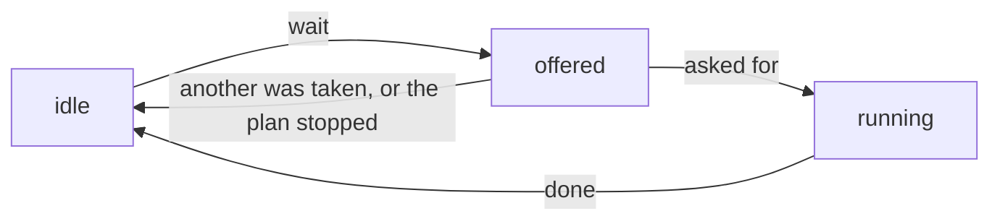

# How presenters run plans

A [plan](glossary.md#plan) is a recipe for an acquisition: a Python generator
that says, one step at a time, what to move, what to read and when. Plans come
from [`bluesky`](glossary.md#bluesky), and what its
[documentation on plans](https://blueskyproject.io/bluesky/main/plans.html)
says applies here too.

In `redsun` any [component](glossary.md#component) can offer plans, and one
[presenter](glossary.md#presenter) runs them. That presenter creates a
[`RunEngine`](glossary.md#runengine), which executes the plans, and starts one
when a view asks for it. The presenter names none of the components that
offer plans: it asks the session which ones do.

`redsun` adds three things to `bluesky`.

A `RunEngine` that does not block. The `RunEngine` of `bluesky` blocks the
thread that calls it until the plan has ended. Called from a window, that is
the main thread, and the window freezes. The one of `redsun` hands the plan to
a thread in the background and returns at once.

`PlanSpec`, a description of the parameters of a plan. It is read from the
signature of the plan and its type hints, and names no toolkit. A component
offers a plan once, and a view of any toolkit builds its controls from the
same description. For Qt, those controls are a
[plan widget](glossary.md#plan-widget).

Continuous plans, which run until they are stopped and take actions from the
user while they run. They let the user work with a plan that is running. A
live view that captures data when the user asks for it is one plan: it shows
frames until it is stopped, and records when the action comes.

---

## A plan that ends by itself

The simplest plan does its steps and stops. This one walks a stage forward,
and the component that holds it offers it to the session:

```python
from collections.abc import Mapping

import bluesky.plan_stubs as bps
from bluesky.utils import MsgGenerator

from redsun import PlanEntry


class StagePlans:
    def __init__(self, name: str) -> None:
        self.name = name

    def walk(
        self, stage: HasPosition, steps: int = 5, size: float = 1.0
    ) -> MsgGenerator[None]:
        for _ in range(steps):
            position = yield from bps.rd(stage.position)
            yield from bps.mv(stage.position, position + size)

    def plan_map(self) -> Mapping[str, PlanEntry]:
        return {"walk": {"plan": self.walk}}
```

`walk` is an ordinary `bluesky` plan: `bps.rd` reads the position, and `bps.mv`
moves the stage and waits for it to arrive. `HasPosition` is the protocol
written in
[Describing a device with a protocol](../tutorials/device-protocols.md), so
the plan works with any stage.

`plan_map` is how a component offers plans. It returns each plan under its
name, as a [`PlanEntry`][redsun.PlanEntry], and a component with that method
satisfies the protocol [`HasPlans`][redsun.HasPlans]. An entry may also list
the document callbacks the plan requires, under `callbacks`, and say under
`extendable` whether the user may attach more.

---

## Running the plans of a session

One presenter has the `RunEngine`. In `setup` it asks the session for every
component that offers plans, and keeps what they offer:

```python
from typing import Any

from psygnal import Signal

from redsun import DeviceMapping, HasPlans, slot
from redsun.engine import RunEngine
from redsun.presenter.plan_spec import (
    PlanSpec,
    collect_arguments,
    create_plan_spec,
    resolve_arguments,
)


class PlanPresenter:
    sig_finished = Signal()

    def __init__(self, name: str, *, devices: DeviceMapping) -> None:
        self.name = name
        self.devices = devices
        self.engine = RunEngine()
        self.plans: dict[str, PlanEntry] = {}
        self.specs: dict[str, PlanSpec] = {}

    def setup(self, providers: Mapping[str, HasPlans]) -> None:
        for component in providers.values():
            self.plans.update(component.plan_map())
        for plan, entry in self.plans.items():
            self.specs[plan] = create_plan_spec(entry["plan"], self.devices)

    @slot
    def run(self, plan: str, values: dict[str, Any]) -> None:
        resolved = resolve_arguments(self.specs[plan], values, self.devices)
        args, kwargs = collect_arguments(self.specs[plan], resolved)
        future = self.engine(self.plans[plan]["plan"](*args, **kwargs))
        future.add_done_callback(lambda _: self.sig_finished.emit())
```

`providers` is a question to the session, answered with every component that
satisfies `HasPlans`. A session file that adds such a component adds its plans
to the presenter, which is not edited.
[Questions](questions.md) explains how the session answers.

`run` starts a plan. Calling the engine does not wait for the plan to end:
the plan runs on a thread of its own, and the call returns a `Future`. The
presenter uses it to send `sig_finished`, so that a view can disable its controls
while the plan runs and enable it again afterwards.

---

## From a plan to its widget

`walk` takes a stage and two numbers, and the user should be able to choose
them. `create_plan_spec` describes a plan from its signature, and a view
builds a plan widget from the description. The view asks the session the
question
the presenter asks:

```python
class PlanView(QWidget):
    def setup(self, providers: Mapping[str, HasPlans], devices: DeviceMapping) -> None:
        for component in providers.values():
            for entry in component.plan_map().values():
                self.add_plan(create_plan_spec(entry["plan"], devices))
```

The presenter and the view each describe the plans. The presenter cannot
hand its descriptions over as a
[shared value](glossary.md#shared-value): the session reads a shared value
when it makes the component, and the presenter learns which plans exist
later, in `setup`. The view holds the devices for the description alone,
which names those that can fill a parameter.

The whole view is in [Qt widgets](qt-widgets.md#plan-widgets), and the
tutorial [Building controls for a plan](../tutorials/plan-controls.md) builds the
three components one step at a time.

### Plans that are refused

A required parameter whose annotation no input can show raises
`UnresolvableAnnotationError`, and the plan is skipped instead of shown with a
control nobody can fill in. `Any` is refused on purpose: it would accept
everything and show as a bare text field.

The check is plain Python and imports no toolkit, so a plan can be inspected
before any application object exists.

What a description holds, how each annotation is read and how the values of a
plan widget become a call are in the
[reference](../reference/api/presenter.md#plan-specification).

---

## Continuous plans

Mark a plan as continuous with the `@continuous` decorator:

```python
from redsun.engine.actions import PlanAction, continuous
from bluesky.utils import MsgGenerator


@continuous(pausable=True)
def live_scan(detectors: Sequence[DetectorProtocol]) -> MsgGenerator[None]:
    while True:
        yield from bps.trigger_and_read(detectors)
```

A continuous plan always gets a toggle to start and stop it. With
`pausable=True` it also gets a button to pause and resume it.

The decorator stores one attribute on the function, `__continuous__`, holding
a `Continuous(pausable=True)`. `create_plan_spec` reads it to set
`PlanSpec.continuous` and `PlanSpec.pausable`, from which the view builds the
two buttons.

### In-flight actions

An action is something the user triggers while the plan runs. Two classes
describe it:

- `PlanAction` declares it: its name, its description and the labels of its
  button.
- `ActionManager` keeps the state of each action while a plan runs.

A `PlanAction` is a frozen dataclass and holds no latch. A plan names it as the
default of a parameter, and `create_plan_spec` reads it there to make the
button. The component that offers the plans owns an `ActionManager`, and the
plans wait on it:

```python
import bluesky.plan_stubs as bps
from bluesky.utils import MsgGenerator

from redsun.engine.actions import PlanAction, ActionManager, continuous

SNAP = PlanAction(name="snap", description="Take one frame")


class MyController:
    def __init__(self, name: str) -> None:
        self.name = name
        self.actions = ActionManager()

    @continuous
    def live(
        self, camera: CameraProtocol, snap: PlanAction = SNAP
    ) -> MsgGenerator[None]:
        yield from bps.open_run()
        while True:
            name = yield from self.actions.wait(snap)
            yield from bps.trigger_and_read([camera])
            self.actions.done(name)
```

`wait` offers the actions it is given, waits until one is asked for, and
returns the name of the one asked for first. That action runs until the plan
calls `done`. The others go back to idle, as all of them do when the plan is
stopped while it waits. Called with no action, `wait` raises `ValueError`.

Each call to `wait` makes new latches for the actions it offers. A request
left from an earlier launch of the plan cannot start an action of this one.

`wait` does not time out, and yields a [checkpoint](glossary.md#checkpoint)
every `poll_interval` seconds while it waits, as the
[stub it uses](../reference/api/engine.md#plan-stubs) does.

The user asks for an action through `request`, a [slot](glossary.md#slot)
that is safe to call from any thread and raises nothing. Asking for an action
no plan offers changes nothing and is logged as a warning. So is asking an
action that is not running to end.

The `RunEngine` has no code for actions. It receives the latches `wait` made
and waits on them.

`create_plan_spec` refuses a plan declaring two actions of one name, with
`ValueError`: the name is what tells the actions of a plan apart.

### Toggle actions

An action with `toggle_states` gets a button that stays pressed until it is
released. The first label shows while the button is released, the second
while it is pressed. With `toggle_states=None`, the default, the button is
clicked.

```python
RECORD = PlanAction(name="record", toggle_states=("Start", "Stop"))


@continuous
def live(
    self, snap: PlanAction = SNAP, record: PlanAction = RECORD
) -> MsgGenerator[None]:
    while True:
        name = yield from self.actions.wait(snap, record)
        if name == record.name:
            yield from self.actions.wait_released(record)
        self.actions.done(name)
```

`live` is a method of `MyController`, as above.

Pressing the button asks for the action, and releasing it asks the action to
end, with `request(name, on=False)`. `wait_released` waits for that. It
raises `ValueError` for an action that is not running.

### Following an action from a view

An action is in one of three states, and `ActionManager.sig_changed` reports
each change with the name of the action and its new `ActionState`. A view
connected to it sets each button from the state reported:

| State | Meaning | What the view does |
|-------|---------|--------------------|
| `idle` | no plan waits for it and none runs it | disables the button, and shows a toggle button released |
| `offered` | a plan waits for it | enables the button |
| `running` | the plan took it, and has not finished it | disables a button that is clicked; a toggle button stays enabled, so the user can release it |



Only the plan changes a state, so the changes arrive in the order they
happened. A request changes none: the view that made it learns what came of
it from the next state.

[How to follow a plan action from a view](../how-to/follow-a-plan-action.md)
shows the view and its links.

---

## See also

- [How to follow a plan action from a view](../how-to/follow-a-plan-action.md)
- [`engine/actions` API](../reference/api/engine.md#actions)
- [`engine/plan_stubs` API](../reference/api/engine.md#plan-stubs)
- [`presenter/plan_spec` API](../reference/api/presenter.md#plan-specification)
- [Qt widgets - plans](qt-widgets.md)
