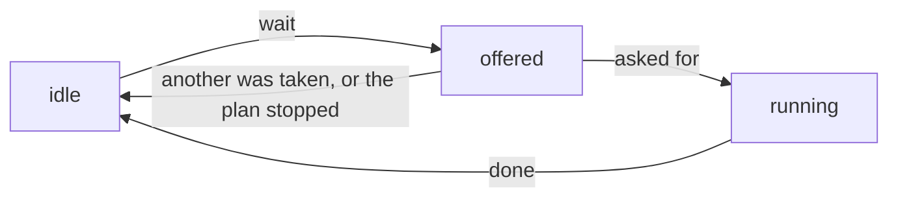

# How presenters run plans

A [plan](glossary.md#plan) is a recipe for an acquisition: a Python generator
that says, one step at a time, what to move, what to read and when. Plans come
from [`bluesky`](glossary.md#bluesky), and what its
[documentation on plans](https://blueskyproject.io/bluesky/main/plans.html)
says applies here too.

In `redsun` any [component](glossary.md#component) can offer plans, and one
[presenter](glossary.md#presenter) runs them. That presenter creates a
[`RunEngine`](glossary.md#runengine), which executes the plans, and starts one
when a view asks for it. The presenter names none of the components that
offer plans: it asks the session which ones do.

`redsun` adds three things to `bluesky`.

A `RunEngine` that does not block. The `RunEngine` of `bluesky` blocks the
thread that calls it until the plan has ended. Called from a window, that is
the main thread, and the window freezes. The one of `redsun` hands the plan to
a thread in the background and returns at once.

`PlanSpec`, a description of the parameters of a plan. It is read from the
signature of the plan and its type hints, and names no toolkit. A component
offers a plan once, and a view of any toolkit builds its controls from the
same description. For Qt, those controls are a
[plan widget](glossary.md#plan-widget).

Continuous plans, which run until they are stopped and take actions from the
user while they run. They let the user work with a plan that is running: a
live view shows frames until the user stops it, and a plan waiting on an
action records a frame each time the user asks for one.

[How to run a plan from a presenter](../how-to/run-a-plan.md) and
[How to write a plan that runs until stopped](../how-to/write-a-continuous-plan.md)
show the code this page describes.

---

## A plan that ends by itself

The simplest plan does its steps and stops, such as a walk that reads the
position of a stage and moves it forward a few times. It is an ordinary
`bluesky` plan. Its parameters are annotated with protocols rather than
classes, as in
[Describing a device with a protocol](../tutorials/device-protocols.md), so
the plan works with any device that has what it reads and sets.

A component offers its plans through a `plan_map` method, which returns each
plan under its name as a [`PlanEntry`][redsun.PlanEntry]. A component with
that method satisfies the protocol [`HasPlans`][redsun.HasPlans]. An entry
may also list the document callbacks the plan requires, under `callbacks`,
and say under `extendable` whether the user may attach more.

The plans stay with the component they belong to: a component that holds a
stage offers the plans that move it, and no central list names them.

---

## Running the plans of a session

One presenter has the `RunEngine`. In `setup` it asks the session for every
component that satisfies `HasPlans`, and keeps what they offer. That is a
question to the session, not a list of names, so a session file that adds such
a component adds its plans to the presenter, which is not edited.
[Questions](questions.md) explains how the session answers.

Calling the engine does not wait for the plan to end: the plan runs on a
thread of its own, and the call returns a `Future`. The presenter uses it to
tell a view that the plan ended, so that the view can enable the controls it
disabled when the plan started.

---

## From a plan to its widget

`create_plan_spec` describes a plan from its signature, and a view builds a
plan widget from the description. The view asks the session the question the
presenter asks, and describes the plans itself.

The presenter cannot hand its descriptions over as a
[shared value](glossary.md#shared-value): the session reads a shared value
when it makes the component, and the presenter learns which plans exist
later, in `setup`. So the view asks for the devices of the session too,
although it moves none: a description lists, for each device parameter, the
devices that can fill it, and needs the devices to find them.

### Plans that are refused

A required parameter whose annotation no input can show makes
`create_plan_spec` raise `UnresolvableAnnotationError`, so a plan is never
shown with a control nobody can fill in. Such a parameter with a default is
hidden instead: the view leaves it out and the plan keeps its default, which
is how the `md` of most `bluesky` plans is treated. Two actions of one name
make it raise `ValueError`. The component describing the plans decides what
follows: one that catches the error for each plan leaves that plan out and
keeps the others, and one that does not fails its whole `setup`. `Any` cannot
be shown on purpose: it would accept everything and show as a bare text
field.

The check is plain Python and imports no toolkit, so a plan can be inspected
before any application object exists.

What a description holds, how each annotation is read and how the values of a
plan widget become a call are in the
[reference](../reference/api/presenter.md#plan-specification).

---

## Continuous plans

The `@continuous` decorator marks a plan that runs until it is stopped. It
stores a `Continuous` on the function, which `create_plan_spec` reads into
`PlanSpec.continuous` and `PlanSpec.pausable`. The view builds the controls
from those: a toggle to start and stop the plan, and with `pausable=True` a
button to pause and resume it.

Stopping is how a continuous plan ends, and the `RunEngine` closes the run of
a stopped plan with the exit status `success`.

### In-flight actions

An action is something the user triggers while the plan runs. Two classes
describe it:

- `PlanAction` declares it: its name, its description and the labels of its
  button.
- `ActionManager` keeps the state of each action while a plan runs.

A `PlanAction` is a frozen dataclass and holds no state. A plan names it as
the default of a parameter, such as `snap: PlanAction = SNAP`, and
`create_plan_spec` reads it there to make the button. The component that
offers the plans owns an `ActionManager`, and the plans wait on it. What
follows names methods of `ActionManager`.

A latch is an object a plan waits on until another thread sets it; the
[engine reference](../reference/api/engine.md#waiting-on-a-latch) describes the one
`redsun` uses. `wait` offers the actions it is given, waits until one is asked for, and
returns the name of the one asked for first. That action runs until the plan
calls `done`. The others go back to idle, as all of them do when the plan is
stopped while it waits. An action that is running when the plan is stopped
stays running until the plan calls `done`, which is why the plan calls it in a
`finally` block.

Each call to `wait` makes new latches for the actions it offers. A request
left from an earlier launch of the plan cannot start an action of this one.

`wait` does not time out, and yields a [checkpoint](glossary.md#checkpoint)
every `poll_interval` seconds while it waits, as the
[stub it uses](../reference/api/engine.md#plan-stubs) does. A plan does
nothing else while it waits, so a plan that shows frames and records one on
request needs a device that streams frames on its own.

The user asks for an action through `request`, a [slot](glossary.md#slot)
that is safe to call from any thread and raises nothing. Asking for an action
no plan offers changes nothing and is logged as a warning. So is asking an
action that is not running to end.

The `RunEngine` has no code for actions. It receives the latches `wait` made
and waits on them.

The name is what tells the actions of a plan apart, so `create_plan_spec`
refuses a plan declaring two actions of one name.

### Toggle actions

An action with `toggle_states` gets a button that stays pressed until it is
released. The first label shows while the button is released, the second
while it is pressed. With `toggle_states=None`, the default, the button is
clicked.

Pressing the button asks for the action, and releasing it asks the action to
end, with `request(name, on=False)`. `wait_released` waits for that.

### Following an action from a view

An action is in one of three states, and `ActionManager.sig_changed` reports
each change with the name of the action and its new `ActionState`. A view
connected to it sets each button from the state reported:

| State | Meaning | What the view does |
|-------|---------|--------------------|
| `idle` | no plan waits for it and none runs it | disables the button, and shows a toggle button released |
| `offered` | a plan waits for it | enables the button |
| `running` | the plan took it, and has not finished it | disables a button that is clicked; a toggle button stays enabled, so the user can release it |

Only the plan changes a state, so the changes arrive in the order they
happened. A request changes none: the view that made it learns what came of
it from the next state.

---

## See also

- [How to run a plan from a presenter](../how-to/run-a-plan.md)
- [How to write a plan that runs until stopped](../how-to/write-a-continuous-plan.md)
- [How to follow a plan action from a view](../how-to/follow-a-plan-action.md)
- [`engine/actions` API](../reference/api/engine.md#actions)
- [`engine/plan_stubs` API](../reference/api/engine.md#plan-stubs)
- [`presenter/plan_spec` API](../reference/api/presenter.md#plan-specification)
- [How the Qt widgets of redsun work](qt-widgets.md#plan-widgets)
