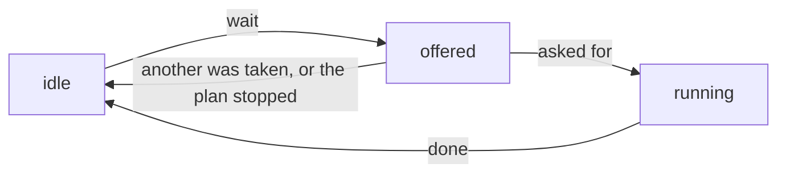

# How presenters run plans

A [plan](glossary.md#plan) is a recipe for an acquisition: a Python generator
that says, one step at a time, what to move, what to read and when. Plans come
from [`bluesky`](glossary.md#bluesky), and most of what its
[documentation on plans](https://blueskyproject.io/bluesky/main/plans.html)
says applies here too.

In `redsun`, any [component](glossary.md#component) can offer plans, and one
[presenter](glossary.md#presenter) runs them. That presenter creates a
[`RunEngine`](glossary.md#runengine), the object that executes plans, and
starts a plan when a view asks for it. The presenter doesn't name the
components that offer plans; it asks the session which ones do.

`redsun` adds three things to `bluesky`:

- **A `RunEngine` that doesn't block.** The `bluesky` `RunEngine` blocks the
  thread that calls it until the plan has ended. When you call it from a
  window, that's the main thread, so the window freezes. The `redsun` one
  hands the plan to a background thread and returns at once.
- **`PlanSpec`**, a description of a plan's parameters. It's read from the
  plan's signature and type hints, and names no [toolkit](glossary.md#toolkit),
  so a component offers a plan once and a view in any toolkit builds its
  controls from the same description. For Qt, those controls are a
  [plan widget](glossary.md#plan-widget).
- **Continuous plans**, which run until they're stopped and take actions from
  the user while they run. They let the user work with a running plan: a live
  view shows frames until the user stops it, and a plan waiting on an action
  records a frame each time the user asks for one.

[How to run a plan from a presenter](../how-to/run-a-plan.md) and
[How to write a plan that runs until stopped](../how-to/write-a-continuous-plan.md)
show the code this page describes.

---

## Plans that end by themselves

The simplest plan does its steps and stops, such as a walk that reads a
stage's position and moves it forward a few times. It's an ordinary `bluesky`
plan. Its parameters are annotated with [protocols](glossary.md#protocol)
rather than classes, as in
[Describing a device with a protocol](../tutorials/device-protocols.md), so
the plan works with any device that has what it reads and sets.

A component offers its plans through a `plan_map` method, which returns each
plan under its name as a [`PlanEntry`][redsun.PlanEntry]. A component with that
method satisfies the [`HasPlans`][redsun.HasPlans] protocol. An entry may also
list the [document callbacks](glossary.md#callback) the plan needs, under
`callbacks`, and say under `extendable` whether the user may attach more.

The plans stay with the component they belong to: a component that holds a
stage offers the plans that move it, and no central list names them.

---

## Running a session's plans

One presenter holds the `RunEngine`. In `setup`, it asks the session for every
component that satisfies `HasPlans`, and keeps the plans they offer. Because
that's a question to the session rather than a list of names, a session file
that adds such a component also adds its plans to the presenter, without
anyone editing the presenter. [Questions](questions.md) explains how the
session answers.

Calling the engine doesn't wait for the plan to end: the plan runs on a thread
of its own, and the call returns a `Future`. The presenter uses the `Future`
to tell a view that the plan ended, so the view can enable the controls it
disabled when the plan started.

---

## From a plan to its widget

A view builds a plan widget from a description, which `create_plan_spec`
makes from the plan's signature. To get the plans, the view asks the session
the same question the presenter asks, and then describes the plans itself.

The presenter can't simply share its descriptions with the view as a
[shared value](glossary.md#shared-value). The session reads shared values when
it makes a component, but the presenter only learns which plans exist later,
in `setup`. So the view describes the plans itself, and for that it also asks
for the session's devices, although it moves none of them: a description
lists, for each device parameter, the devices that can fill it.

### Plans that are refused

If a required parameter has an annotation that no input can show,
`create_plan_spec` raises `UnresolvableAnnotationError`, so a plan is never
shown with a control nobody can fill in. If such a parameter has a default,
it's hidden instead: the view leaves it out and the plan keeps its default,
which is how the `md` parameter of most `bluesky` plans is treated. Two
actions with the same name make `create_plan_spec` raise `ValueError`, since
the name is what tells a plan's actions apart.

The component that describes the plans decides what happens next. One that
catches the error for each plan leaves that plan out and keeps the others,
while one that doesn't fails its whole `setup`.

`Any` can't be shown, on purpose: it would accept everything and show up as a
bare text field.

The check is plain Python and imports no toolkit, so you can inspect a plan
before any application object exists.

The [reference](../reference/api/presenter.md#plan-specification) covers what
a description holds, how each annotation is read, and how the values of a plan
widget become a call.

---

## Continuous plans

The `@continuous` decorator marks a plan that runs until it's stopped. It
stores a `Continuous` on the function, which `create_plan_spec` reads into
`PlanSpec.continuous` and `PlanSpec.pausable`. The view builds the controls
from those two: a toggle to start and stop the plan, and, with
`pausable=True`, a button to pause and resume it.

Stopping is the normal way for a continuous plan to end, and the `RunEngine`
closes the [run](glossary.md#run) of a stopped plan with the exit status
`success`.

### In-flight actions

An action is something the user triggers while the plan runs. Two classes
describe it:

- `PlanAction` declares it: its name, its description and the labels of its
  button.
- `ActionManager` keeps the state of each action while a plan runs.

A `PlanAction` is a frozen dataclass and holds no state. A plan names it as
the default of a parameter, such as `snap: PlanAction = SNAP`, and
`create_plan_spec` finds it there to make the button. The component that
offers the plans owns an `ActionManager`, which the plans wait on. The methods
named in the rest of this section belong to `ActionManager`.

`wait` offers the actions it's given, waits until one is asked for, and
returns the name of the one asked for first. That action then runs until the
plan calls `done`. The others go back to idle, as all of them do if the plan
is stopped while it waits.

!!! warning "A stopped plan leaves its running action running"

    An action that is running when the plan is stopped stays running until
    the plan calls `done`. Call `done` in a `finally` block.

Each call to `wait` makes new latches for the actions it offers. A latch is an
object a plan waits on until another thread sets it; the [engine
reference](../reference/api/engine.md#waiting-on-a-latch) describes the one
`redsun` uses. Because the latches are new each time, a request left over from
an earlier launch of the plan can't start an action of this one. The
`RunEngine` itself has no code for actions: it receives the latches `wait` made
and waits on them.

`wait` doesn't time out. While it waits, it yields a
[checkpoint](glossary.md#checkpoint) every `poll_interval` seconds, as the
[stub it uses](../reference/api/engine.md#plan-stubs) does. A plan does
nothing else while it waits, so a plan that shows frames and records one on
request needs a device that streams frames on its own.

The user asks for an action through `request`, a [slot](glossary.md#slot)
that's safe to call from any thread and raises nothing. Asking for an action
no plan offers changes nothing and is logged as a warning, and so is asking to
end an action that isn't running.

### Toggle actions

An action with `toggle_states` gets a button that stays pressed until it's
released. The first label shows while the button is released, and the second
while it's pressed. With `toggle_states=None`, the default, the button is
clicked instead.

Pressing the button asks for the action, and releasing it asks the action to
end, with `request(name, on=False)`. The plan waits for the release with
`wait_released`.

### Following an action from a view

An action is always in one of three states, and `ActionManager.sig_changed`
reports each change with the action's name and its new `ActionState`. A view
connected to it sets each button from the state it reports:

| State | Meaning | What the view does |
|-------|---------|--------------------|
| `idle` | no plan waits for it and none runs it | disables the button, and shows a toggle button released |
| `offered` | a plan waits for it | enables the button |
| `running` | the plan took it, and has not finished it | disables a button that is clicked; a toggle button stays enabled, so the user can release it |

Only the plan changes a state, so the changes arrive in the order they
happened. A request changes no state: the view that made it learns what came
of it from the next state.

---

## See also

- [How to run a plan from a presenter](../how-to/run-a-plan.md)
- [How to write a plan that runs until stopped](../how-to/write-a-continuous-plan.md)
- [How to follow a plan action from a view](../how-to/follow-a-plan-action.md)
- [`engine/actions` API](../reference/api/engine.md#actions)
- [`engine/plan_stubs` API](../reference/api/engine.md#plan-stubs)
- [`presenter/plan_spec` API](../reference/api/presenter.md#plan-specification)
- [How the Qt widgets work](qt-widgets.md#plan-widgets)
