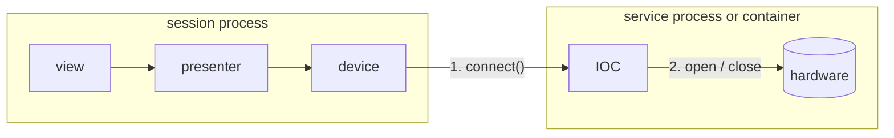

# Services

A service is a server some devices talk to: an EPICS IOC, a camera server, a
motion controller's gateway. redsun does not talk to hardware through a
service itself; ophyd-async devices do, over Channel Access. What redsun adds
is the session's view of the service: starting it when the session owns it,
noticing when it goes away, stopping it cleanly, and handing its prefix to the
devices that use it.

## Two connection levels

1. **Session to service.** ophyd-async's `connect()`, which the build runs for
   every device declared with `autoconnect`. A device that does not connect is
   skipped, like one that fails to build.
2. **Service to hardware.** Opening a serial port or a camera, and choosing
   which one, happens inside the service and is driven over process variables.
   It is the same for a service on another machine, since the list of ports
   comes from the machine that owns them.

The two are kept apart on purpose. A session can be connected to a service
that holds no hardware yet, and a service can let its hardware go while every
connection stays up.

## Launched and attached

A service declared with a `module` is **launched**: the container runs it as
`python -m <module>` when it is built, and stops it when it shuts down. One
declared without is **attached**: already running, in a container or on
another host, and only lending the prefix its devices address it by. Both are
declared with [`declare_service`][redsun.containers.declare_service] or in the
`services` section of a session file; see
[Write a service](../how-to/write-a-service.md).

A launched service belongs to the session in both directions:

- **Starting** is the first build step, before any device is built. The
  container waits for the line the service prints once it is ready, up to
  [`STARTUP_TIMEOUT`][redsun.services.STARTUP_TIMEOUT]. A service that does not
  start is logged, and every device naming it is skipped.
- **Stopping** runs when the container shuts down, whether or not it was built,
  and before the session's log file closes, so how each service ended is in the
  file. A build that raises stops the services it started before the
  exception leaves it.

## Stopping a process

A service is asked to stop in three steps, each waiting `stop_timeout` seconds:

1. **Close its standard input.** A service that watches it cleans up and exits.
2. **Send `SIGINT`**, on POSIX only.
3. **Kill it.**

Closing standard input comes first because it is the only request that runs a
service's cleanup on every platform. `Popen.terminate()` skips cleanup on
Windows as on Linux. A console control event never reaches a process started
without a console window, and a Qt application has to start services without
one, or each opens a window of its own. Closing standard input is also what
stops a service when the session itself crashes: the operating system closes
the pipe, and the service sees the end of its input.

A killed service may leave work half done: a large file still being written is
the usual case. A service that needs longer to close sets a longer
`stop_timeout`.

## Several services on one host

Each launched service gets a Channel Access server port of its own, added to
`EPICS_CA_ADDR_LIST` in the session process. Without that, two IOCs on the
default port answer on Linux but not on Windows, where the second is never
found. A service keeps its port for as long as the session process runs, so a
container built again reaches it again. See the note in
[Connecting](architecture/devices.md#connecting) for the limit this runs into:
libca reads the address list once per process.

## A service going away

A launched service that exits without being asked is logged at `ERROR`, with
its exit code and last lines of output, and emits
[`sig_exited`][redsun.services.Service.sig_exited] with its name and code.
Nothing restarts it. While it is gone, reads and writes on its devices raise
`TimeoutError` after ten seconds; once it is back, they answer again without a
reconnect, since Channel Access channels recover on their own.

`sig_exited` is emitted from the thread reading the service's output. A slot
connected to it in `wire` runs where the slot's owner asks: a view's slots run
on the main thread, and a presenter slot declared without a thread runs on the
output thread, named `service-<name>`, which is harmless since the service has
already exited. A presenter slot that touches anything bound to the main thread
declares `@slot(thread="main")`.

An attached service has no process to watch. Its outage shows as timeouts on
its devices.

## What a service's output becomes

Every line a launched service prints is logged under
`redsun.service.<name>`, and written to a log file of its own beside the
application's. A line that is a JSON log record keeps its level and time; any
other line is logged at `DEBUG`. See
[Log from a service](../how-to/configure-logging.md#log-from-a-service).

## What is not here

- **Restarting a service** that crashed.
- **Standby**, a service letting its hardware go while connected, is written
  by the application for now, from the presenter that owns the devices; see
  [Standby](architecture/devices.md#standby). The container takes it over once
  ophyd-async can disconnect a device, when standby can also drop connections
  and stop the services the session launched.
- **Launching a service in a container.** An attached service covers one
  started beside the session with `docker compose`.

The decisions behind this design are recorded in
[ADR 12](decisions/0012-services-and-two-connection-levels.md).
