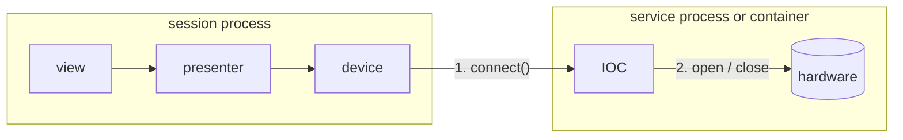

# Services

A service is a server devices talk to: an EPICS IOC, a camera server, a motion
controller's gateway. `ophyd-async` devices talk to it over Channel Access or
PVAccess; `redsun` does not. What `redsun` handles is the session's side:
starting the service when the session owns it, noticing when it exits, stopping
it cleanly, and giving its prefix and transport to the devices that use it.

## Two connection levels



1. **Session to service.** `ophyd-async`'s `connect()`, which the build runs for
   every device declared with `autoconnect`. A device that does not connect is
   skipped, like one that fails to build.
2. **Service to hardware.** The service opens a serial port or a camera, and
   chooses which, driven over process variables. This works the same for a
   service on another machine, since the list of ports comes from the machine
   that has them.

The two levels are kept apart on purpose. A session can be connected to a
service holding no hardware yet, and a service can release its hardware while
every connection stays up.

## Launched and attached

A service declared with a `module` is **launched**: the container runs it as
`python -m <module>` when built and stops it at shutdown. A service declared
without one is **attached**: it already runs, in a container or on another
host, and only lends its devices their prefix. Declare either with
[`declare_service`][redsun.containers.declare_service] or in the `services`
section of a session file, which works whether the session is built with
`from_config` or from a container class taking that file. A service the class
body declares replaces one the file names. See
[Write a service](../how-to/write-a-service.md).

The session owns a launched service from start to stop:

- **Starting** is the first build step, before any device is built. The
  container waits for the line the service prints when ready, up to
  [`STARTUP_TIMEOUT`][redsun.services.STARTUP_TIMEOUT]. A service that does not
  start is logged, and every device naming it is skipped.
- **Stopping** runs at shutdown, whether or not the container was built, and
  before the session's log file closes, so the file records how each service
  ended. A build that raises stops the services it started before the
  exception propagates.

## Stopping a process

A service is stopped in three steps, each waiting `stop_timeout` seconds:

1. **Close its standard input.** A service watching it cleans up and exits.
2. **Send `SIGINT`**, on POSIX only.
3. **Kill it.**

Closing standard input comes first because it is the only request that runs a
service's cleanup on every platform. `Popen.terminate()` skips cleanup on both
Windows and Linux. A console control event never reaches a process started
without a console window, and a Qt application must start services without
one, or each opens its own window. Closing standard input also stops a service
when the session crashes: the operating system closes the pipe and the service
reads end of input.

A killed service may leave work unfinished, typically a large file being
written. A service needing longer to close sets a longer `stop_timeout`.

## One transport per session

Every service of a session is reached over the same protocol, named once under
the `services` section of its file or as the `transport` attribute of its
container class:

```yaml
services:
  transport: pv-access
  camera_ioc:
    plugin_name: mylab
    plugin_id: camera-ioc
```

| name | protocol | what a session does for it |
| --- | --- | --- |
| `channel-access` | Channel Access | gives each launched service a server port of its own and lists `127.0.0.1:<port>` in `EPICS_CA_ADDR_LIST` |
| `pv-access` | PVAccess | binds each launched service to `127.0.0.1` on a free TCP port and puts that address in `EPICS_PVA_ADDR_LIST` |

`channel-access` is what a session speaks unless it says otherwise, and a file
layered over another cannot change it. The variables both protocols read hold
one setting for the whole process, so two transports in one session would leave
each unable to say which service a variable is for.

Under Channel Access, two IOCs on the default port both answer on Linux, but on
Windows the second is never found, which is why each gets a port. It keeps that
port while the session process runs, so a container built again reaches it
again. The note in [Connecting](architecture/devices.md#connecting) describes
the limit: libca reads the address list once per process. Under PVAccess a
service picks its own ports, and `pvxs` takes a free one when the default is
busy, so a session assigns nothing. A client does not search the loopback
unless it is told to, which is what the address list is for.

`redsun` depends on `ophyd-async` and on nothing either protocol needs. A
component brings what its own service speaks, `caproto` or `p4p` or `fastcs`,
and `ophyd-async[ca]` or `ophyd-async[pva]` for the device side; see
[Write a service](../how-to/write-a-service.md).

## What a launched service is told

Besides its transport's variables, a launched process reads its name and prefix
from its environment:

| variable | value |
| --- | --- |
| `REDSUN_SERVICE_NAME` | the name the service is declared under |
| `REDSUN_SERVICE_PREFIX` | the `prefix` of the declaration, empty when it has none |

A module serving several sessions names its channels from these rather than
taking arguments for them.

## A service exiting

A launched service that exits unasked is logged at `ERROR` with its exit code
and last lines of output, and emits
[`sig_exited`][redsun.services.Service.sig_exited] with its name and code.
Nothing restarts it. While it is down, reads and writes on its devices raise
`TimeoutError` after ten seconds; once it is back they answer again without a
reconnect, since both protocols reconnect on their own.

`sig_exited` is emitted from the thread reading the service's output. A slot
connected to it in `wire` runs where its owner asks: a view's slots run on the
main thread, and a presenter slot declared without a thread runs on the output
thread, named `service-<name>`. That is harmless, since the service has already
exited. A presenter slot touching anything bound to the main thread declares
`@slot(thread="main")`.

An attached service has no process to watch; an outage shows as timeouts on its
devices.

## What a service's output becomes

Each line a launched service prints is logged under `redsun.service.<name>` and
written to its own log file beside the application's. A line that is a JSON log
record keeps its level and time; any other line is logged at `DEBUG`. See
[Log from a service](../how-to/configure-logging.md#log-from-a-service).

## What is not here

- **Restarting a crashed service.**
- **Standby**, a service releasing its hardware while connected, is for now
  written by the application, in the presenter owning the devices; see
  [Standby](architecture/devices.md#standby). The container takes it over once
  `ophyd-async` can disconnect a device, when standby can also drop connections
  and stop launched services.
- **Launching a service in a container.** An attached service covers one
  started beside the session with `docker compose`.

[ADR 12](decisions/0012-services-and-two-connection-levels.md) records the
decisions behind this design.
