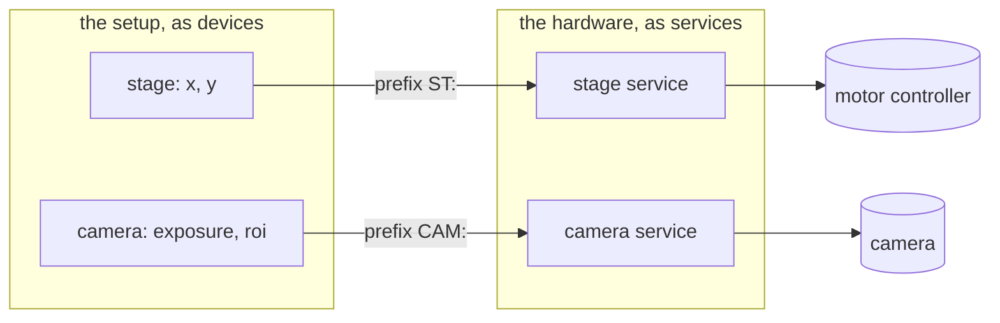
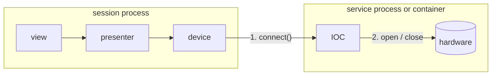

# How a session runs and talks to services

A service is a program that sits between your devices and the hardware, such
as an [EPICS](glossary.md#epics) [IOC](glossary.md#ioc), a camera server or a
motion controller's gateway. Your [`ophyd-async`](glossary.md#ophyd-async)
devices talk to it over [Channel Access](glossary.md#channel-access) or
[PVAccess](glossary.md#pvaccess), and `redsun` takes no part in that. What
`redsun` handles is everything around it: it starts the service when the
session launches it, notices when it exits, stops it cleanly, and gives its
[prefix](glossary.md#prefix) and transport to the devices that use it.

!!! warning "Devices without a service"

    You don't strictly need a service, since an `ophyd-async` device can
    reach its hardware on its own. For now, though, `redsun` supports such
    devices only in part, so a service is the preferred way to reach
    hardware. We will provide tutorials on wrapping third-party packages
    through `ophyd-async` in the future.

## Devices and services

A session splits your setup into devices and services, which know as little as
possible about each other.

Devices describe what your setup contains, such as a stage with an X and a Y
position, or a camera with an exposure time and a region of interest. Each
device is a set of signals the session reads and sets, so it says what can be
controlled but not how to reach the hardware.

Reaching the hardware is the service's job. A service opens the serial port or
the camera, speaks the vendor's protocol or runs the vendor's library, and
offers the result as [process variables](glossary.md#process-variable). It
knows how to drive the hardware, but nothing about the setup around it.

Devices and services meet at the prefix. When you declare a device with
`service="stage_ioc"`, the device reaches its signals under that service's
prefix, and the prefix is all it knows about the service.


```mermaid
flowchart LR
    subgraph model [the setup, as devices]
        ST[stage: x, y]
        CA[camera: exposure, roi]
    end
    subgraph impl [the hardware, as services]
        SS[stage service]
        CS[camera service]
    end
    ST -- "prefix ST:" --> SS
    CA -- "prefix CAM:" --> CS
    SS --> H1[(motor controller)]
    CS --> H2[(camera)]
```

Because the devices don't depend on the services, you can change one side and
leave the other alone:

- You can run the same devices, presenters and views against the real
  services in the lab and against simulated ones on a laptop. Only the
  services change:

    ```yaml
    # common.yaml: what the setup is
    devices:
      stage:
        plugin_name: mylab
        plugin_id: stage
        service: stage_ioc
    ```

    ```yaml
    # lab.yaml: how it is reached in the lab
    services:
      stage_ioc:
        plugin_name: mylab
        plugin_id: stage-ioc
        prefix: "ST:"
    ```

    ```yaml
    # simulation.yaml: how it is reached without hardware
    services:
      stage_ioc:
        plugin_name: mylab
        plugin_id: stage-sim
        prefix: "ST:"
    ```

    Your session then lists `common.yaml` and one of the other two in its
    `config`.

- If a vendor library crashes, it takes down its service process, not the
  session. The session logs the exit, and the devices of that service time out
  until it is back.
- A service can lend its hardware to another program while every device stays
  connected, and take it back later. For now your application does this
  itself; see [Standby](components.md#standby).
- An attached service runs wherever the hardware is plugged in, even on
  another machine, because the devices only need its prefix.

A device that needs no hardware at all, such as the soft stage in the
[tutorial](../tutorials/first-session.md), needs no service either.

## Two connection levels

A device reaches its hardware in two steps, and each step connects on its own:


```mermaid
flowchart LR
    subgraph app [session process]
        D[device]
        P[presenter]
        V[view]
    end
    subgraph svc [service process or container]
        S[IOC]
        H[(hardware)]
    end
    D -- "1. connect()" --> S
    S -- "2. open / close" --> H
    V --> P --> D
```

1. **Session to service.** The build calls `ophyd-async`'s `connect()` on
   every device declared with `autoconnect`. A device that doesn't connect is
   skipped, just like one that fails to build. A
   [mocked session](glossary.md#mocked-session) connects each device to a
   simulated backend and launches no service, so it reaches neither level.
2. **Service to hardware.** The service opens a serial port or a camera, and
   which one it opens is set through its process variables. This works the
   same for a service on another machine, since the list of ports comes from
   the machine that has them.

Keeping the two levels apart is deliberate: a session can stay connected to a
service that holds no hardware yet, and a service can release its hardware
while every connection stays up.

## Launched and attached

A service is either launched by the session or attached to it. When you
declare a service with `Launch`, the session runs it as `python -m <module>`
while it builds, and stops it at shutdown. When you declare it with `Attach`,
it is already running, in a container or on another host, and the session
only passes its prefix on to the devices. You can declare either kind on the
session class or in the `services` section of a session file, and any keyword
the class leaves out is taken from the file. See
[Write a service](../how-to/write-a-service.md).

The session owns a launched service from start to stop:

- **Starting** is the first build step, so it happens before any device is
  built. The session waits for the line the service prints when it's ready, up
  to [`STARTUP_TIMEOUT`][redsun.services.STARTUP_TIMEOUT]. If the service
  doesn't start, the session logs it and skips every device that names it.
- **Stopping** happens at shutdown, after every component and before the
  session's log files close, so the files record how each service ended. If
  the build raises, it stops the services it already started before the error
  leaves it.

## Stopping a process

The session stops a service in three steps, and after each one it waits up to
`stop_timeout` seconds for the service to exit:

1. **Close its standard input.** A service watching it cleans up and exits.
2. **Send `SIGINT`**, on POSIX only.
3. **Kill it.**

Closing standard input comes first because it's the only request that runs a
service's cleanup on every platform. The other requests fall short:
`Popen.terminate()` skips cleanup on both Windows and Linux, and a console
control event never reaches a process started without a console window. A Qt
application has to start its services without one, or each service opens its
own window. Closing standard input also stops a service when the session
crashes, because the operating system closes the pipe and the service reads
the end of its input.

A killed service may leave work unfinished, typically a large file it was
writing. If your service needs longer to close, give it a longer
`stop_timeout`.

## One transport per session

All the services of a session are reached over the same protocol, which you
name once in the `services` section of the configuration:

```yaml
services:
  transport: pv-access
  camera_ioc:
    plugin_name: mylab
    plugin_id: camera-ioc
```

The transport decides how the session sets up each launched service. Under
`channel-access`, the session gives each launched service a server port of its
own and tells its own process where that port is. Under `pv-access`, it binds
each launched service to `127.0.0.1` on a free port and tells its own process
to look there. [Environment variables](../reference/environment.md) lists what
it sets.

A session speaks `channel-access` unless it says otherwise, and a file layered
over another can't change it. Only one transport is allowed because the
variables both protocols read hold one setting for the whole process, so with
two transports in one session, no variable could say which service it is for.

Each Channel Access service gets its own port because of Windows. On Linux,
two IOCs on the default port both answer, but on Windows the second one is
never found. The cause is libca, the Channel Access client library, which reads
its list of server addresses only once per process. So each service keeps its
port for as long as the session process runs, and if you build the session
again in the same process, it finds the service on the same port.

PVAccess needs none of this: a service picks its own ports, and `pvxs` takes a
free one when the default is busy, so the session assigns nothing. The session
still tells its own process to look at `127.0.0.1`, because a PVAccess client
doesn't search the loopback address unless it's told to.

!!! warning "Another program can take the port first"

    A port is free when the session chooses it, but nothing holds it until
    the service binds it, so another program on the host can take it in
    between. If that happens, the service fails to start or its devices don't
    connect. The service keeps its port for the life of the session process,
    so to get a different port, start the session again in a new process.

`redsun` itself depends on `ophyd-async` and on nothing that either protocol
needs. Each component brings what its own service speaks, such as `caproto`,
`p4p` or `fastcs`, plus `ophyd-async[ca]` or `ophyd-async[pva]` for the device
side; see [Write a service](../how-to/write-a-service.md).

## What a launched service receives

When the session launches a service, it tells the service its name and
prefix, the ready text from its declaration, and the level the session logs
at, on top of the transport's variables. A Python service reads these through
the functions of `redsun.services`:
[`identity`][redsun.services.identity],
[`ready`][redsun.services.ready] and
[`configure_logging`][redsun.services.configure_logging].
[Environment variables](../reference/environment.md) lists how they are
passed.

Because a service learns its name this way, a module that serves several
sessions names its channels from its identity instead of taking arguments for
it.

## Unexpected exits

If a launched service stops on its own, the session logs it at `ERROR` with
its exit code and last lines of output, and the service emits
[`sig_exited`][redsun.services.Service.sig_exited] with its name and code.
Nothing restarts it. While it's down, reads and writes on its devices raise
`TimeoutError` after ten seconds. Once it's back, they answer again without a
reconnect, since both protocols reconnect on their own.

`sig_exited` is emitted from the thread that reads the service's output, so
where a [slot](glossary.md#slot) connected to it runs depends on the component
that owns the slot. A [view](glossary.md#view)'s slots run on the main thread.
A [presenter](glossary.md#presenter) slot runs on the output thread, named
`service-<name>`, unless you choose another thread for it. That thread has no
more output to read once the service has exited, so the slot running there
gets in nobody's way. If your presenter slot touches anything that only the
main thread may use, such as a Qt widget, declare it with
`@slot(thread="main")`.

An attached service has no process for the session to watch, so an outage
shows up only as timeouts on its devices.

## Service output

Everything a launched service prints ends up in the logs. Each line is
logged under `redsun.service.<name>` and written to the service's own log
file, next to the application's. A line that is a JSON log record keeps its
level and time, and any other line is logged at `DEBUG`. See
[Log from a service](../how-to/configure-logging.md#log-from-a-service).

## Not supported yet

- **Restarting a crashed service.**
- **Standby**, a service releasing its hardware while it stays connected. For
  now your application writes it, in the presenter that owns the devices; see
  [Standby](components.md#standby). The session will take it over once
  `ophyd-async` can disconnect a device, and standby will then also be able to
  drop connections and stop launched services.
- **Launching a service in a container.** An attached service covers one you
  start beside the session with `docker compose`.

[ADR 12](decisions/0012-services-and-two-connection-levels.md) records the
decisions behind this design.
