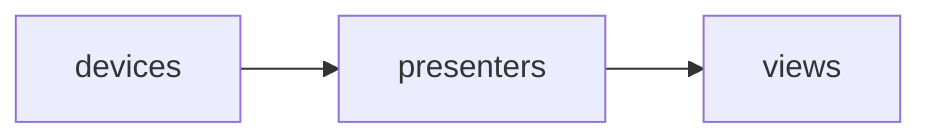
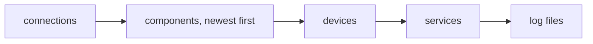

# How a session build sequence works

A [session](../reference/glossary.md#session) is one running application. It
knows which [components](../reference/glossary.md#component) to make, makes
them in the right order, connects them, and takes them apart again when it
ends.

You write a session as a class:

```python
from typing import Annotated

from redsun import AsDevice, AsPresenter, AsView, Declare
from redsun.qt import QtSession


class MyApp(QtSession):
    config = "session.yaml"

    stage: AsDevice[MyStage]
    motor_ctrl: AsPresenter[MotorPresenter]
    motor_widget: Annotated[AsView[MotorView], Declare(step_size=5.0)]

    def wire(self) -> None:
        self.connect(self.motor_ctrl.sig_moved, self.motor_widget.refresh)


MyApp().run()
```

Each annotated line is a [declaration](../reference/glossary.md#declaration):
the name on the left is the component's name, and the annotation says which
[layer](../reference/glossary.md#layer) it belongs to and which class to make.
A line without `AsDevice`, `AsPresenter` or `AsView` is an ordinary attribute,
not a component.

`self.motor_ctrl` is typed as a `MotorPresenter` for your editor and for mypy.
`AsPresenter` wraps the class without replacing it.

## Devices, presenters, views

A session is split into three layers, the
[DVP](../reference/glossary.md#dvp) pattern:



- **Devices** talk to hardware. They are `ophyd-async` devices.
- **Presenters** hold the behaviour: they run plans, compute things from the
  data, and drive the devices.
- **Views** show things on screen and pass on what the user does.

Layers are built in that order, and a component may only use what its own
layer or an earlier one owns. A presenter never knows about a view, which is
what lets it run without a screen, for example in a test.
[Components](components.md) explains what each layer may contain.

## What a build does

[`build`][redsun.Session.build] runs a fixed list of steps. First it reads the
[configuration](../reference/glossary.md#configuration) and gets the
[frontend](../reference/glossary.md#frontend) ready (for Qt, the
`QApplication`). Then it runs the [build steps](../reference/glossary.md#build-step)
in this order:

| step | what happens |
| --- | --- |
| `services` | start the [services](services.md) the session launches, and the catalog |
| `devices` | make every device |
| `connect` | connect the devices, all at once |
| `registry` | make the values every component may ask for |
| `presenters` | make the presenters |
| `views` | make the views |
| `setup` | call each component's `setup` method |
| `seal` | record what each component would save, to notice changes later |
| `wiring` | connect the [signals](../reference/glossary.md#signal) to the [slots](../reference/glossary.md#slot) |
| `presentation` | put the views on screen |
| `report` | log a summary of what was built |

The order never changes. A frontend changes what happens inside a step, never
which steps run.

### A component that fails to build

A device that does not connect, or a presenter whose constructor raises, is
logged and left out. The session carries on without it, and the summary at
the end says what is missing:

```text
Container built: 1/2 devices, 1/3 presenters, 0/0 views
Not built: stage (device, not connected), broken (presenter)
```

Anything built from a missing component is left out too. A mistake in the
session itself, such as a malformed `wiring` section, still stops the build.
[ADR 11](decisions/0011-tolerating-a-component-that-fails-to-build.md) records
why.

To stop instead whenever something is missing, make the session
[strict](../reference/glossary.md#strict-session):

```yaml
strict: true
```

A strict session gives back everything it had started, then raises
[`BuildError`][redsun.BuildError] naming each missing component and the
reason.

## Shutting down

Each step registers how to undo what it did, at the moment it does it: a
started service registers its stop, a built component registers its
`shutdown`. These are [releases](../reference/glossary.md#release).
[`shutdown`][redsun.Session.shutdown] runs them in reverse order:



Connections go first, so nothing reaches a component that is shutting down.
A build that fails halfway runs the same releases, so it never leaves a
service running. Calling `shutdown` twice is safe, and a session that was
shut down can be built again.

## The configuration

A session reads its settings from [session files](../reference/glossary.md#session-file)
and mappings, listed in `config`. The name of each component is also its key
in the file:

```yaml
session: my-lab
frontend: qt

presenters:
  motor_ctrl:
    step: 2.0
```

Several sources are read in order and merged: a later one wins, and nested
sections merge key by key. Two rules differ:

- A component's entry is replaced whole. A later file naming `motor_ctrl`
  replaces every setting of `motor_ctrl`, since one file should own a
  constructor's arguments.
- `schema_version`, `frontend` and `services.transport` must agree. They say
  what kind of session this is, so a later source giving a different value is
  an error.

A subclass adds its sources after its base class's, so shared settings are
written once:

```python
class Instrument(QtSession):
    config = "common.yaml"


class Simulation(Instrument):
    config = "simulation.yaml"  # read after common.yaml
```

The merged result is checked before anything is built. A misspelled key or a
value of the wrong type raises [`ConfigurationError`][redsun.ConfigurationError],
which lists every problem as `section.key: what`. The
[session file guide](../how-to/write-a-session-file.md) lists every key.

### A session with no class

A file can describe a whole session, with every component taken from a
[plugin](plugins.md):

```python
from redsun import Session

app = Session.from_config("session.yaml").build()
```

The `frontend` key picks the class to build on, so a file naming `qt` comes
up as a `QtSession`. Such a session has no class name to fall back on, so its
file must set `session`.

## The session's name

`session` in the configuration names the session; without it, the session is
named after its class. The name is used for:

- the folder its data, catalog and log files go in;
- the application its menus and commands are registered on;
- the file where one user's [settings](../how-to/save-a-session.md) are kept.

## Log files

Each run writes its log to a file under the session's folder, and each
launched service writes to a file of its own beside it. The files follow the
data folder if it moves while the session runs, and close last at shutdown.
[Configure logging](../how-to/configure-logging.md) shows where they go.

## Protocols a session is built from

A session is written against two [protocols](../reference/glossary.md#protocol):

- [`BuildableSession`][redsun.BuildableSession] lists every build step as a
  method. [`Session`][redsun.Session] implements them all, and does nothing
  in the two that belong to a frontend: `start_runtime` and `present`.
- [`DesktopSession`][redsun.DesktopSession] adds a window and `run`, which
  builds, shows the window, and starts the event loop.

`QtSession` fills `start_runtime` with the `QApplication`, and `present` with
the main window and its views. A session with no frontend shows nothing,
which is what a test wants: `build()` alone gives you every component without
opening a window.
