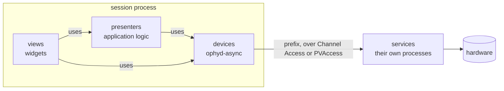
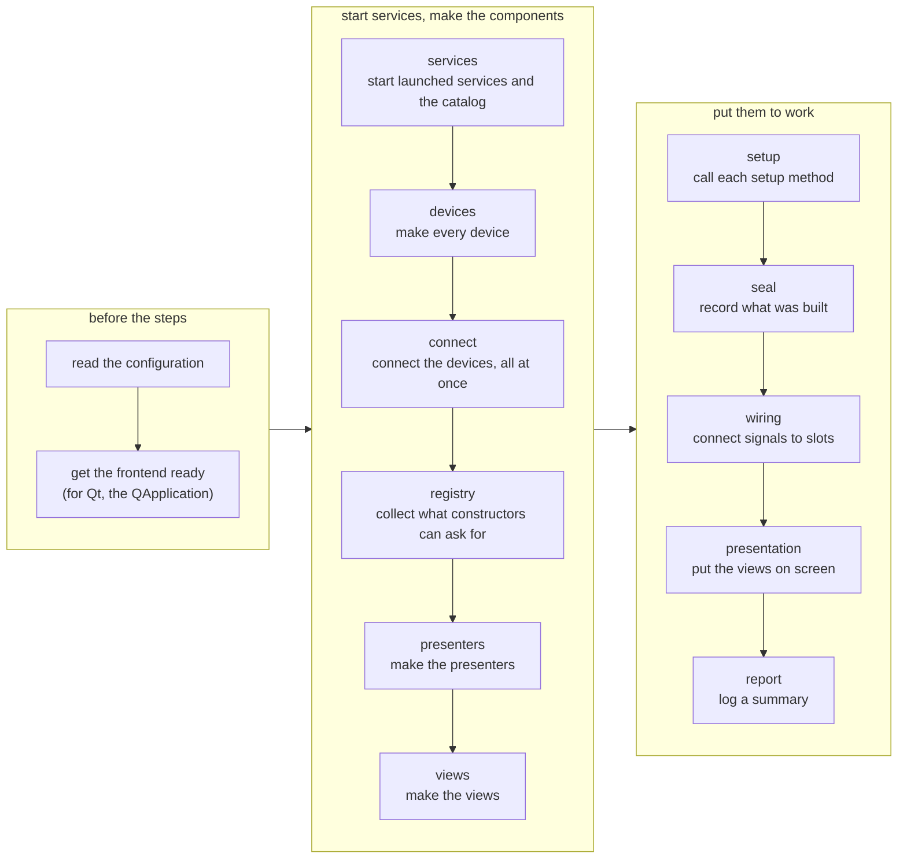
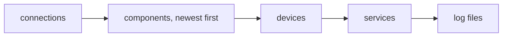

# How a session build sequence works

A [session](glossary.md#session) is one running application. It knows which
[components](glossary.md#component) to make, makes them in the right order,
connects them, and takes them apart again when it ends.

You write a session as a class:

```python
from collections.abc import Iterator
from typing import Annotated

from redsun import AsDevice, AsPresenter, AsView, Declare, Link
from redsun.qt import QtSession


class MyApp(QtSession):
    config = "session.yaml"

    stage: AsDevice[MyStage]
    motor_ctrl: AsPresenter[MotorPresenter]
    motor_widget: Annotated[AsView[MotorView], Declare(step_size=5.0)]

    def wire(self) -> Iterator[Link]:
        yield self.motor_ctrl.sig_moved, self.motor_widget.refresh


MyApp().run()
```

Each annotated line is a [declaration](glossary.md#declaration). The name on
the left becomes the component's name, and the annotation says which
[layer](glossary.md#layer) the component belongs to and which class to make.
A line without `AsDevice`, `AsPresenter` or `AsView` is an ordinary
attribute, not a component.

Once the session is built, `self.motor_ctrl` holds the `MotorPresenter` the
session made. To your editor and `mypy`, `AsPresenter[MotorPresenter]` is still
the `MotorPresenter` type with a marker attached, so they see the same class.
The markers start with `As` so that each one says what it marks, and so that
none has the name of a class a component may itself subclass, such as
`Device`.

## Devices, presenters, views

A session is split into three layers of components, which together form the
[DVP](glossary.md#dvp) pattern, short for Device-View-Presenter. Below them sit
the services, which reach the hardware:


```mermaid
flowchart LR
    subgraph app [session process]
        V["views<br/>widgets"] -- uses --> P["presenters<br/>application logic"] -- uses --> D["devices<br/>ophyd-async"]
        V -- uses --> D
    end
    D -- "prefix, over Channel Access or PVAccess" --> S["services<br/>their own processes"]
    S --> H[(hardware)]
```

- **Devices** describe your setup. Each one is an
  [`ophyd-async`](glossary.md#ophyd-async) device: a set of signals, such as a
  position or an exposure time, that presenters and plans can read and set. A device
  knows what can be controlled, but nothing about when or why.
- **Presenters** hold the application logic, which decides what happens and
  when. A presenter runs [plans](plans.md) to acquire data, computes results
  from the [documents](glossary.md#document) a run produces, moves devices when
  asked to, and keeps whatever state the application needs between those
  steps.
- **Views** are what the user sees and touches. A view holds the widgets,
  shows what the devices and presenters report, such as a position or an
  image, and turns what the user does, such as pressing a button, into a
  signal that a presenter acts on. Deciding what that signal leads to is left
  to the presenter.

The [services](services.md) are not a layer, because they are separate
programs rather than components the session builds. A service owns the
hardware and offers it to the devices under a [prefix](glossary.md#prefix).
The session starts the services it launches before it builds anything else,
and stops them after every component. A device that needs no hardware, such as
a simulated stage, needs no service.

The session builds the layers in the order devices, presenters, views. A
component can receive, in its constructor or `setup`, only what its own layer
or an earlier one owns, so a view may take presenters and devices, while a
presenter never holds a view. Signals and slots are different: they connect
components across layers in either direction. Because a presenter holds no
view, it can run without a screen, for example in a test.
[Components](components.md) explains what each layer may contain.

## What a build does

[`build`][redsun.Session.build] reads the
[configuration](glossary.md#configuration), gets the
[frontend](glossary.md#frontend) ready, and then runs the
[build steps](glossary.md#build-step) in a fixed order:


```mermaid
flowchart LR
    subgraph start [before the steps]
        direction TB
        C["read the configuration"] --> R["get the frontend ready<br/>(for Qt, the QApplication)"]
    end
    subgraph make [start services, make the components]
        direction TB
        S1["services<br/>start launched services and the catalog"] --> S2["devices<br/>make every device"]
        S2 --> S3["connect<br/>connect the devices, all at once"]
        S3 --> S4["registry<br/>collect what constructors can ask for"]
        S4 --> S5["presenters<br/>make the presenters"]
        S5 --> S6["views<br/>make the views"]
    end
    subgraph finish [put them to work]
        direction TB
        S7["setup<br/>call each setup method"] --> S8["seal<br/>record what was built"]
        S8 --> S9["wiring<br/>connect signals to slots"]
        S9 --> S10["presentation<br/>put the views on screen"]
        S10 --> S11["report<br/>log a summary"]
    end
    start --> make --> finish
```

Two steps do more than their names say. `registry` collects everything a
component's constructor can ask for by type: the settings, the devices, and
the [shared values](glossary.md#shared-value) of the session's
[providers](glossary.md#provider), which are classes made only to share values. `seal` records which components
were built and closes the session to further building. It also notes the
settings each component would [save](../how-to/save-a-session.md) now, so the
session can later tell whether you changed any.

The order never changes. A frontend can change what happens inside a step, but
never which steps run. The `presentation` step, for example, does nothing in a
plain `Session`, while `QtSession` uses it to show the main window and its
views.

### Components that fail to build

If a device doesn't connect, or a presenter's constructor raises, the session
logs it and leaves that component out. The session carries on without it, and
the summary at the end says what is missing. Anything built from a missing
component is left out too. A mistake in the session itself, such as a
malformed `wiring` section, still stops the build.
[ADR 11](decisions/0011-tolerating-a-component-that-fails-to-build.md) records
why.

A [strict](glossary.md#strict-session) session stops instead, whenever
something is missing.
[How to find out why a component is missing](../how-to/find-a-missing-component.md)
shows how to read the summary and the log, and how to make a session strict.

Two other cases only log a warning, and the session keeps what it built: a
component that shares nothing, asks for nothing and isn't wired to anything,
and a shared value that no component asks for. Neither is a mistake. While
you're still putting a session together, some components aren't connected
yet, and a [plugin](glossary.md#plugin) may ship components or values that
your session has no use for.

## Shutting down

Each step registers how to undo what it did, at the moment it does it: a
started service registers its stop, and a built component registers its
`shutdown`. These undo actions are the session's
[releases](glossary.md#release), and [`shutdown`][redsun.Session.shutdown]
runs them in reverse order:


```mermaid
graph LR
    W[connections] --> C[components, newest first] --> D[devices] --> S[services] --> L[log files]
```

The session undoes the connections first, so no signal calls a slot of a
component that is shutting down. A build that fails halfway runs the same
releases, so it never leaves a service running. You can safely call `shutdown`
twice, and you can build a session again after it was shut down.

## The configuration

You can describe a session in one of two ways: declare its components in a
Python class, or list them all in a [session file](glossary.md#session-file).
Either way, the settings come from the files and mappings the session reads,
and the same rules decide how those sources combine.

=== "Declared in a class"

    A session class names each component as a typed attribute, so the components
    and their classes live in your code, where your editor and `mypy` can check
    them. Files are optional. When the class lists some in `config`, they supply
    the settings: the session name and the arguments of the
    components the class declares. Each component's name is also its key in the
    file:

    ```python
    class MyApp(QtSession):
        config = "session.yaml"

        motor_ctrl: AsPresenter[MotorPresenter]
    ```

    ```yaml
    session: my-lab

    presenters:
      motor_ctrl:
        step: 2.0
    ```

    A file can also add a component the class doesn't declare, by naming the
    [plugin](plugins.md) that provides it, as
    [Components from a file and from a class](plugins.md#components-from-a-file-and-from-a-class)
    shows.

=== "Described in a file"

    A session can come entirely from its files, with every component taken
    from a plugin. You then need no class of your own:

    ```python
    from redsun import Session

    app = Session.from_config("session.yaml").build()
    ```

    ```yaml
    session: my-lab
    frontend: qt

    devices:
      stage:
        plugin_name: mylab
        plugin_id: stage
    ```

    The `frontend` key picks the class the session is built on, so a file naming
    `qt` comes up as a `QtSession`. Such a session has no class name to fall back
    on, so its files must set `session`.
    [Run a session without a GUI](../how-to/run-without-a-gui.md) shows a file
    that names no frontend at all.

### Merging the sources

A session reads its sources in order, whether a class lists them in `config`
or you pass them to `from_config`, and merges them: a later source wins, and
nested sections merge key by key. Two rules are different:

- A component's entry is replaced whole. If a later file names `motor_ctrl`,
  it replaces every setting of `motor_ctrl`, since one file should own a
  constructor's arguments.
- `schema_version`, `frontend` and `services.transport` must agree across
  sources. They say what kind of session this is, so a later source giving a
  different value is an error.

A subclass adds its sources after its base class's, so you write shared
settings once:

```python
class Instrument(QtSession):
    config = "common.yaml"


class Simulation(Instrument):
    config = "simulation.yaml"  # read after common.yaml
```

!!! tip "Every mistake in the configuration at once"

    The session checks the merged result before anything is built. A
    misspelled key or a value of the wrong type raises
    [`ConfigurationError`][redsun.ConfigurationError], which lists every
    problem as `section.key: what`. [Session file](../reference/session-file.md)
    lists every key.

## Session name

You set the session's name with the `session` key in the configuration. If you
leave it out, the session is named after its class. The session uses its name
for:

- the folder its data, catalog and log files go in;
- the application its menus and commands are registered on;
- the file where one user's [settings](../how-to/save-a-session.md) are kept.

## Log files

Each run writes its log to a file in the session's folder, and each launched
service writes to a file of its own beside it. The log files follow the data
folder if it moves while the session runs, and they close last at shutdown.
[Configure logging](../how-to/configure-logging.md) shows where they go.

## Session protocols

A session is written against two [protocols](glossary.md#protocol):

- [`BuildableSession`][redsun.BuildableSession] lists every build step as a
  method, and [`Session`][redsun.Session] implements them all. For the two
  steps that belong to a frontend, `Session` does the least a session needs:
  `start_runtime` sets the backend that coroutine slots run on, and `present`
  does nothing.
- [`DesktopSession`][redsun.DesktopSession] adds a window and `run`, which
  builds the session, shows the window and starts the event loop.

`QtSession` adds the `QApplication` to `start_runtime`, and fills `present`
with the main window and its views. A session with no frontend shows nothing,
which is what a test wants: `build()` alone gives you every component without
opening a window.
