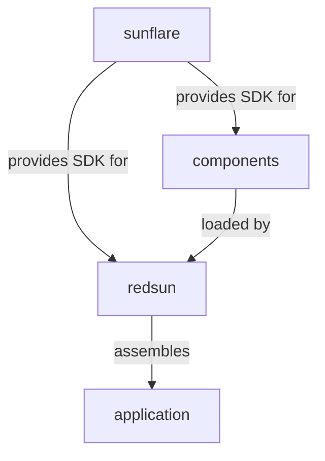

# Statement of need

Scientific data acquisition often involves controlling a variety of hardware devices, coordinating measurements, and managing the resulting data and metadata. While the [Bluesky] ecosystem provides a powerful hardware abstraction layer and data model, building a complete application that integrates these capabilities into a usable interface remains a non-trivial task.

`redsun` aims to address this gap by providing a modular, event-driven framework for constructing scientific data acquisition applications.

## The role of each part

- **[sunflare]** is the Software Development Kit (SDK) that provides shared base classes and communication patterns (devices, presenters, views, a shared container for inter-component communication and data exchange). It ensures a consistent programming model across the entire ecosystem.
- **Components** are user-developed packages that implement the actual hardware drivers, business logic, and UI components using `sunflare` abstractions.
- **redsun** is the application shell that discovers plugins, wires them together through its container architecture, and launches the final application.

## Design philosophy

`redsun` follows three guiding principles:

1. **Don't reinvent the wheel** - leverage existing tools like Bluesky's hardware protocols and Qt's UI framework. Instead of building everything from scratch, ship the tools to build the wheel.
2. **Be modular** - users should be able to pick only the components they need. A plugin providing a motor controller should work independently of one providing a camera interface.
3. **Give users control** - users own their data and metadata. The framework provides the structure but does not impose constraints on what data means or how it should be organized.

## Why not just use Bluesky directly?

Bluesky was originally designed with an interactive approach in mind, in the sense that the user would directly control the `RunEngine` execution via a command-line interface or via `IPython`. This is imperative for the context in which Bluesky was developed (large experimental setups with multiple hardware devices connected to a central control system such as [EPICS] and [Tango]).

What `redsun` provides on top of Bluesky is a more lab-bench experience, for setups that are meant to be controlled via a Graphical User Interface similar to [Micro-Manager].

[bluesky]: https://blueskyproject.io/bluesky/main/index.html
[sunflare]: https://redsun-acquisition.github.io/sunflare/
[micro-manager]: https://micro-manager.org/
[epics]: https://epics-controls.org/
[tango]: https://www.tango-controls.org/
