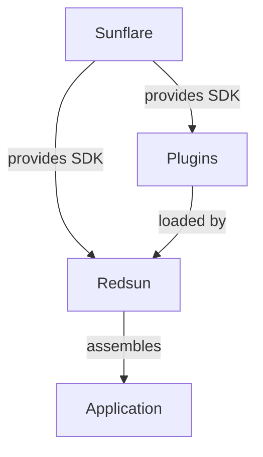

# Statement of need

Scientific data acquisition often involves controlling a variety of hardware devices, coordinating measurements, and managing the resulting data and metadata. While the [Bluesky] ecosystem provides a powerful hardware abstraction layer and data model, building a complete application that integrates these capabilities into a usable interface remains a non-trivial task.

Redsun addresses this gap by providing a modular, event-driven framework for constructing scientific data acquisition applications.

## The role of each component

- **[Sunflare]** is the Software Development Kit (SDK) that provides shared base classes and communication patterns (devices, presenters, views, virtual bus). It ensures a consistent programming model across the entire ecosystem.
- **Plugins** are user-developed packages that implement the actual hardware drivers, business logic, and UI components using Sunflare's abstractions.
- **Redsun** is the application shell that discovers plugins, wires them together through its container architecture, and launches the final application.

## Design philosophy

Redsun follows three guiding principles:

1. **Don't reinvent the wheel** - leverage existing tools like Bluesky's hardware protocols and Qt's UI framework. Instead of building everything from scratch, ship the tools to build the wheel.
2. **Be modular** - users should be able to pick only the components they need. A plugin providing a motor controller should work independently of one providing a camera interface.
3. **Give users control** - users own their data and metadata. The framework provides the structure but does not impose constraints on what data means or how it should be organized.

## Why not just use Bluesky directly?

Bluesky excels at hardware abstraction and experiment orchestration, but it does not provide:

- a graphical user interface framework;
- a plugin system for composing applications from independent packages;
- a container architecture for managing component lifecycles and dependencies;
- an event-driven communication layer between UI and business logic.

Redsun fills these gaps while staying fully compatible with the Bluesky data model and message protocol.

[bluesky]: https://blueskyproject.io/bluesky/main/index.html
[sunflare]: https://redsun-acquisition.github.io/sunflare/
