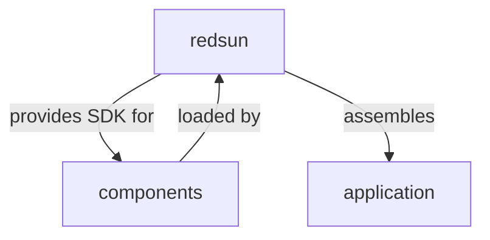

# Why redsun exists

Scientific data acquisition means controlling many devices, coordinating measurements, and managing the data and metadata they produce. The [Bluesky] ecosystem provides a hardware abstraction layer and a data model, but turning them into a complete application with a usable interface is still hard work.

`redsun` fills that gap with a modular, event-driven framework for building acquisition applications.

```mermaid
graph TD
    redsun -->|provides SDK for| components
    components -->|loaded by| redsun
    redsun -->|assembles| application
```

## The role of each part

- **`redsun` as SDK** provides the patterns components are written in: devices, presenters and views, and the signals, slots and shared values they exchange, so every package is written the same way.
- **Components** are packages users write: hardware drivers, logic and interfaces built on the `redsun` SDK.
- **`redsun` as application shell** discovers plugins, builds their components into a session, connects them, and launches the application.

## Design philosophy

`redsun` follows three principles:

1. **Don't reinvent the wheel.** Use existing tools, such as the `bluesky` hardware protocols and Qt for the interface, and ship the tools to build the wheel.
2. **Be modular.** Users pick only the components they need. A plugin providing a motor controller works without one providing a camera interface.
3. **Give users control.** Users own their data and metadata. The framework gives structure but does not decide what data means or how it is organized.

## Why not use Bluesky directly?

`bluesky` was designed for interactive use: the user drives the `RunEngine` from a command line or `IPython`. That fits where it was developed, large facilities with many devices behind a central control system such as [EPICS] or [Tango].

`redsun` adds a lab-bench experience on top of `bluesky`, for setups controlled through a graphical interface, as with [Micro-Manager].

[bluesky]: https://blueskyproject.io/bluesky/main/index.html
[micro-manager]: https://micro-manager.org/
[epics]: https://epics-controls.org/
[tango]: https://www.tango-controls.org/
