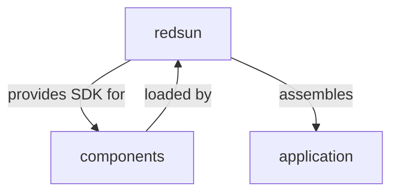

# Why redsun exists

Scientific data acquisition means controlling many devices, coordinating measurements, and managing the data and metadata they produce. The [Bluesky] ecosystem provides a hardware abstraction layer and a data model, but turning them into a complete application with a usable interface is still hard work.

`redsun` fills that gap with a modular, event-driven framework for building acquisition applications.

```mermaid
graph TD
    redsun -->|provides SDK for| components
    components -->|loaded by| redsun
    redsun -->|assembles| application
```

## The role of each part

- **`redsun` as SDK** provides the patterns components are written in: devices, presenters and views, and the signals, slots and shared values they exchange, so every package is written the same way.
- **Components** are packages users write: hardware drivers, logic and interfaces built on the `redsun` SDK.
- **`redsun` as application shell** discovers plugins, builds their components into a session, connects them, and launches the application.

## Design philosophy

`redsun` follows three principles:

1. **Don't reinvent the wheel.** Use existing tools, such as the [`bluesky`](glossary.md#bluesky) hardware protocols and Qt for the interface, and ship the tools to build the wheel.
2. **Be modular.** Users pick only the components they need. A plugin providing a motor controller works without one providing a camera interface.
3. **Give users control.** Users own their data and metadata. The framework gives structure but does not decide what data means or how it is organized.

## Why not use Bluesky directly?

`bluesky` was designed for interactive use: the user drives the [`RunEngine`](glossary.md#runengine) from a command line or `IPython`. That fits where it was developed, large facilities with many devices behind a central control system such as [EPICS] or [Tango].

`redsun` brings `bluesky` to a setup on a bench: one instrument, driven by one person through a window, as with [Micro-Manager].

## Coming from Micro-Manager

The two divide the work differently, so no part of one is the other under
another name. This is what comes closest:

| Micro-Manager | `redsun` |
| --- | --- |
| device adapter | a [device](glossary.md#device), and a [service](glossary.md#service) when the hardware sits behind a server |
| hardware configuration file | [session file](glossary.md#session-file) |
| multi-dimensional acquisition | [plan](glossary.md#plan) |
| live mode | a plan that runs until it is stopped, see [Plans](plans.md#continuous-plans) |
| plugin | a [plugin](glossary.md#plugin) providing [components](glossary.md#component) |

## What redsun does not ship

`redsun` is a library you build a program with. These are left to you, or to
a plugin you install:

| Not shipped | Who provides it |
| --- | --- |
| drivers for hardware | the devices and services you write or install |
| an acquisition panel | a [view](glossary.md#view) you write; the widgets of a plan are given, see [Qt widgets](qt-widgets.md) |
| an image viewer | a view you write |
| a writer of acquisition files | the device or its service, see [Where a device writes](components.md#where-a-device-writes) |

Two things nobody provides:

- A service that crashed is not started again. The session logs that it
  exited.
- One process has one frontend.

[What a running session cannot change](limits.md) explains both.

[bluesky]: https://blueskyproject.io/bluesky/main/index.html
[micro-manager]: https://micro-manager.org/
[epics]: https://epics-controls.org/
[tango]: https://www.tango-controls.org/
