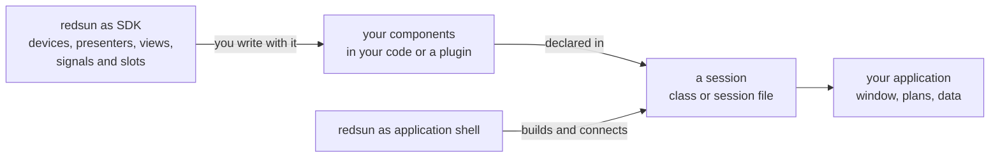

# Why redsun exists

Acquiring scientific data means controlling many devices, coordinating
measurements, and managing the data and metadata they produce. The [Bluesky]
ecosystem gives you a common way to talk to hardware and a model for the data,
but turning them into a complete application with a usable interface is still
hard work.

`redsun` fills that gap. It's a toolkit for building your own acquisition
software out of small, separate components that work together by sending each
other signals.

```mermaid
flowchart LR
    SDK["redsun as SDK<br/>devices, presenters, views,<br/>signals and slots"] -- "you write with it" --> C["your components<br/>in your code or a plugin"]
    C -- "declared in" --> S["a session<br/>class or session file"]
    Shell["redsun as application shell"] -- "builds and connects" --> S
    S --> App["your application<br/>window, plans, data"]
```

## SDK, components and application

`redsun` is both the software development kit (SDK) you write components with
and the application that runs them.

- **`redsun` as SDK** gives you the patterns to write components in: devices,
  presenters and views, and the signals, slots and shared values they
  exchange, so every package is written the same way.
- **[Components](glossary.md#component)** are the classes you write, or
  install from a [plugin](glossary.md#plugin): devices that describe your
  hardware, presenters that hold the application logic, and views that show
  it on screen.
- **`redsun` as application shell** discovers plugins, builds their components
  into a [session](glossary.md#session), connects them, and launches the
  application.

## Design philosophy

Three ideas shape how `redsun` is built:

1. **It builds on tools that already exist.** `redsun` uses the hardware
   protocols of [`bluesky`](glossary.md#bluesky),
   [`ophyd-async`](glossary.md#ophyd-async) for devices and Qt for the window,
   rather than writing its own. What it adds is what you need to put them
   together into one application.
2. **You take only what you need.** Each component stands on its own, so a
   session holds only the ones you declare, and a plugin that offers a motor
   controller works without one that offers a camera.
3. **Your data stays yours.** `redsun` gives every file a place and a name,
   but your devices write the data, in the formats they choose, and what the
   data means and how you organize it is up to you.

## Why not use Bluesky directly?

`bluesky` runs acquisitions, but it leaves the application around them to
you: you drive the [`RunEngine`](glossary.md#runengine) from a command line or
`IPython`, and the rest is expected to exist already. That fits the large
facilities it was developed at, where a control system such as [EPICS] or
[Tango] runs the hardware, staff keep it running, and separate programs show
the instrument to the people using it.

A setup on a bench has none of that around it: one instrument, driven by one
person through a window, as with [Micro-Manager]. `redsun` brings `bluesky`
there. It still speaks EPICS, through the services your devices talk to, but
it starts and stops those services itself, builds the window, and decides
where the data goes, instead of relying on a facility to provide them.

## Coming from Micro-Manager

If you've used Micro-Manager, many ideas in `redsun` will feel familiar,
although the pieces are divided differently. These are the closest matches:

| Micro-Manager | `redsun` |
| --- | --- |
| device adapter | a [device](glossary.md#device), preferably with a [service](glossary.md#service) to reach the hardware |
| hardware configuration file | [session file](glossary.md#session-file) |
| multi-dimensional acquisition | [plan](glossary.md#plan) |
| live mode | a plan that runs until it is stopped, see [Plans](plans.md#continuous-plans) |
| plugin | a [plugin](glossary.md#plugin) providing [components](glossary.md#component) |

## What redsun leaves to you

`redsun` gives you the framework, and everything specific to your instrument
comes from you or from a plugin:

| Not included | Where it comes from |
| --- | --- |
| hardware drivers | the devices and services you write or install |
| an image viewer | a [view](glossary.md#view) you write |
| a writer for acquisition files | the device or its service, see [Where a device writes](components.md#where-a-device-writes) |

For common tasks, `redsun` ships
[built-in components](plugins.md#built-in-components) you can use instead of
writing your own. When you do write a panel of your own for your plans,
`redsun` still builds the [plan widget](glossary.md#plan-widget) of each one;
see [Qt widgets](qt-widgets.md).

`redsun` also doesn't restart a service that crashes, and a program can run
only one [frontend](glossary.md#frontend). [Limitations](limits.md) explains
both.

[bluesky]: https://blueskyproject.io/bluesky/main/index.html
[micro-manager]: https://micro-manager.org/
[epics]: https://epics-controls.org/
[tango]: https://www.tango-controls.org/
