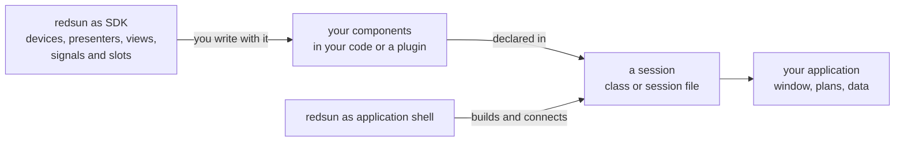

# Why redsun exists

Acquiring scientific data means controlling many devices, coordinating
measurements, and managing the data and metadata they produce. The [Bluesky]
ecosystem gives you a common way to talk to hardware and a model for the data,
but turning them into a complete application with a usable interface is still
hard work.

`redsun` fills that gap. It's a toolkit for building your own acquisition
software out of small, separate components that work together by sending each
other signals.

```mermaid
flowchart LR
    SDK["redsun as SDK<br/>devices, presenters, views,<br/>signals and slots"] -- "you write with it" --> C["your components<br/>in your code or a plugin"]
    C -- "declared in" --> S["a session<br/>class or session file"]
    Shell["redsun as application shell"] -- "builds and connects" --> S
    S --> App["your application<br/>window, plans, data"]
```

## SDK, components and application

`redsun` is both the software development kit (SDK) you write components with
and the application that runs them.

- **`redsun` as SDK** gives you the patterns to write components in: devices,
  presenters and views, and the signals, slots and shared values they
  exchange, so every package is written the same way.
- **[Components](glossary.md#component)** are the classes you write, or
  install from a [plugin](glossary.md#plugin): devices that describe your
  hardware, presenters that hold the application logic, and views that show
  it on screen.
- **`redsun` as application shell** discovers plugins, builds their components
  into a [session](glossary.md#session), connects them, and launches the
  application.

## Design philosophy

`redsun` follows three principles:

1. **Don't reinvent the wheel.** Use existing tools, such as the
   [`bluesky`](glossary.md#bluesky) hardware protocols and Qt for the
   interface, instead of writing new ones, and give you what you need to put
   them together.
2. **Be modular.** You pick only the components you need. A plugin that
   provides a motor controller works without one that provides a camera
   interface.
3. **Give users control.** You own your data and metadata. The framework gives
   structure, but it doesn't decide what the data means or how it's organized.

## Why not use Bluesky directly?

`bluesky` was designed for interactive use, where you drive the
[`RunEngine`](glossary.md#runengine) from a command line or `IPython`. That
fits the places it was developed for: large facilities with many devices
behind a central control system such as [EPICS] or [Tango].

`redsun` brings `bluesky` to a setup on a bench: one instrument, driven by one
person through a window, as with [Micro-Manager].

## Coming from Micro-Manager

If you've used Micro-Manager, many ideas in `redsun` will feel familiar,
although the pieces are divided differently. These are the closest matches:

| Micro-Manager | `redsun` |
| --- | --- |
| device adapter | a [device](glossary.md#device), preferably with a [service](glossary.md#service) to reach the hardware |
| hardware configuration file | [session file](glossary.md#session-file) |
| multi-dimensional acquisition | [plan](glossary.md#plan) |
| live mode | a plan that runs until it is stopped, see [Plans](plans.md#continuous-plans) |
| plugin | a [plugin](glossary.md#plugin) providing [components](glossary.md#component) |

## What redsun leaves to you

`redsun` gives you the framework, and everything specific to your instrument
comes from you or from a plugin:

| Not included | Where it comes from |
| --- | --- |
| hardware drivers | the devices and services you write or install |
| an image viewer | a [view](glossary.md#view) you write |
| a writer for acquisition files | the device or its service, see [Where a device writes](components.md#where-a-device-writes) |

For common tasks, `redsun` ships
[built-in components](plugins.md#built-in-components) you can use instead of
writing your own. When you do write a panel of your own for your plans,
`redsun` still builds the [plan widget](glossary.md#plan-widget) of each one;
see [Qt widgets](qt-widgets.md).

`redsun` also doesn't restart a service that crashes, and a program can run
only one [frontend](glossary.md#frontend). [Limitations](limits.md) explains
both.

[bluesky]: https://blueskyproject.io/bluesky/main/index.html
[micro-manager]: https://micro-manager.org/
[epics]: https://epics-controls.org/
[tango]: https://www.tango-controls.org/
