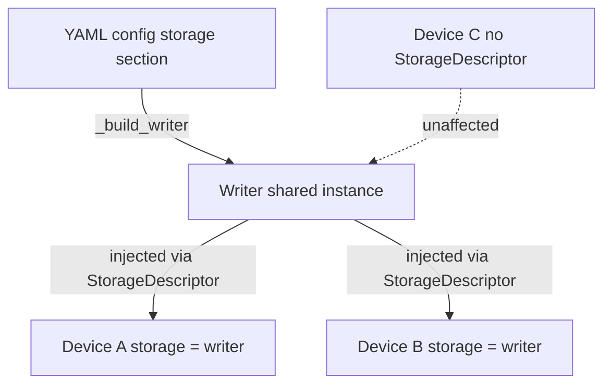

# Storage

Redsun provides an optional, session-scoped storage layer that lets devices write acquired frames to disk without managing their own file handles or knowing where data lands. The design follows the same dependency injection principle as the rest of the container: devices declare intent, the container supplies the implementation.

## Overview

A single shared [`Writer`][sunflare.storage.Writer] instance is constructed once per session and injected into every device that opts in. All devices within a session write to the same store, each under its own array key, so data from multiple cameras or detectors ends up in one coherent file.



Storage is fully **opt-in** at two levels:

- **Session level** — no `storage:` section in the YAML means no writer is built and no injection occurs.
- **Device level** — only devices that declare `storage = StorageDescriptor()` in their class body receive the writer. Devices without the descriptor are unaffected.

## Opting in as a device author

Declare the descriptor as a class attribute:

```python
from sunflare.storage import StorageDescriptor, StorageProxy

class MyDetector(Device):
    storage = StorageDescriptor()
```

`storage` starts as `None` and is set by the container at build time. Device code must guard against `None` before use:

```python
def prepare(self, value: PrepareKwargs) -> Status:
    s = Status()
    if self.storage is None:
        s.set_exception(RuntimeError("No storage backend configured."))
        return s
    ...
    self._sink = self.storage.prepare(self.name, capacity)
    ...
```

The [`StorageProxy`][sunflare.storage.StorageProxy] protocol is the full interface available on `self.storage` after injection — `update_source`, `prepare`, `kickoff`, `get_indices_written`, `collect_stream_docs`.

## Session configuration

Add a `storage:` section to the session YAML. Only `backend` and `base_path` need to be specified for most use cases:

```yaml
schema_version: 1.0
session: my-experiment
frontend: pyqt

storage:
  backend: zarr
  base_path: /data/scans        # C:/data/scans on Windows
  filename_provider: auto_increment
```

All fields and their defaults:

| Field | Type | Default | Description |
|---|---|---|---|
| `backend` | `str` | `"zarr"` | Storage backend. Currently only `"zarr"` is supported. |
| `base_path` | `str` | `~/redsun-storage/<session>` | Base directory for all stores this session. Created automatically if absent. Plain filesystem path — no URI syntax needed. |
| `filename_provider` | `str` | `"auto_increment"` | Filename strategy (see below). |
| `filename` | `str` | `"scan"` | Static filename — only used when `filename_provider` is `"static"`. |

### Filename strategies

`filename_provider` controls how individual store names are generated within `base_path`:

=== "auto_increment (default)"

    Stores are named `scan_00000`, `scan_00001`, … — predictable and human-readable. Never overwrites previous data.

    ```yaml
    storage:
      backend: zarr
      base_path: /data/scans
      filename_provider: auto_increment
    ```

    Produces: `/data/scans/scan_00000.zarr`, `/data/scans/scan_00001.zarr`, …

=== "uuid"

    Each store gets a random UUID4 name. Useful when concurrent writers must avoid any chance of collision.

    ```yaml
    storage:
      backend: zarr
      base_path: /data/scans
      filename_provider: uuid
    ```

    Produces: `/data/scans/3f2504e0-4f89-11d3-9a0c-0305e82c3301.zarr`, …

=== "static"

    Every acquisition writes to the same filename. Use only when you explicitly want to overwrite.

    ```yaml
    storage:
      backend: zarr
      base_path: /data/scans
      filename_provider: static
      filename: background
    ```

    Produces: `/data/scans/background.zarr` (overwritten each run).

### Default store location

When `base_path` is omitted, Redsun creates stores under `~/redsun-storage/<session>`:

```yaml
session: my-experiment
storage:
  backend: zarr
  # → ~/redsun-storage/my-experiment/scan_00000.zarr
```

The directory is created automatically on first use.

## How injection works

During [`build()`][redsun.containers.container.AppContainer.build], after all devices are constructed, the container checks each device for a [`StorageDescriptor`][sunflare.storage.StorageDescriptor] anywhere in its class hierarchy (full MRO walk). Devices that have one receive the shared writer via `setattr`. The check is performed by the private `_HasStorage` protocol, whose metaclass overrides `__instancecheck__` to inspect the class rather than the instance value — this correctly identifies opted-in devices even when `storage` is currently `None`.

!!! note "Future: per-plan override"
    The filename provider is currently fixed for the lifetime of the session.
    A future release will expose a way to swap strategies at plan time — for
    example to use a static name for background acquisitions and auto-increment
    for experimental runs.

## Backend dependencies

The `zarr` backend requires the optional `acquire-zarr` package, installed via:

```bash
pip install sunflare[zarr]
```

The import is deferred until the writer is actually built, so sessions without a `storage:` section have no dependency on `acquire-zarr`.

Future backends (`hdf5`, `ome-zarr`, `tiff`) will follow the same optional-extra pattern.
