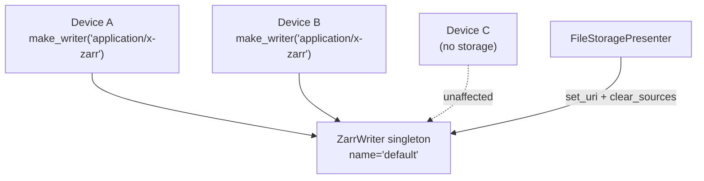

# Storage

!!! warning
    Storage support is under active development. Expect breaking changes.

Redsun provides a session-scoped storage layer that lets devices write acquired
frames to disk without managing their own file handles or knowing where data
lands.

## Overview

Writers are **singletons keyed by `(name, mimetype)`**. Any device that calls
`make_writer` with the same key gets the same instance, so multiple devices
automatically write into the same store.


```mermaid
graph TD
    D1["Device A\nmake_writer('application/x-zarr')"] --> W[ZarrWriter singleton\nname='default']
    D2["Device B\nmake_writer('application/x-zarr')"] --> W
    D3["Device C\n(no storage)"] -. unaffected .-> W
    SP[FileStoragePresenter] -->|set_uri + clear_sources| W
```

Storage is **opt-in per device** — devices that don't call `make_writer` are
completely unaffected.

---

## Device side

Imaging devices acquire a writer at `__init__` time and use it in `prepare`:

```python
from redsun.storage import PrepareInfo
from redsun.storage.device import make_writer

class MyCamera(Device):
    def __init__(self, name: str, /) -> None:
        super().__init__(name)
        self._writer = make_writer("application/x-zarr")

    def prepare(self, value: PrepareInfo) -> Status:
        s = Status()
        try:
            capacity = 0 if value.write_forever else value.capacity
            self._sink = self._writer.prepare(
                name=self.name,
                data_key="camera-image",
                dtype=np.dtype("uint16"),
                shape=(512, 512),
                capacity=capacity,
            )
        except Exception as e:
            s.set_exception(e)
        else:
            s.set_finished()
        return s

    def kickoff(self) -> Status:
        self._writer.kickoff()
        ...
```

Non-imaging devices (motors, lights, etc.) contribute metadata instead of
frames:

```python
from redsun.storage import PrepareInfo, register_metadata

class MyMotor(Device):
    def prepare(self, value: PrepareInfo) -> Status:
        s = Status()
        register_metadata(self.name, {"position": self._pos, "egu": "mm"})
        s.set_finished()
        return s
```

The writer snapshots the metadata registry at `kickoff()`.

---

## Presenter side

A dedicated `FileStoragePresenter` handles URI assignment before each plan:

```python
from redsun.storage import SessionPathProvider
from redsun.storage.presenter import get_available_writers

writers = get_available_writers()
# {"application/x-zarr": {"default": <ZarrWriter>}}

provider = SessionPathProvider(base_dir=Path("/data"), session="exp1")

for mimetype, groups in writers.items():
    for group_name, writer in groups.items():
        path_info = provider(plan_name, group_name)
        writer.clear_sources()
        writer.set_uri(path_info.store_uri)
```

`SessionPathProvider` produces auto-incrementing URIs of the form:

```
file:///data/exp1/2026_02_25/live_stream_00000
file:///data/exp1/2026_02_25/live_stream_00001
```

The counter increments independently per plan name, so different plans never
collide.

---

## Backend dependencies

The Zarr backend requires the optional `acquire-zarr` package:

```bash
pip install redsun[zarr]
```

The import is deferred — sessions without imaging devices have no dependency
on `acquire-zarr`.

---

## See also

- [Storage architecture](architecture/storage.md) — full lifecycle, custom backends
- [`redsun.storage` API reference](../reference/api/storage.md)
