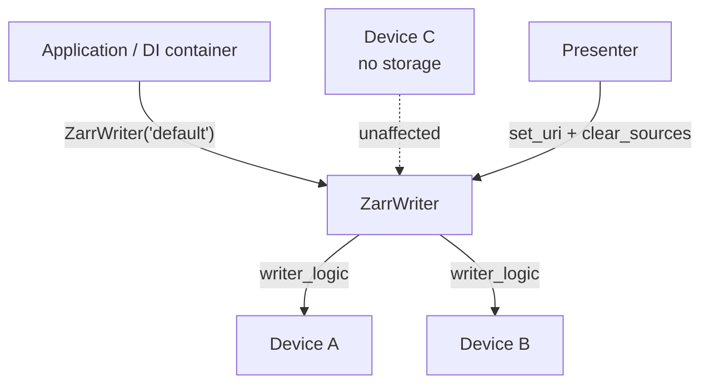

# Storage

!!! warning
    Storage support is under active development. Expect breaking changes.

`redsun` provides a session-scoped storage layer that lets devices write acquired
frames to disk without managing their own file handles or knowing where data
lands.

## Overview

Writers are **injected into devices at construction time** via dependency
injection.  Multiple devices that should write into the same store receive the
same writer instance — the writer tracks each device as a named *source* and
fans their frames into a single backend.


```mermaid
graph TD
    DI[Application / DI container] -->|"ZarrWriter('default')"| W[ZarrWriter]
    W --> |writer_logic| DA[Device A]
    W --> |writer_logic| DB[Device B]
    DC[Device C\nno storage] -. unaffected .-> W
    SP[Presenter] -->|set_uri + clear_sources| W
```

Storage is **opt-in per device** — devices that do not receive a writer are
unaffected.  The writer instance itself is stateless between acquisitions: it
is opened, written to, and closed on each plan, then reused for the next.

---

## Protocol hierarchy

Two protocols govern writer objects:

| Protocol | Purpose |
|---|---|
| [`DataWriter`][redsun.device.DataWriter] | Single-device persistence: open, write, collect documents, close |
| [`ControllableDataWriter`][redsun.device.ControllableDataWriter] | Extends `DataWriter` with source registration, frame pushing, and URI configuration; satisfied by shared backends like `ZarrWriter` |

A device that holds a writer exposes it through the
[`HasWriterLogic`][redsun.storage.HasWriterLogic] protocol (a `writer_logic`
property typed as `DataWriter`).  Helper functions and callbacks use this
protocol to discover writers without depending on any concrete class.

---

## Device side

An imaging device receives a writer at `__init__` time and uses it in
`prepare` and `kickoff`:

```python
from __future__ import annotations

import numpy as np
from bluesky.protocols import Status

from redsun.device import Device, ControllableDataWriter, PrepareInfo


class MyCamera(Device):
    def __init__(
        self,
        name: str,
        /,
        writer: ControllableDataWriter,
    ) -> None:
        super().__init__(name)
        self._writer = writer

    @property
    def writer_logic(self) -> ControllableDataWriter:
        """Expose the writer so presenters and callbacks can discover it."""
        return self._writer

    def prepare(self, value: PrepareInfo) -> Status:
        s = Status()
        try:
            capacity = 0 if value.write_forever else value.capacity
            self._writer.register(
                name=self.name,
                dtype=np.dtype("uint16"),
                shape=(2048, 2048),
                capacity=capacity,
            )
        except Exception as e:
            s.set_exception(e)
        else:
            s.set_finished()
        return s

    def kickoff(self) -> Status:
        s = Status()
        try:
            self._writer.open(self.name)
            # arm hardware, start acquisition loop …
        except Exception as e:
            s.set_exception(e)
        else:
            s.set_finished()
        return s
```

The `writer_logic` property makes the device satisfy
[`HasWriterLogic`][redsun.storage.HasWriterLogic] structurally, enabling
automatic discovery by the presenter and metadata callbacks without any
explicit registration.

---

## Metadata

There are two ways to attach metadata to a store.

### Direct — in `prepare()`

Call [`update_metadata(metadata)`][redsun.storage.Writer.update_metadata] on the
writer directly.  This is the simplest option when the device owns the writer:

```python
def prepare(self, value: PrepareInfo) -> Status:
    self._writer.update_metadata({
        self.name: {
            "exposure_time": self._exposure_s,
            "roi": list(self._roi),
        }
    })
    self._writer.register(self.name, ...)
    ...
```

Metadata accumulates on the writer between `prepare()` calls and is passed
into the backend when the store is first opened.  It is cleared automatically
by [`close()`][redsun.storage.Writer.close] (or explicitly via
[`clear_metadata()`][redsun.storage.Writer.clear_metadata]) so each new run
starts clean.

### Via a bluesky descriptor callback

For devices that are not imaging devices (motors, lights, etc.) a bluesky
callback can forward the configuration section of each
[`EventDescriptor`](https://blueskyproject.io/event-model/main/explanations/event-descriptors.html)
document into the associated writer using
[`handle_descriptor_metadata`][redsun.storage.handle_descriptor_metadata]:

```python
from redsun.storage import handle_descriptor_metadata


class MyCallback:
    def __init__(self, devices: dict) -> None:
        self._devices = devices

    def descriptor(self, doc) -> None:
        handle_descriptor_metadata(doc, self._devices)
        # … rest of callback logic
```

The function iterates the descriptor's `configuration` section, looks up each
device name in `devices`, checks whether it satisfies `HasWriterLogic` and
whether its writer satisfies [`HasMetadata`][redsun.storage.HasMetadata]
(i.e. has `set_metadata`), and forwards the configuration snapshot.

Bluesky emits one descriptor per stream name per run, so this function fires
once per run for a given stream.

---

## Presenter side

Before each plan the presenter must set the write location on every active
writer.  [`get_available_writers`][redsun.storage.presenter.get_available_writers]
discovers unique writers from the device registry via `HasWriterLogic`:

```python
from pathlib import Path

from redsun.storage import SessionPathProvider
from redsun.storage.presenter import get_available_writers

# devices is your application device registry (Mapping[str, Any])
writers = get_available_writers(devices)
# {"application/x-zarr": {"default": <ZarrWriter>}}

provider = SessionPathProvider(base_dir=Path("/data"), session="exp1")

for mimetype, groups in writers.items():
    for group_name, writer in groups.items():
        path_info = provider(plan_name, group=group_name)
        writer.clear_sources()
        writer.set_uri(path_info.store_uri)
```

`SessionPathProvider` produces auto-incrementing URIs of the form:

```
file:///data/exp1/2026_02_25/live_stream_00000
file:///data/exp1/2026_02_25/live_stream_00001
```

The counter increments independently per plan name, so different plans never
collide.  Counters for existing directories are picked up automatically on
construction, preventing overwrites across application restarts.

---

## Backend dependencies

The Zarr backend requires the optional `acquire-zarr` package:

=== "uv (recommended)"

    ```bash
    uv pip install redsun[zarr]
    ```

=== "pip"

    ```bash
    pip install redsun[zarr]
    ```

The import is deferred — sessions without imaging devices have no dependency
on `acquire-zarr`.

---

## See also

- [`redsun.storage` API reference](../reference/api/storage.md)
- [`redsun.device` API reference](../reference/api/device.md)
