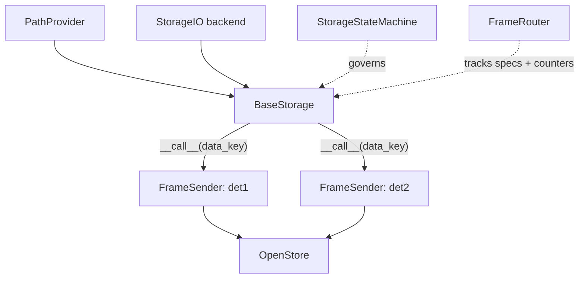
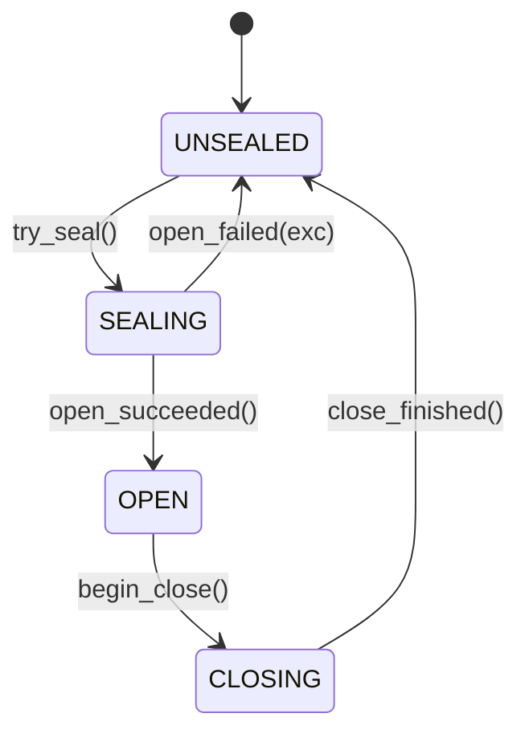

# Storage

!!! warning
    Storage support is under active development. Expect breaking changes.

`redsun` provides a session-scoped storage layer that lets devices write
acquired frames without managing file handles or knowing where data lands.

## Overview

Storage is split across two axes: **what a backend does** (`StorageIO` /
`OpenStore`) and **how frames reach it** (`SinkFactory` / `BaseStorage`).
A single `BaseStorage` instance fans frames from many named channels
(`data_key`s) into one backend store.


```mermaid
graph TD
    P[PathProvider] --> BS[BaseStorage]
    IO[StorageIO backend] --> BS
    BS -->|"__call__(data_key)"| S1[FrameSender: det1]
    BS -->|"__call__(data_key)"| S2[FrameSender: det2]
    S1 --> ST[OpenStore]
    S2 --> ST
    FSM[StorageStateMachine] -.governs.-> BS
    FR[FrameRouter] -.tracks specs + counters.-> BS
```

## Protocols

| Protocol | Purpose |
|---|---|
| `StorageIO` | Backend *mechanics*: `open(path, specs) -> OpenStore`, `uri()`, `resource_info()` |
| `OpenStore` | Lifecycle-bound *handle*: `write()`, `release()`, `close()` |
| `SinkFactory` | Frame-facing surface: `register()`, `__call__(data_key)`, `uri_for()`, `signal_for()` |

`BaseStorage` implements `SinkFactory` on top of a `StorageIO` and a
`PathProvider`. Backends live in `redsun.storage.backends` (`_memory`,
`_acquire_zarr`).

The `StorageIO`/`OpenStore` split is deliberate: a backend describes *how* to
open and address data, while the returned handle owns the *open lifetime*.
Don't push lifecycle methods onto `StorageIO`.

## Declaring a stream

Each channel is described by a frozen `StreamSpec`:

```python
from redsun.storage import StreamSpec

spec = StreamSpec(
    data_key="det1",
    shape=(2048, 2048),
    dtype="uint16",
    capacity=100,   # None means unbounded
)
```

`capacity` must be `None` or `>= 1`; anything else raises at construction.
`spec.is_unbounded` is the canonical check for a never-ending stream.

Register the spec, then obtain a sender for the channel:

```python
await storage.register(spec)
sender = await storage(spec.data_key)
await sender.asend(frame)
```

## Frame senders and capacity

`FrameSender` is an `AsyncGenerator[None, NDArray]`. **Capacity is enforced by
the generator's control flow, not by exceptions**: the pusher writes the first
frame during the open handshake, then loops `capacity - 1` more times — or
forever when the spec is unbounded. When the loop ends, the generator returns,
and its `finally` block pops the sink and releases the channel.

Nothing raises `StopAsyncIteration` by hand, and the cleanup must stay in
`finally` so an aborted plan still releases the channel.

## Lifecycle: `StorageStateMachine`


```mermaid
stateDiagram-v2
    [*] --> UNSEALED
    UNSEALED --> SEALING: try_seal()
    SEALING --> OPEN: open_succeeded()
    SEALING --> UNSEALED: open_failed(exc)
    OPEN --> CLOSING: begin_close()
    CLOSING --> UNSEALED: close_finished()
```

Registration is only legal while UNSEALED — `ensure_registrable()` waits out a
CLOSING store and rejects SEALING/OPEN with `InvalidStoreState`.

The interesting case is **concurrent first writes**. Several channels may push
their first frame at once; they all call `try_seal()`, exactly one wins and
performs the open, and the losers park in `await_open()` until the winner
signals success. If the open fails, `open_failed()` returns the machine to
UNSEALED and propagates the exception to everyone waiting.

`try_seal()` is called *outside* the try/except that wraps the store open. A
seal attempted while CLOSING opened nothing and parked nobody, so there is no
state to roll back; routing it through `open_failed()` would raise a second
`InvalidStoreState` and mask the original bug.

All transitions go through the machine. Never assign the state directly.

## Paths

`SessionPathProvider` resolves where a burst lands, combining a session base
directory with a `PlanFilenameProvider` that tracks a per-plan counter and
zero-pads it. It exposes `PathSignals` so the current directory, plan, and
counter are observable from the UI, and `_scan_existing()` resumes numbering
from files already on disk rather than overwriting them.

## Counters

`FrameRouter` owns the per-`data_key` `StreamSpec` and a `SignalR[int]` frame
counter. `mark_written()` is the single place counts advance — subscribe to
`signal_for(data_key)` to follow progress rather than polling the backend.
