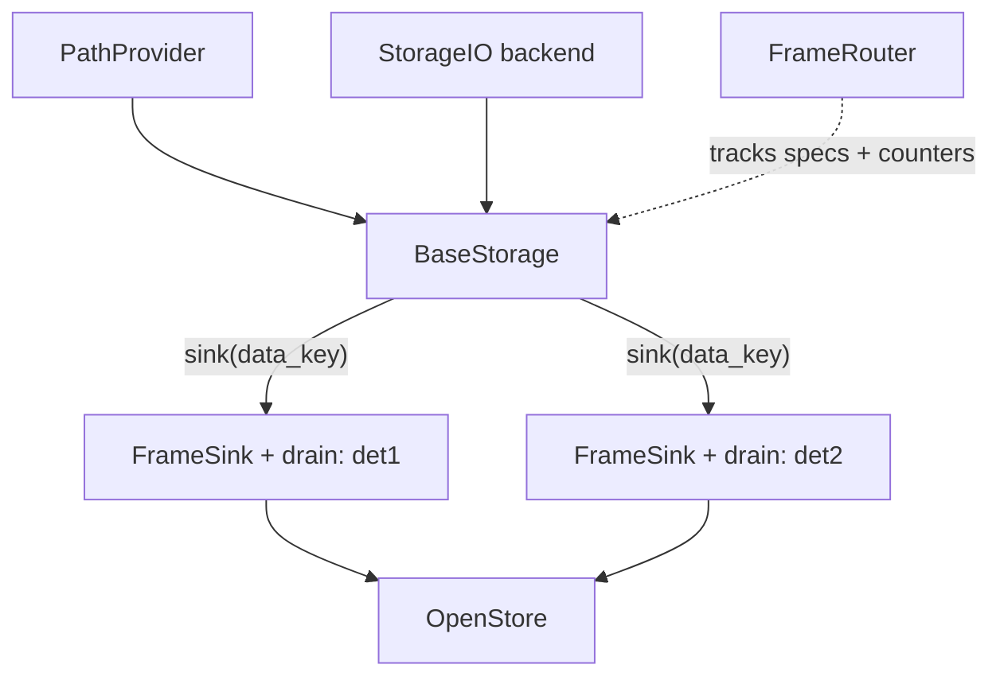
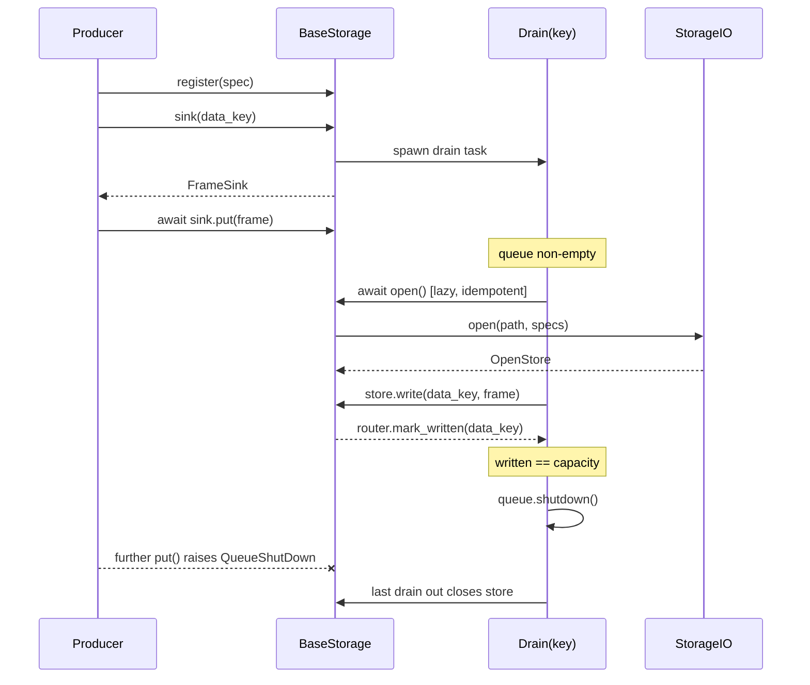

# Storage

!!! warning
    Storage is under active development. Expect breaking changes.

`redsun` has a storage layer scoped to the session: devices write frames
without managing file handles or knowing where the data goes.

## Overview

Storage has two sides: **what a backend does** (`StorageIO` / `OpenStore`) and
**how frames reach it** (`SinkFactory` / `BaseStorage`). One `BaseStorage`
routes frames from many named channels (`data_key`s) into one backend store.


```mermaid
graph TD
    P[PathProvider] --> BS[BaseStorage]
    IO[StorageIO backend] --> BS
    BS -->|"sink(data_key)"| S1[FrameSink + drain: det1]
    BS -->|"sink(data_key)"| S2[FrameSink + drain: det2]
    S1 --> ST[OpenStore]
    S2 --> ST
    FR[FrameRouter] -.tracks specs + counters.-> BS
```

## Protocols

| Protocol | Purpose |
|---|---|
| `StorageIO` | Backend *mechanics*: `open(path, specs) -> OpenStore`, `uri()`, `resource_info()` |
| `OpenStore` | Lifecycle-bound *handle*: `write()`, `release()`, `close()` |
| `SinkFactory` | Frame-facing surface: `register()`, `sink(data_key)`, `open()`, `close()`, `uri_for()`, `signal_for()` |

`BaseStorage` implements `SinkFactory` on a `StorageIO` and a `PathProvider`.
Backends live in `redsun.storage.backends` (`_memory`, `_acquire_zarr`).

The split is deliberate: a backend describes *how* to open and address data,
and the handle it returns owns the time the data is *open*. Do not add
lifecycle methods to `StorageIO`.

## Declaring a stream

A frozen `StreamSpec` describes each channel:

```python
from redsun.storage import StreamSpec

spec = StreamSpec(
    data_key="det1",
    shape=(2048, 2048),
    dtype="uint16",
    capacity=100,  # None means unbounded
)
```

`capacity` must be `None` or `>= 1`; anything else raises on construction.
`spec.is_unbounded` tells whether a stream never ends.

Register the spec (sync), then get a sink for the channel:

```python
storage.register(spec)
sink = storage.sink(spec.data_key)
await sink.put(frame)  # async producer: device logic
sink.put_nowait(frame)  # sync producer: document callback
sink.close()  # end the stream; queued frames still flush
```

## Frame sinks and capacity

`sink(data_key)` returns a `FrameSink`, a producer-only handle on a bounded
`culsans.Queue`. Async device logic calls `await put`; sync document callbacks,
which run inside `emit_sync` on the loop thread and cannot await, call
`put_nowait`. `sink.close()` is sync and idempotent.

`sink()` also starts a **drain task** per key, owned by `BaseStorage`. The drain
is the queue's only consumer; producers cannot read frames back. **The drain
enforces capacity, not exceptions**: it counts writes and, at `spec.capacity`,
calls `queue.shutdown()` and exits. An unbounded spec (`capacity=None`) drains
until closed. A producer writing past capacity sees `culsans.QueueShutDown` on
its next `put` or `put_nowait`. Nothing raises `StopAsyncIteration` by hand.
Stopping at capacity is best effort: a fast async producer can queue a few
frames before `queue.shutdown()` takes effect, and those frames are discarded
at teardown instead of written.

Teardown for a key always runs in the drain's exit path, whatever triggered it
(capacity, `sink.close()` or `storage.close()`); the last drain to exit closes
the backend.

## Lifecycle: open, drain, close


```mermaid
sequenceDiagram
    participant P as Producer
    participant BS as BaseStorage
    participant D as Drain(key)
    participant IO as StorageIO

    P->>BS: register(spec)
    P->>BS: sink(data_key)
    BS->>D: spawn drain task
    BS-->>P: FrameSink
    P->>BS: await sink.put(frame)
    Note over D: queue non-empty
    D->>BS: await open() [lazy, idempotent]
    BS->>IO: open(path, specs)
    IO-->>BS: OpenStore
    D->>BS: store.write(data_key, frame)
    BS-->>D: router.mark_written(data_key)
    Note over D: written == capacity
    D->>D: queue.shutdown()
    P--xBS: further put() raises QueueShutDown
    D->>BS: last drain out closes store
```

`open()` is idempotent and guarded by a lock. It is called in two ways:
**eagerly**, from a device's `prepare` when writing is about to start, and
**lazily**, by a drain before its first write, so the store is created at the
first frame written and not before. Concurrent callers wait on the lock for the
same open instead of racing the backend.

`register()` is sync and only allowed before opening: it raises
`StoreStateError` while the store is open, opening or closing.

`close(flush=True)`, the default, shuts every queue down cleanly: drains write
what is already queued, then exit. `close(flush=False)`, which `reset_group`
uses to abort, shuts queues down at once and drops queued frames. Either way,
the last drain to exit closes the backend under the open lock; there is no
separate release call.

A failed drain write does not raise at the producer: `gather` collects it with
`return_exceptions=True`. Awaiting `close()` re-raises what a drain failed on.

!!! note
    A `bluesky` plan collecting a `StandardDetector` must declare the stream
    first (`bps.declare_stream(det, name=..., collect=True)`), or `collect` has
    no stream to attach documents to.

ADR [0002](decisions/0002-storage-dual-context-redesign.md) records the design,
including the trade-offs for concurrent first writes and for aborting versus
flushing.

## Paths

`SessionPathProvider` decides where a burst is written, from a session base
directory and a `PlanFilenameProvider` keeping a zero-padded counter per plan.
Its `PathSignals` let the interface follow the current directory, plan and
counter, and `_scan_existing()` continues numbering from files already on disk
instead of overwriting them.

## Counters

`FrameRouter` holds each `data_key`'s `StreamSpec` and a `SignalR[int]` frame
counter. `mark_written()` is the only place counts advance: subscribe to
`signal_for(data_key)` to follow progress instead of polling the backend.
