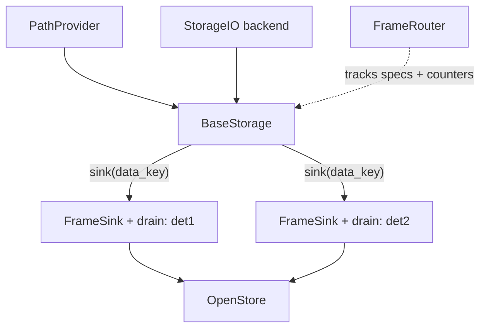
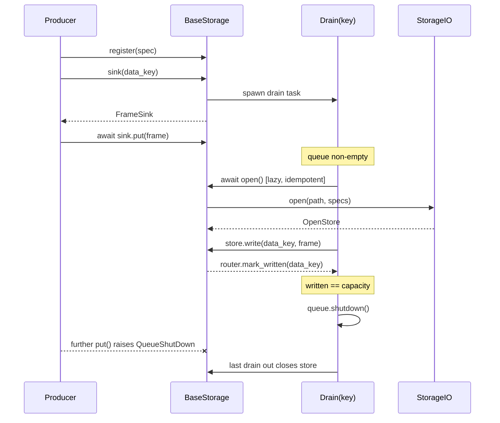

# Storage

!!! warning
    Storage support is under active development. Expect breaking changes.

`redsun` provides a session-scoped storage layer that lets devices write
acquired frames without managing file handles or knowing where data lands.

## Overview

Storage is split across two axes: **what a backend does** (`StorageIO` /
`OpenStore`) and **how frames reach it** (`SinkFactory` / `BaseStorage`).
A single `BaseStorage` instance fans frames from many named channels
(`data_key`s) into one backend store.


```mermaid
graph TD
    P[PathProvider] --> BS[BaseStorage]
    IO[StorageIO backend] --> BS
    BS -->|"sink(data_key)"| S1[FrameSink + drain: det1]
    BS -->|"sink(data_key)"| S2[FrameSink + drain: det2]
    S1 --> ST[OpenStore]
    S2 --> ST
    FR[FrameRouter] -.tracks specs + counters.-> BS
```

## Protocols

| Protocol | Purpose |
|---|---|
| `StorageIO` | Backend *mechanics*: `open(path, specs) -> OpenStore`, `uri()`, `resource_info()` |
| `OpenStore` | Lifecycle-bound *handle*: `write()`, `release()`, `close()` |
| `SinkFactory` | Frame-facing surface: `register()`, `sink(data_key)`, `open()`, `close()`, `uri_for()`, `signal_for()` |

`BaseStorage` implements `SinkFactory` on top of a `StorageIO` and a
`PathProvider`. Backends live in `redsun.storage.backends` (`_memory`,
`_acquire_zarr`).

The `StorageIO`/`OpenStore` split is deliberate: a backend describes *how* to
open and address data, while the returned handle owns the *open lifetime*.
Don't push lifecycle methods onto `StorageIO`.

## Declaring a stream

Each channel is described by a frozen `StreamSpec`:

```python
from redsun.storage import StreamSpec

spec = StreamSpec(
    data_key="det1",
    shape=(2048, 2048),
    dtype="uint16",
    capacity=100,  # None means unbounded
)
```

`capacity` must be `None` or `>= 1`; anything else raises at construction.
`spec.is_unbounded` is the canonical check for a never-ending stream.

Register the spec (sync), then obtain a sink for the channel:

```python
storage.register(spec)
sink = storage.sink(spec.data_key)
await sink.put(frame)  # async producer: device logic
sink.put_nowait(frame)  # sync producer: document callback
sink.close()  # end the stream; queued frames still flush
```

## Frame sinks and capacity

`sink(data_key)` returns a `FrameSink` — a thin producer-only handle over a
bounded `culsans.Queue`. Async device logics `await put`; sync document
callbacks (running inside `emit_sync` on the loop thread, which can never
await) use `put_nowait`. `sink.close()` is sync and idempotent.

Calling `sink()` also spawns a **drain task**, one per key, owned by
`BaseStorage`. The drain is the only consumer of the queue — producers cannot
read frames back. **Capacity is enforced by the drain, not by exceptions**: it
counts writes and, at `spec.capacity`, calls `queue.shutdown()` and exits;
unbounded specs (`capacity=None`) drain until close. An overrunning producer's
next `put`/`put_nowait` observes this as `culsans.QueueShutDown` — the
queue-era analogue of the old generator returning. Nothing raises
`StopAsyncIteration` by hand. Shutdown on overrun is best-effort, not a hard
guarantee: a fast async producer can enqueue a few frames past capacity
before the drain's `queue.shutdown()` call takes effect, and those overshoot
frames are simply discarded at teardown rather than written.

All per-key teardown happens in the drain's exit path, whichever way it was
triggered (capacity, `sink.close()`, or `storage.close()`); the last drain out
closes the backend.

## Lifecycle: open, drain, close


```mermaid
sequenceDiagram
    participant P as Producer
    participant BS as BaseStorage
    participant D as Drain(key)
    participant IO as StorageIO

    P->>BS: register(spec)
    P->>BS: sink(data_key)
    BS->>D: spawn drain task
    BS-->>P: FrameSink
    P->>BS: await sink.put(frame)
    Note over D: queue non-empty
    D->>BS: await open() [lazy, idempotent]
    BS->>IO: open(path, specs)
    IO-->>BS: OpenStore
    D->>BS: store.write(data_key, frame)
    BS-->>D: router.mark_written(data_key)
    Note over D: written == capacity
    D->>D: queue.shutdown()
    P--xBS: further put() raises QueueShutDown
    D->>BS: last drain out closes store
```

`open()` is idempotent and lock-guarded, with two entry points: **eager**,
called from a device's write-intent `prepare` when writing is imminent, and
**lazy**, called by a drain before its first write — the store materialises
on the first frame actually written, never earlier. Concurrent openers await
the same in-flight open on the lock rather than racing the backend.

`register()` is sync and only legal before open — it raises `StoreStateError`
while the store is open, opening, or closing.

`close(flush=True)` (default) shuts every queue down cleanly: drains finish
writing what's already queued, then exit. `close(flush=False)` (used by
`reset_group` for abort) shuts queues down immediately, dropping queued
frames for a fast teardown. Either way, the last drain to exit closes the
backend under the open lock — no separate release API.

Drain write failures don't raise at the producer — `gather` collects them
with `return_exceptions=True` — so `close()` is the error observation point:
awaiting it re-raises whatever a drain failed on.

!!! note
    A bluesky plan that collects a `StandardDetector` must pre-declare the
    stream (`bps.declare_stream(det, name=..., collect=True)`) — otherwise
    `collect` has no stream to attach documents to.

Design rationale, including the concurrent-first-write and abort-vs-flush
tradeoffs, lives in ADR
[0002](decisions/0002-storage-dual-context-redesign.md).

## Paths

`SessionPathProvider` resolves where a burst lands, combining a session base
directory with a `PlanFilenameProvider` that tracks a per-plan counter and
zero-pads it. It exposes `PathSignals` so the current directory, plan, and
counter are observable from the UI, and `_scan_existing()` resumes numbering
from files already on disk rather than overwriting them.

## Counters

`FrameRouter` owns the per-`data_key` `StreamSpec` and a `SignalR[int]` frame
counter. `mark_written()` is the single place counts advance — subscribe to
`signal_for(data_key)` to follow progress rather than polling the backend.
